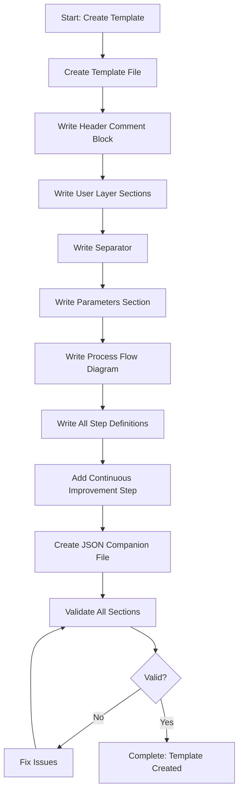

<!--
Step: Create Template File
Purpose: Create the template file with all sections including header comment, process header, parameters, process flow diagram, and step definitions
-->

# Step: Create Template File

## Description

Create a template file in `.processes/templates/` with proper filename and all required sections. Includes header comment, parameters, flow diagram, and step definitions.

## Purpose & Usage

Use this step when you need to:
- Create a new process template file
- Define a reusable workflow for common tasks
- Establish standardized process structure

**Output**: Complete template file with all sections and validation reports.

## Quick Reference

| Section | Required | Purpose |
|---------|----------|---------|
| Header comment | Yes | Metadata and purpose |
| Parameters | Yes | Required/optional inputs |
| Process Flow | Yes | Mermaid diagram |
| Steps | Yes | Sequential step definitions |
| Continuous Improvement | Yes | Final learning step |

---

## Agent Layer

### Required Components

- [mandatory-logging.md](../_components/mandatory-logging.md) - Logging guidelines

### Output (Detailed)

- Template file: `.processes/templates/{{templateName}}.md`
- Header comment block
- Parameters section with placeholders
- Process flow diagram (mermaid)
- Complete steps section
- Continuous improvement step
- JSON companion file
- Validation reports

### Guidance

<!-- @include: _components/mandatory-logging.md -->

**Specific Actions:**
- Create file: `.processes/templates/{{templateName}}.md` using kebab-case
- Write header comment with metadata
- Write process header and status
- List required/optional parameters with placeholders
- Add mermaid diagram matching planned steps
- Write each step: `- [ ] Step N: [Description]`
- Each step references process-step: `@framework-step:category/step-name`
- Add continuous improvement as final step

**Step Reference Format:**
```
- [ ] Step N: [Description]
  - **Description**: What this step accomplishes
  - **Output**: What this step produces
  - **Step**: @framework-step:category/step-name
```

### Flow



### Substeps

- [ ] **Substep 1**: Create template file with proper naming
- [ ] **Substep 2**: Write header comment block with metadata
- [ ] **Substep 3**: Write User Layer sections (description, usage, quick reference)
- [ ] **Substep 4**: Write separator and Agent Layer header
- [ ] **Substep 5**: Write parameters section
- [ ] **Substep 6**: Write process flow diagram (mermaid)
- [ ] **Substep 7**: Write all step definitions with references
- [ ] **Substep 8**: Add continuous improvement step
- [ ] **Substep 9**: Create JSON companion file
- [ ] **Substep 10**: Validate all sections present

### Memory File Usage

**Write to**: Current step section in memory.md
- Information Produced: Template file path, validation results
- Files Modified/Created: Template file, JSON companion
