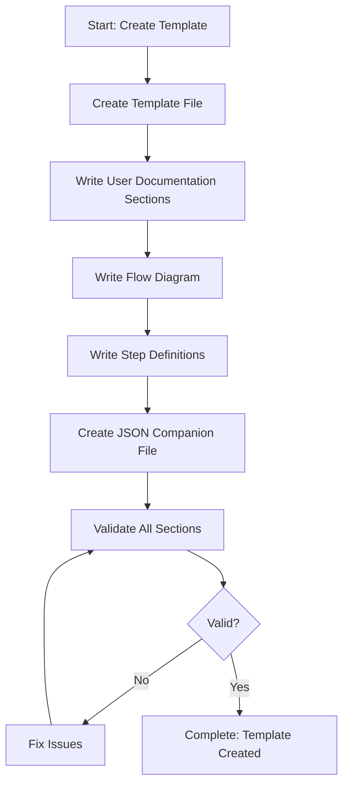

# Step: Create Template File

## Description

Create a template file in `~/.claude/agentic-processes/templates/{category}/` with proper filename and all required sections. Includes user documentation in MD and complete step definitions in JSON.

## Purpose & Usage

Use this step when you need to:
- Create a new process template file
- Define a reusable workflow for common tasks
- Establish standardized process structure

**Output**: Complete template MD file (user docs) and JSON file (step definitions), validation reports.

## Quick Reference

| File | Content |
|------|---------|
| `{template-name}.md` | Description, Purpose & Usage, Quick Reference, Flow diagram, Steps checklist |
| `{template-name}.json` | Metadata, parameters, steps with full context, guidance |

| Section | Required | Purpose |
|---------|----------|---------|
| Description | Yes | What the template does |
| Parameters | Yes | Required/optional inputs |
| Process Flow | Yes | Mermaid diagram |
| Steps | Yes | Sequential step definitions |
| Continuous Improvement | Yes | Final learning step |

## Flow

