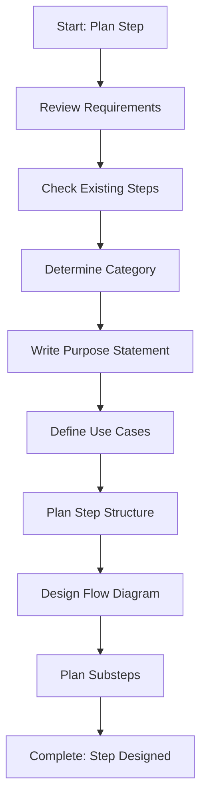

# Step: Plan and Design Step

## Description

Analyze requirements for a new step, define its purpose, identify use cases, determine category, plan structure, and design the mermaid flow diagram.

## Purpose & Usage

Use this step when you need to:
- Plan a new process step before creation
- Define step purpose and use cases
- Design step structure and flow
- Determine appropriate category

**Output**: Complete step design including purpose, structure plan, and flow diagram.

## Quick Reference

| Category | Use Case |
|----------|----------|
| api | Controller/endpoint steps |
| service | Business logic steps |
| data | Repository/database steps |
| template | Template creation steps |
| testing | Test-related steps |
| planning | Planning/design steps |
| investigation | Research and analysis steps |
| common | Cross-cutting utility steps |
| learning | Improvement steps |

## Flow

