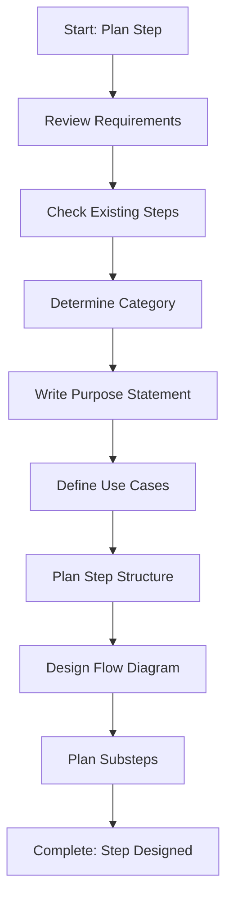

<!--
Step: Plan and Design Step
Purpose: Analyze requirements, define purpose, identify use cases, determine category, plan step structure, and design flow diagram
-->

# Step: Plan and Design Step

## Description

Analyze requirements for a new step, define its purpose, identify use cases, determine category, plan structure, and design the mermaid flow diagram.

## Purpose & Usage

Use this step when you need to:
- Plan a new process step before creation
- Define step purpose and use cases
- Design step structure and flow
- Determine appropriate category

**Output**: Complete step design including purpose, structure plan, and flow diagram.

## Quick Reference

| Category | Use Case |
|----------|----------|
| api | Controller/endpoint steps |
| service | Business logic steps |
| data | Repository/database steps |
| template | Template creation steps |
| testing | Test-related steps |
| planning | Planning/design steps |
| learning | Improvement steps |

---

## Agent Layer

### Required Components

- [mandatory-logging.md](../_components/mandatory-logging.md) - Logging guidelines

### Output (Detailed)

- Requirements document
- Purpose statement
- Use cases documentation
- Category selection with rationale
- Step structure plan
- Mermaid flow diagram code
- Substeps outline

### Guidance

<!-- @include: _components/mandatory-logging.md -->

**Specific Actions:**
- Review the need for a new step
- Check existing steps for similar patterns
- Review `.processes/steps/README.md` for categories
- Determine appropriate category
- **Emphasize simplicity**: Avoid over-engineering, keep designs focused
- **Use generic step references**: Reference "previous step" not specific numbers
- **Steps only produce outputs**: Don't include flow control logic in steps
- Write clear purpose statement
- Define when to use this step
- Plan structure following step-template.md
- Design mermaid flow diagram
- Plan substeps with clear actions

**Design Principles:**
- Agents make individual tool calls sequentially
- Tools return existing files only - no separate validation needed
- Consolidate related operations into single substeps
- Prefer unified flows over multiple branches

### Flow

### Substeps

- [ ] **Substep 1**: Review requirements and need for new step
- [ ] **Substep 2**: Check existing steps for patterns
- [ ] **Substep 3**: Determine appropriate category
- [ ] **Substep 4**: Write clear purpose statement
- [ ] **Substep 5**: Define use cases (when to use)
- [ ] **Substep 6**: Plan step structure (sections)
- [ ] **Substep 7**: Design mermaid flow diagram
- [ ] **Substep 8**: Plan substeps with actions

### Memory File Usage

**Write to**: Current step section in memory.md
- Information Produced: Purpose, category, structure plan, flow diagram
- Decisions Made: Category selection, design choices
