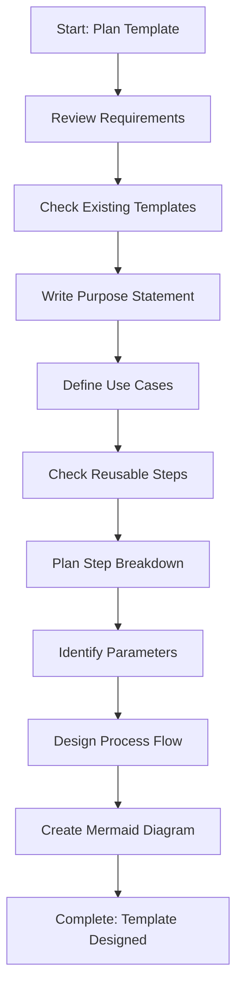

<!--
Step: Plan and Design Template
Purpose: Analyze requirements, define purpose, identify use cases, plan step breakdown, identify parameters, and design process flow
-->

# Step: Plan and Design Template

## Description

Analyze requirements for a new template, define its purpose, identify use cases, plan step breakdown, identify parameters, and design the process flow structure.

## Purpose & Usage

Use this step when you need to:
- Plan a new process template before creation
- Define template purpose and use cases
- Design step breakdown and flow
- Identify required/optional parameters

**Output**: Complete template design including purpose, parameters, steps, and flow diagram.

## Quick Reference

| Parameter Type | Description |
|----------------|-------------|
| Required | Must be provided by user |
| Optional | Helpful but not mandatory |

---

## Agent Layer

### Required Components

- [mandatory-logging.md](../_components/mandatory-logging.md) - Logging guidelines

### Output (Detailed)

- Requirements document
- Purpose statement
- Use cases documentation
- Step breakdown plan
- Required parameters list
- Optional parameters list
- Process flow structure
- Mermaid flow diagram code

### Guidance

<!-- @include: _components/mandatory-logging.md -->

**Specific Actions:**
- Review the need for a new template
- Check existing templates for similar patterns
- Write clear purpose statement
- Define when to use this template
- **Before planning steps**: Check existing generic steps in `.processes/steps/planning/` and `.processes/steps/common/`
- **When planning steps**: Prefer reusable step categories
- **When planning steps**: Ensure each step represents actual work, not flow control
- Identify required parameters (user must provide)
- Identify optional parameters (helpful but not mandatory)
- Break down workflow into logical stages
- Create mermaid flowchart diagram
- List all steps sequentially with clear outputs

**Parameter Naming:**
- Use camelCase: `featureName`, `targetBranch`
- Be descriptive and clear

### Flow

### Substeps

- [ ] **Substep 1**: Review requirements for new template
- [ ] **Substep 2**: Check existing templates for patterns
- [ ] **Substep 3**: Write clear purpose statement
- [ ] **Substep 4**: Define use cases (when to use)
- [ ] **Substep 5**: Check existing reusable steps
- [ ] **Substep 6**: Plan step breakdown with outputs
- [ ] **Substep 7**: Identify required/optional parameters
- [ ] **Substep 8**: Design process flow structure
- [ ] **Substep 9**: Create mermaid flow diagram

### Memory File Usage

**Write to**: Current step section in memory.md
- Information Produced: Purpose, parameters, step breakdown, flow diagram
- Decisions Made: Step organization, parameter choices
