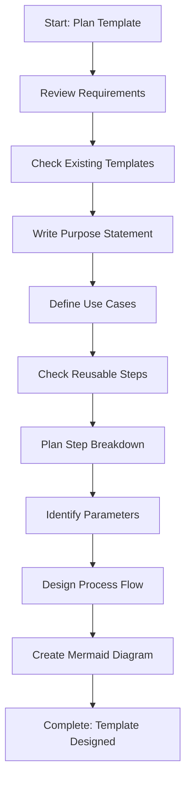

# Step: Plan and Design Template

## Description

Analyze requirements for a new template, define its purpose, identify use cases, plan step breakdown, identify parameters, and design the process flow structure.

## Purpose & Usage

Use this step when you need to:
- Plan a new process template before creation
- Define template purpose and use cases
- Design step breakdown and flow
- Identify required/optional parameters

**Output**: Complete template design including purpose, parameters, steps, and flow diagram.

## Quick Reference

| Parameter Type | Description |
|----------------|-------------|
| Required | Must be provided by user |
| Optional | Helpful but not mandatory |

| Design Consideration | Guidance |
|---------------------|----------|
| Reusable steps | Check `~/.claude/agentic-processes/steps/planning/` and `~/.claude/agentic-processes/steps/common/` |
| Parameter naming | Use camelCase: `featureName`, `targetBranch` |
| Final step | Always include continuous improvement |

## Flow

