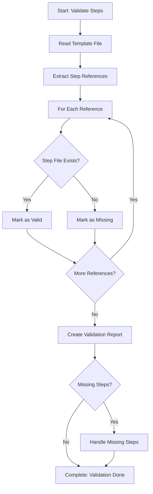

# Step: Validate Process-Steps Exist

## Description

Analyze a template to identify which process-steps are referenced and verify they exist in `.processes/steps/`.

## Purpose & Usage

Use this step when you need to:
- Validate a template's step references
- Ensure all referenced steps exist
- Identify missing steps that need to be created

**Output**: Validation report of existing vs. missing process-steps.

## Quick Reference

| Reference Format | Location |
|------------------|----------|
| `@framework-step:category/step-name` | `.processes/steps/category/step-name.md` |

| If Missing Steps | Action |
|-----------------|--------|
| Auto-spawn enabled | Spawn sub-processes to create steps |
| Manual preferred | PAUSE and list missing steps for user |

## Flow

