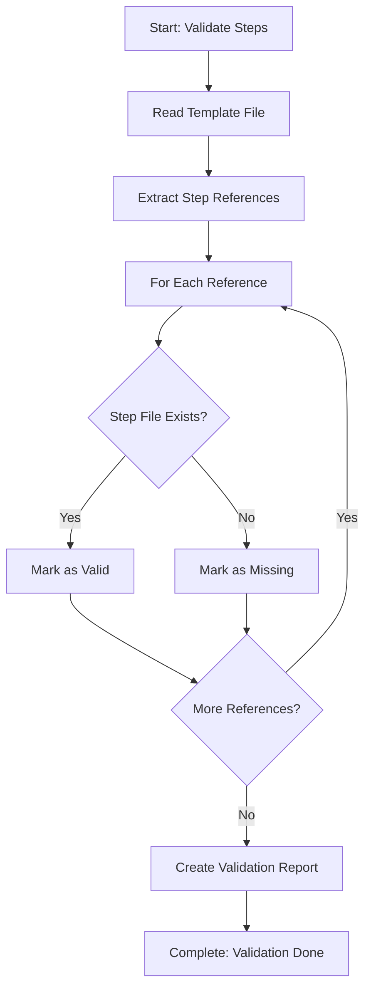

<!--
Step: Validate Process-Steps Exist
Purpose: Analyze a template to identify which process-steps are referenced and verify they exist
-->

# Step: Validate Process-Steps Exist

## Description

Analyze a template to identify which process-steps are referenced and verify they exist in `.processes/steps/`.

## Purpose & Usage

Use this step when you need to:
- Validate a template's step references
- Ensure all referenced steps exist
- Identify missing steps that need to be created

**Output**: Validation report of existing vs. missing process-steps.

## Quick Reference

| Reference Format | Location |
|------------------|----------|
| `@framework-step:category/step-name` | `.processes/steps/category/step-name.md` |

---

## Agent Layer

### Required Components

- [mandatory-logging.md](../_components/mandatory-logging.md) - Logging guidelines

### Output (Detailed)

- Validation report with existence status
- List of all referenced process-steps
- List of missing process-steps with suggested locations
- (Optional) Spawned sub-processes for missing steps if `autoSpawnMissing` is true

### Guidance

<!-- @include: _components/mandatory-logging.md -->

**Specific Actions:**
- Review each step definition in the template
- Extract all `@framework-step:category/step-name` references
- Check if each step exists in `.processes/steps/{category}/{step-name}.md`
- List missing steps with category locations
- Verify continuous improvement step exists
- Store validation results in memory

**Files/Folders:**
- Review: Template being validated
- Check: `.processes/steps/{category}/{step-name}.md`

### Flow

### Substeps

- [ ] **Substep 1**: Read template file
- [ ] **Substep 2**: Extract all `@framework-step:` references
- [ ] **Substep 3**: Check existence of each referenced step
- [ ] **Substep 4**: Create validation report
- [ ] **Substep 5**: List missing steps with suggested locations
- [ ] **Substep 6**: Handle missing steps (if any found)
  - **Option A - Sub-Process**: If template has `subProcessTrigger` configured or user approves:
    - Use `@framework-step:common/spawn-sub-process` for each missing step
    - Template: `create-process-step-template`
    - Parameters: `{ stepName, category }` for each missing step
    - Sync Point: As configured (usually "immediate")
  - **Option B - PAUSE**: If user prefers manual creation:
    - PAUSE process and notify user
    - List missing steps with locations
    - User creates manually and resumes

### Memory File Usage

**Write to**: Current step section in memory.md
- Information Produced: Validation results, missing steps list
- Decisions Made: Which steps need to be created
