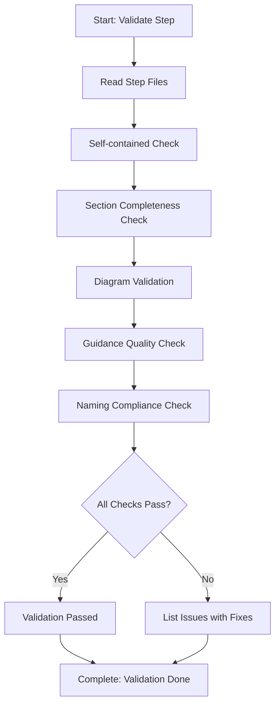

# Step: Validate Step Structure

## Description

Perform comprehensive validation of a step file to ensure it meets all requirements including section completeness, diagram validation, guidance quality, and best practices compliance.

## Purpose & Usage

Use this step when you need to:
- Validate a newly created step file
- Ensure step follows all required conventions
- Verify step is self-contained and complete

**Output**: Comprehensive validation report with pass/fail status.

## Quick Reference

| Check | Requirement |
|-------|-------------|
| Self-contained | No references to other steps |
| Section completeness | All required sections present |
| Diagram validation | Mermaid syntax correct |
| Guidance quality | Detailed and actionable |
| Naming compliance | Kebab-case filename |

| File | Required Sections |
|------|-------------------|
| MD | Description, Purpose & Usage, Quick Reference, Flow |
| JSON | metadata, output, guidance, substeps, dependencies |

## Flow

