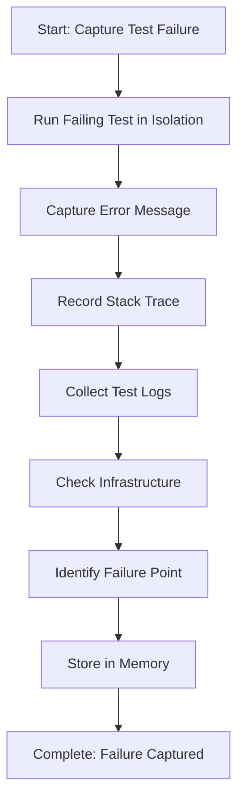

# Step: Capture Test Failure

## Description

Execute the failing integration test and systematically capture all relevant failure information including error messages, stack traces, test output, and logged information.

## Purpose & Usage

Use this step when you need to:
- Investigate a failing integration test
- Capture comprehensive failure data for diagnosis
- Document test failure information for analysis

**Output**: Complete failure information including error messages, stack traces, and test logs.

## Quick Reference

| Info Type | What to Capture |
|-----------|-----------------|
| Error message | Exception type and message |
| Stack trace | Full trace showing failure point |
| Test logs | Setup, execution, and teardown logs |
| Infrastructure | Docker, database, queue errors |

## Flow

