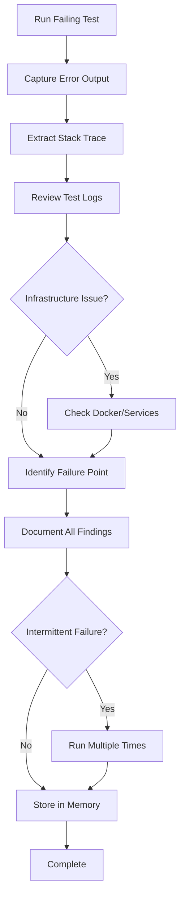

<!--
Step: Capture Test Failure
Purpose: Run failing test, capture full output including error messages, stack traces, and logs
-->

# Step: Capture Test Failure

## Required Components

- [mandatory-logging.md](_components/mandatory-logging.md) - Logging guidelines

## Description

Execute the failing integration test and systematically capture all relevant failure information including error messages, stack traces, test output, and any logged information. This comprehensive failure data will be used to diagnose the root cause in subsequent steps.

## Output

- Test execution output captured
- Error messages and exception details documented
- Stack traces recorded
- Test initialization and setup logs collected
- Failure point identified
- All findings stored in current step section of memory.md

## Guidance

<!-- @include: _components/mandatory-logging.md -->

**Specific Actions:**
- Run the specific failing test in isolation to capture clean output
- Capture the complete error message and exception type
- Record the full stack trace showing the failure point
- Check test initialization logs for setup issues
- Review any console output or logging during test execution
- Note any infrastructure errors (Docker, database, message queue)
- Identify the exact line of test code where the failure occurs
- Check if failure is consistent or intermittent

**Files/Folders:**
- Work in: `{{testProject}}` (default: `Tests/IntegrationTests`)
- Test class: `{{testClass}}`
- Specific test: `{{testName}}`

**Tools:**
- Run specific test: `dotnet test --filter "FullyQualifiedName~{{testClass}}.{{testName}}"`
- Run with verbose output: `dotnet test --filter "FullyQualifiedName~{{testClass}}.{{testName}}" --verbosity detailed`
- Check Docker logs if needed: `docker-compose logs`
- Review test output in TestResults folder if generated

**Best Practices:**
- Run the test multiple times if failure seems intermittent
- Capture output in verbose mode for maximum detail
- Don't modify any code yet - just observe and document (except for adding temporary logging)
- Look for patterns in error messages
- Note any recent changes to test infrastructure or dependencies
- **If needed, add temporary logging statements** to capture more details about test execution:
  - Add logs before and after critical operations to understand execution flow
  - Log variable values, method parameters, and return values at key points
  - Include timestamps to identify timing-related issues
  - **IMPORTANT**: Mark all temporary logging with comments like `// TODO: REMOVE - Added by agent for debugging`
  - Remove all temporary logging once the issue is diagnosed and fixed

## Memory Usage

**When to Use Memory:**
- Always use memory for this step - it's the foundation for diagnosis
- Store all captured failure information for later analysis
- Create structured documentation that can be referenced by subsequent steps

**Memory Usage for This Step:**
- **Write to**: Current step section in memory.md - Store complete test failure information including:
  - Information Produced:
    - Test name and location
    - Full error message and exception type
    - Complete stack trace
    - Test execution output
    - Infrastructure status (Docker, services)
    - Identified failure point in test code
    - Notes on consistency (always fails, intermittent)
    - Any relevant context ({{failureDescription}} if provided)
  - Files Modified/Created: (if temporary logging was added)
  - Notes: Any observations about the failure pattern

## Flow

### Substeps

- [ ] **Substep 1**: Run the specific failing test using `dotnet test --filter "FullyQualifiedName~{{testClass}}.{{testName}}" --verbosity detailed`
- [ ] **Substep 2**: Capture the complete error message and exception type from test output
- [ ] **Substep 3**: Extract and record the full stack trace showing where the failure occurred
- [ ] **Substep 4**: Review test initialization and setup code execution in the output
- [ ] **Substep 5**: Check for any infrastructure issues (Docker containers, database connections, message queues)
- [ ] **Substep 6**: Identify the exact line in the test code where the failure occurs
- [ ] **Substep 7**: **If needed for diagnosis**, add temporary logging statements to capture additional details:
  - Add logs at critical points in test execution (marked with `// TODO: REMOVE - Added by agent for debugging`)
  - Log variable values, service states, or intermediate results
  - Re-run the test with the additional logging
  - Capture the enhanced output
  - **Remember to remove these temporary logs after diagnosis**
- [ ] **Substep 8**: If failure seems intermittent, run the test 3-5 times to check consistency
- [ ] **Substep 9**: Update current step section in memory.md with all captured information:
  - Information Produced:
    - Test identification (name, class, project, description)
    - Error summary (exception type, message)
    - Stack trace (full trace with line numbers)
    - Test output (relevant console/log output)
    - Infrastructure status (Docker, services, connections)
    - Failure point (exact location in test code)
    - Consistency analysis (always fails, intermittent, conditions)
  - Files Modified/Created: List any files with temporary logging added (if applicable)
  - Notes: Reminder to remove temporary logging after diagnosis (if added)

**Notes:**
- Don't attempt to fix anything in this step - focus on observation (except adding temporary logging if needed for better visibility)
- The more detail captured now, the easier diagnosis will be later
- If test setup fails, that's important information to capture
- Infrastructure issues should be clearly distinguished from test logic issues
- Temporary debug logging is acceptable for diagnosis but must be marked clearly and removed after fixing
- Use standard comment format for all temporary logs: `// TODO: REMOVE - Added by agent for debugging`
