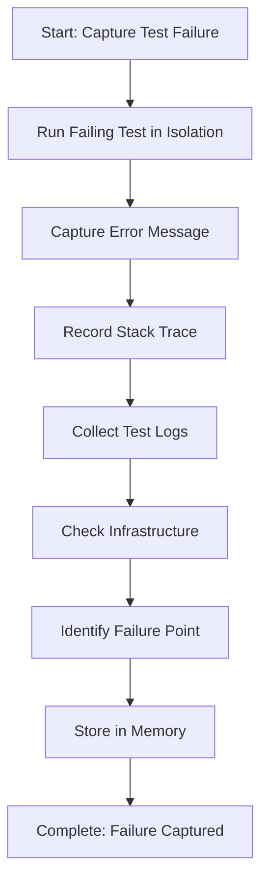

<!--
Step: Capture Test Failure
Purpose: Run failing test, capture full output including error messages, stack traces, and logs
-->

# Step: Capture Test Failure

## Description

Execute the failing integration test and systematically capture all relevant failure information including error messages, stack traces, test output, and logged information.

## Purpose & Usage

Use this step when you need to:
- Investigate a failing integration test
- Capture comprehensive failure data for diagnosis
- Document test failure information for analysis

**Output**: Complete failure information including error messages, stack traces, and test logs.

## Quick Reference

| Info Type | What to Capture |
|-----------|-----------------|
| Error message | Exception type and message |
| Stack trace | Full trace showing failure point |
| Test logs | Setup, execution, and teardown logs |
| Infrastructure | Docker, database, queue errors |

---

## Agent Layer

### Required Components

- [mandatory-logging.md](../_components/mandatory-logging.md) - Logging guidelines

### Output (Detailed)

- Test execution output captured
- Error messages and exception details documented
- Stack traces recorded
- Test initialization logs collected
- Failure point identified
- All findings stored in memory.md

### Guidance

<!-- @include: _components/mandatory-logging.md -->

**Specific Actions:**
- Run the specific failing test in isolation
- Capture complete error message and exception type
- Record full stack trace
- Check test initialization logs
- Review console output and logging
- Note infrastructure errors (Docker, database, queue)
- Identify exact failure line
- Check if failure is consistent or intermittent

**Files/Folders:**
- Work in: `{{testProject}}` (default: `Tests/IntegrationTests`)
- Test class: `{{testClass}}`
- Specific test: `{{testName}}`

**Tools:**
- Run test: `dotnet test --filter "FullyQualifiedName~{{testClass}}.{{testName}}"`
- Verbose: `dotnet test --filter "..." --verbosity detailed`
- Docker logs: `docker-compose logs`

### Flow

### Substeps

- [ ] **Substep 1**: Run failing test in isolation to capture clean output
- [ ] **Substep 2**: Capture complete error message and exception type
- [ ] **Substep 3**: Record full stack trace
- [ ] **Substep 4**: Check test initialization and setup logs
- [ ] **Substep 5**: Note any infrastructure errors
- [ ] **Substep 6**: Identify exact line where failure occurs
- [ ] **Substep 7**: Store all findings in memory.md

### Memory File Usage

**Write to**: Current step section in memory.md
- Information Produced: Error messages, stack traces, failure point
- Decisions Made: Failure consistency (intermittent vs consistent)
