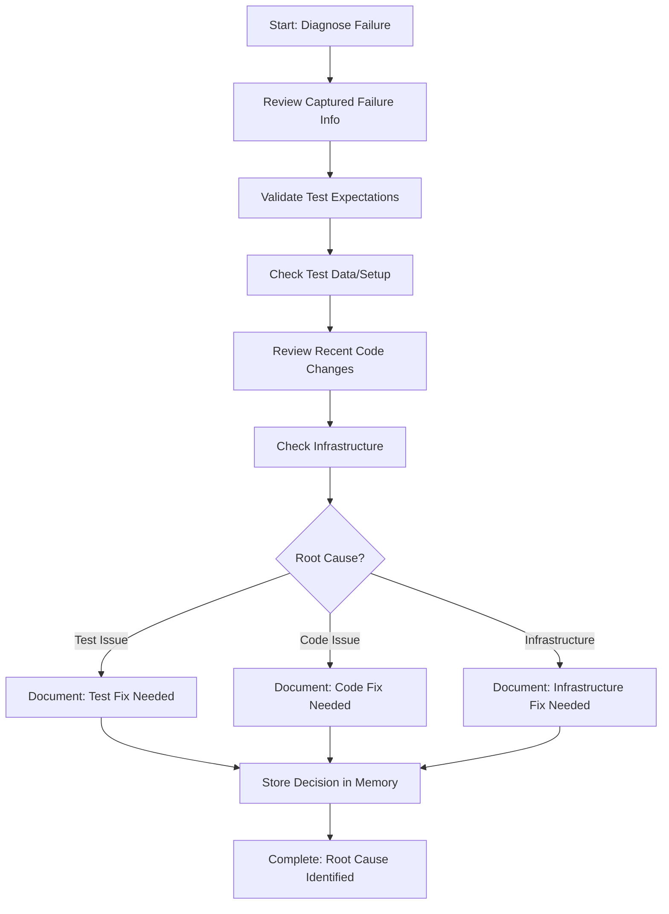

# Step: Diagnose Integration Test Failure

## Description

Systematically analyze captured test failure information to determine root cause. Distinguish between test logic issues, application code bugs, or infrastructure problems.

## Purpose & Usage

Use this step when you need to:
- Analyze captured test failure information
- Determine root cause category (test, code, or infrastructure)
- Make informed decision about what needs fixing

**Output**: Root cause identified and categorized with documented rationale.

## Quick Reference

| Category | Description | Fix Target |
|----------|-------------|------------|
| Test Issue | Wrong assertions, bad test data | Test code |
| Code Issue | Bug in application code | Application code |
| Infrastructure | Setup, Docker, mocks broken | Infrastructure/setup |

## Flow

