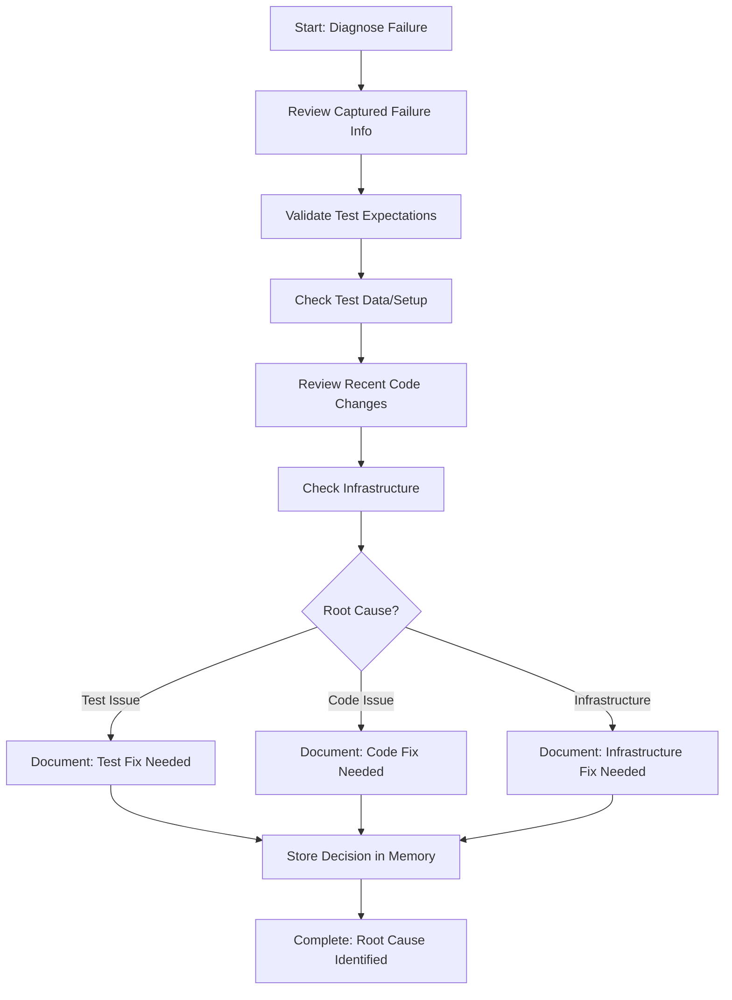

<!--
Step: Diagnose Integration Test Failure
Purpose: Analyze test failure to identify root cause - test logic issue, code bug, or infrastructure problem
-->

# Step: Diagnose Integration Test Failure

## Description

Systematically analyze captured test failure information to determine root cause. Distinguish between test logic issues, application code bugs, or infrastructure problems.

## Purpose & Usage

Use this step when you need to:
- Analyze captured test failure information
- Determine root cause category (test, code, or infrastructure)
- Make informed decision about what needs fixing

**Output**: Root cause identified and categorized with documented rationale.

## Quick Reference

| Category | Description | Fix Target |
|----------|-------------|------------|
| Test Issue | Wrong assertions, bad test data | Test code |
| Code Issue | Bug in application code | Application code |
| Infrastructure | Setup, Docker, mocks broken | Infrastructure/setup |

---

## Agent Layer

### Required Components

- [mandatory-logging.md](../_components/mandatory-logging.md) - Logging guidelines

### Output (Detailed)

- Root cause identified and categorized
- Test logic correctness validated
- Test data and setup reviewed
- Recent code changes analyzed
- Decision rationale documented

### Guidance

<!-- @include: _components/mandatory-logging.md -->

**Specific Actions:**
- Review test failure information from previous step
- Validate test expectations match business requirements
- Check test assertions are correct
- Review test data setup (mocks, fixtures, databases)
- Examine recent code changes
- Check infrastructure configuration
- Distinguish: "test is wrong" vs "code is wrong" vs "setup is wrong"
- Document reasoning

**Files/Folders:**
- Read from: Previous step in memory.md
- Work in: `{{testProject}}`
- May review: Application code, test setup, Docker config

**Tools:**
- Check git history: `git log --oneline --all --since="2 weeks ago" -- <file>`
- Read test code and application code
- Examine test setup code

### Flow

### Substeps

- [ ] **Substep 1**: Review failure info from previous step
- [ ] **Substep 2**: Validate test expectations against requirements
- [ ] **Substep 3**: Check test assertions correctness
- [ ] **Substep 4**: Review test data setup
- [ ] **Substep 5**: Examine recent code changes
- [ ] **Substep 6**: Check infrastructure configuration
- [ ] **Substep 7**: Categorize root cause
- [ ] **Substep 8**: Document decision rationale

### Memory File Usage

**Read from**: Previous step - captured failure information
**Write to**: Current step section in memory.md
- Information Produced: Root cause category, analysis results
- Decisions Made: What needs to be fixed and why
