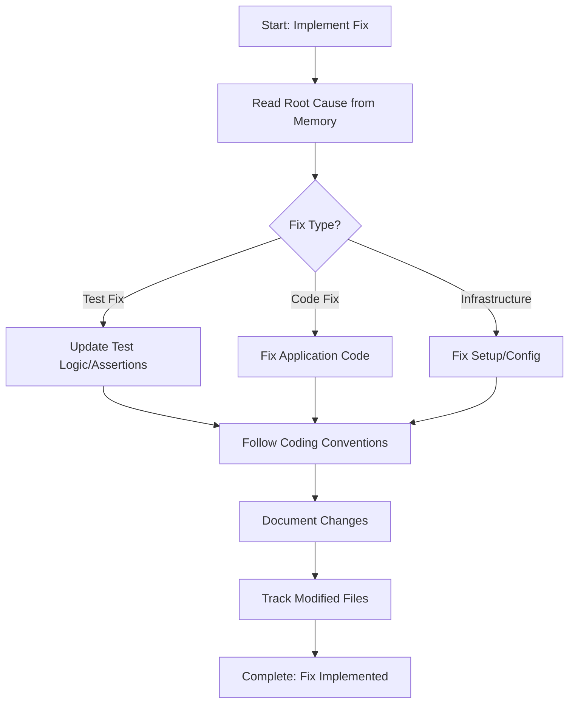

<!--
Step: Implement Integration Test Fix
Purpose: Implement the fix based on root cause analysis - test fix, code fix, or infrastructure fix
-->

# Step: Implement Integration Test Fix

## Description

Implement the appropriate fix based on root cause analysis. Handle three fix branches: test logic updates, application code fixes, or infrastructure corrections.

## Purpose & Usage

Use this step when you need to:
- Fix failing test based on diagnosed root cause
- Update test logic/assertions (test fix branch)
- Fix application code bugs (code fix branch)
- Correct infrastructure/setup issues (infrastructure fix branch)

**Output**: Fix implemented according to root cause analysis.

## Quick Reference

| Fix Branch | What to Fix | Location |
|------------|-------------|----------|
| Test Fix | Test logic, assertions, data | Test project |
| Code Fix | Application bugs | Service, Repository, Controller |
| Infrastructure Fix | Setup, mocks, Docker | Test base, fixtures, config |

---

## Agent Layer

### Required Components

- [mandatory-logging.md](../_components/mandatory-logging.md) - Logging guidelines

### Output (Detailed)

- Fix implemented according to root cause
- Test code updated (if test fix)
- Application code fixed (if code fix)
- Infrastructure corrected (if infrastructure fix)
- Modified files tracked

### Guidance

<!-- @include: _components/mandatory-logging.md -->

**Specific Actions:**
- Read previous step to understand what needs fixing
- Follow appropriate fix branch:
  - **Branch A - Test Fix**: Update test logic, assertions, expected values, test data
  - **Branch B - Code Fix**: Fix application code bugs
  - **Branch C - Infrastructure Fix**: Update test setup, base classes, Docker, mocks
- Follow project coding conventions
- Keep fix minimal and focused
- Document all changes

**Files/Folders:**
- Read from: Previous step in memory.md
- Test fixes: `{{testProject}}`
- Code fixes: `Service/`, `Repositories/`, `WebApi/Controllers/`
- Infrastructure fixes: Test base classes, Docker configs

### Flow

### Substeps

- [ ] **Substep 1**: Read root cause from previous step
- [ ] **Substep 2**: Identify fix branch (Test/Code/Infrastructure)
- [ ] **Substep 3**: Implement focused fix following conventions
- [ ] **Substep 4**: Document all changes made
- [ ] **Substep 5**: Track modified files

### Memory File Usage

**Read from**: Previous step - root cause analysis
**Write to**: Current step section in memory.md
- Information Produced: Fix details, changes made
- Files Modified/Created: All files changed
