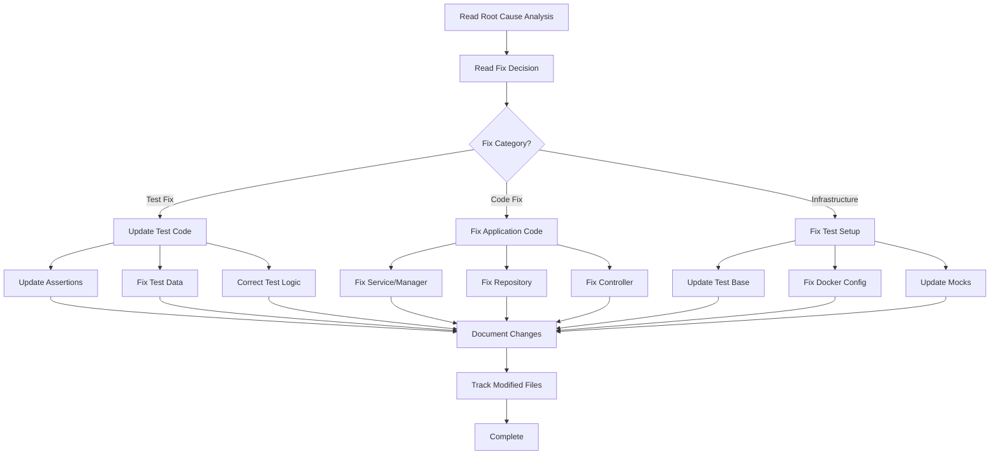

<!--
Step: Implement Integration Test Fix
Purpose: Implement the fix based on root cause analysis - test fix, code fix, or infrastructure fix
-->

# Step: Implement Integration Test Fix

## Required Components

- [mandatory-logging.md](_components/mandatory-logging.md) - Logging guidelines

## Description

Implement the appropriate fix based on the root cause analysis from the previous step. This step handles three distinct fix branches: updating test logic/assertions (test fix), fixing application code bugs (code fix), or correcting test infrastructure/setup (infrastructure fix). The implementation is guided by the root cause determination and documented decision rationale.

## Output

- Fix implemented according to root cause analysis
- Test code updated (if test fix branch)
- Application code fixed (if code fix branch)
- Infrastructure/setup corrected (if infrastructure fix branch)
- Implementation details documented in current step section of memory.md
- Modified files tracked in Files Modified/Created subsection
- Temporary debug logging retained (will be removed after test passes)

## Guidance

<!-- @include: _components/mandatory-logging.md -->

**Specific Actions:**
- Read previous step sections in memory.md to understand what needs to be fixed
- Follow the appropriate fix branch based on root cause category
- **Branch A - Test Fix**: Update test logic, assertions, expected values, or test data
- **Branch B - Code Fix**: Fix bugs in application code (services, managers, repositories, controllers)
- **Branch C - Infrastructure Fix**: Update test setup, base classes, Docker configuration, or mocks
- Follow project coding conventions and patterns
- Ensure fix is minimal and focused on the identified issue
- Remove any temporary debug logging added during diagnosis
- Document all changes made
- Track which files were modified

**Files/Folders:**
- Read from: Previous step sections in memory.md
- Work in: Depends on fix type
  - Test fixes: `{{testProject}}` (default: `Tests/IntegrationTests`)
  - Code fixes: `Service/`, `Repositories/`, `WebApi/Controllers/`, etc.
  - Infrastructure fixes: Test base classes, Docker configs, test fixtures

**Tools:**
- Use appropriate edit tools (replace_string_in_file, insert_edit_into_file)
- Search for related code if needed (grep_search, semantic_search)
- Read files to understand context before editing
- Review project coding conventions in `.user-processes/guidelines/`

**Best Practices:**
- Make minimal, focused changes addressing only the identified issue
- Follow existing code patterns and conventions
- Maintain consistency with surrounding code style
- Don't introduce unrelated changes or refactoring
- Preserve existing functionality not related to the fix
- Add comments if the fix requires explanation
- **Keep temporary debug logging** - it will be removed AFTER the test passes in a later step
- Test-related changes should maintain test readability and clarity
- Code fixes should follow SOLID principles and project architecture

## Memory Usage

**When to Use Memory:**
- Always use memory for this step to document implementation
- Read from previous analysis to understand what to fix
- Write comprehensive notes about changes made

**Memory Usage for This Step:**
- **Read from**: Previous step sections in memory.md - Root cause analysis and fix decision
- **Write to**: Current step section in memory.md:
  - Information Produced:
    - Fix category (test/code/infrastructure)
    - Summary of changes made
    - Rationale for implementation approach
    - Any assumptions or considerations
    - Note about temporary logging that will be removed after test passes
  - Decisions Made: Implementation approach choices
  - Files Modified/Created:
    - Full file path for each changed file
    - Type of change (test update, code fix, infrastructure change)
    - Brief description of what was changed
  - Notes: Additional context or observations

## Flow

### Substeps

- [ ] **Substep 1**: Read previous step sections in memory.md to understand the identified root cause and fix category
- [ ] **Substep 2**: Review the proposed fix approach and rationale from previous steps
- [ ] **Substep 3**: Identify all files that need to be modified based on the fix decision
- [ ] **Substep 4**: **Branch A - Test Fix** (if root cause is test issue):
  - [ ] 4a. Read the test file (`{{testClass}}`) to understand current implementation
  - [ ] 4b. Update test assertions to match correct expected behavior
  - [ ] 4c. Fix test data setup or test fixtures
  - [ ] 4d. Correct test logic or test flow
  - [ ] 4e. Update test documentation/comments if needed
- [ ] **Substep 5**: **Branch B - Code Fix** (if root cause is code bug):
  - [ ] 5a. Locate the application code file with the bug (service, manager, repository, controller)
  - [ ] 5b. Read the code to understand current implementation
  - [ ] 5c. Implement the fix following project patterns and SOLID principles
  - [ ] 5d. Ensure fix doesn't break other functionality
  - [ ] 5e. Follow project coding conventions from `.user-processes/guidelines/`
- [ ] **Substep 6**: **Branch C - Infrastructure Fix** (if root cause is infrastructure issue):
  - [ ] 6a. Identify infrastructure component to fix (test base, Docker, mocks)
  - [ ] 6b. Read current configuration/setup code
  - [ ] 6c. Update test base class or setup methods
  - [ ] 6d. Fix Docker configuration or container setup
  - [ ] 6e. Update mock configurations or test dependencies
  - [ ] 6f. Add health checks or readiness waits if needed
- [ ] **Substep 7**: Update current step section in memory.md with complete implementation documentation:
  - Information Produced:
    - Fix category and summary
    - Detailed description of changes made
    - Rationale for implementation approach
    - Any assumptions or design decisions
    - Note about temporary logging that will be removed after test passes
  - Decisions Made: Implementation approach choices
  - Files Modified/Created:
    - Full path of each modified file
    - Type of change (test update, code fix, infrastructure change)
    - Brief description of what was changed in each file
  - Notes: Additional context or observations

**Notes:**
- Stay focused on the identified issue - don't introduce scope creep
- Follow the project's established patterns and conventions
- Make sure changes are consistent with the codebase style
- If fix requires changes to multiple files, ensure they work together cohesively
- **Don't remove debug logging yet** - it will be removed after test passes in the verification step
- Document thoroughly so the validation step can verify the fix properly
