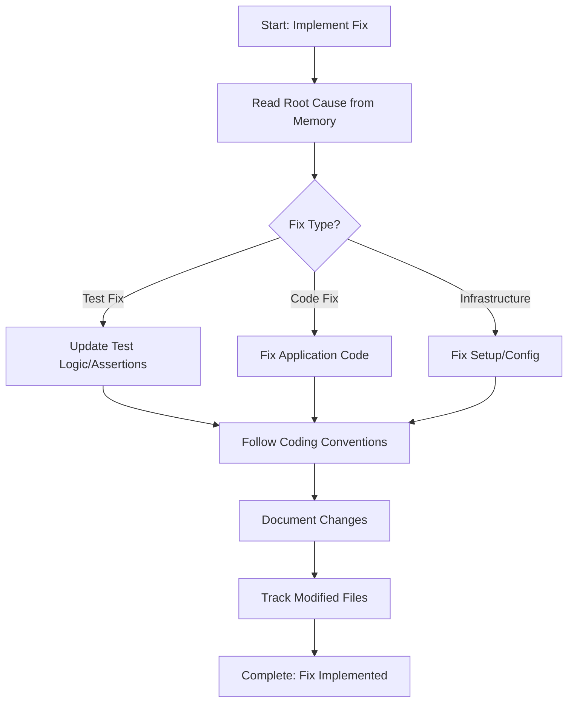

# Step: Implement Integration Test Fix

## Description

Implement the appropriate fix based on root cause analysis. Handle three fix branches: test logic updates, application code fixes, or infrastructure corrections.

## Purpose & Usage

Use this step when you need to:
- Fix failing test based on diagnosed root cause
- Update test logic/assertions (test fix branch)
- Fix application code bugs (code fix branch)
- Correct infrastructure/setup issues (infrastructure fix branch)

**Output**: Fix implemented according to root cause analysis.

## Quick Reference

| Fix Branch | What to Fix | Location |
|------------|-------------|----------|
| Test Fix | Test logic, assertions, data | Test project |
| Code Fix | Application bugs | Service, Repository, Controller |
| Infrastructure Fix | Setup, mocks, Docker | Test base, fixtures, config |

## Flow

