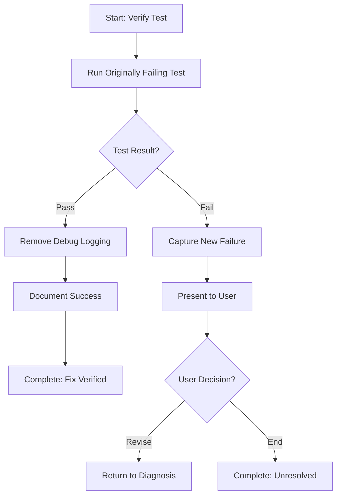

# Step: Verify Test Passes

## Description

Execute the originally failing test to verify the fix works. If passed, clean up any temporary debug logging. If failed, present options to continue debugging.

## Purpose & Usage

Use this step when you need to:
- Verify implemented fix resolves the test failure
- Clean up temporary debug code after successful fix
- Handle continued failures with user options

**Output**: Test verification results and cleanup of debug code.

## Quick Reference

| Result | Action |
|--------|--------|
| Pass | Clean up debug logging, document success |
| Fail | Capture new failure, present user options |

## Flow

