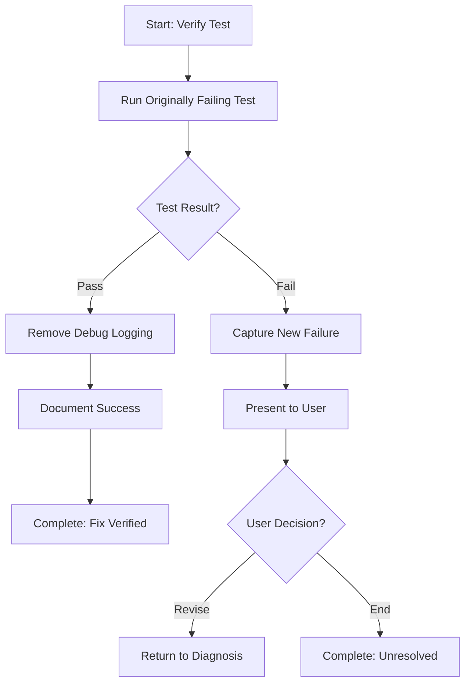

<!--
Step: Verify Test Passes
Purpose: Run the originally failing test to verify the fix works, and clean up temporary debug logging
-->

# Step: Verify Test Passes

## Description

Execute the originally failing test to verify the fix works. If passed, clean up any temporary debug logging. If failed, present options to continue debugging.

## Purpose & Usage

Use this step when you need to:
- Verify implemented fix resolves the test failure
- Clean up temporary debug code after successful fix
- Handle continued failures with user options

**Output**: Test verification results and cleanup of debug code.

## Quick Reference

| Result | Action |
|--------|--------|
| Pass | Clean up debug logging, document success |
| Fail | Capture new failure, present user options |

---

## Agent Layer

### Required Components

- [mandatory-logging.md](../_components/mandatory-logging.md) - Logging guidelines

### Output (Detailed)

- Test execution results captured
- Pass/fail status determined
- If passed: Debug logging removed, success confirmed
- If failed: New failure captured, user options presented

### Guidance

<!-- @include: _components/mandatory-logging.md -->

**Specific Actions:**
- Run the specific test that was failing
- Capture complete test output
- Determine pass/fail status
- **If passed:**
  - Remove temporary debug logging (marked with `// TODO: REMOVE - Added by agent for debugging`)
  - Verify no debug artifacts remain
  - Document successful fix
- **If failed:**
  - Capture new failure information
  - Present to user
  - Offer: revise analysis, add diagnostics, or end process
  - Wait for user decision

**Files/Folders:**
- Read from: Previous step in memory.md
- Work in: `{{testProject}}`
- Test to run: `{{testClass}}.{{testName}}`
- Files to clean: Those with temporary debug logging

**Tools:**
- Run test: `dotnet test --filter "FullyQualifiedName~{{testClass}}.{{testName}}"`

### Flow

### Substeps

- [ ] **Substep 1**: Run the originally failing test
- [ ] **Substep 2**: Capture complete output
- [ ] **Substep 3**: Determine pass/fail
- [ ] **Substep 4 (if pass)**: Remove temporary debug logging
- [ ] **Substep 4 (if fail)**: Capture new failure, present options to user
- [ ] **Substep 5**: Document final status

### Memory File Usage

**Read from**: Previous step - files modified
**Write to**: Current step section in memory.md
- Information Produced: Test results, final status
- Decisions Made: Success/failure, next steps (if failed)
