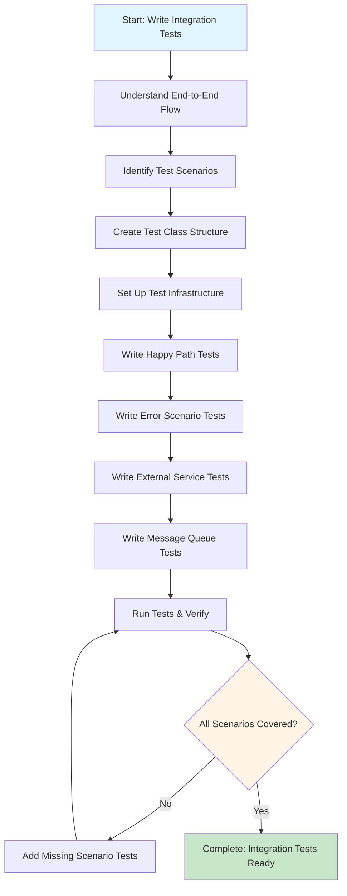

# Process Step: Write Integration Tests

## Required Components

- [mandatory-logging.md](_components/mandatory-logging.md) - Logging guidelines
- `.github/instructions/code-conventions.instructions.md` - Code conventions
- Project-specific integration testing patterns documentation
- Project-specific test data generation patterns documentation
- Project-specific assertion patterns documentation

## Step Metadata
- **Prerequisites**: Components implemented (API/Subscribers/Services), integration test infrastructure available
- **Outputs**: Comprehensive end-to-end integration test files with full scenario coverage

## Description

This step guides the creation of comprehensive integration tests that verify the complete flow of system components working together. Integration tests can be triggered by various entry points: API endpoints (HTTP requests), message queue subscribers (Kafka messages), or scheduled jobs. These tests validate the entire system working together, including business logic, database interactions, external service integration, and message processing. Integration tests ensure that all components integrate correctly and that the system behaves as expected in realistic scenarios.

## Guidance

<!-- @include: _components/mandatory-logging.md -->

## When to Use This Step

Use this step when you need to:
- Create integration tests for newly implemented API endpoints (HTTP-triggered flows)
- Create integration tests for message queue subscribers (Kafka-triggered flows)
- Create integration tests for scheduled jobs or background processes
- Add end-to-end test coverage for new features
- Verify complex workflows involving multiple services
- Test integration with external services (via mocks)
- Validate message queue publishing and consumption
- Test database transactions and data persistence

## Context Parameters

These parameters should be provided when executing this step:

- `componentType`: Type of component being tested (e.g., "API Controller", "Subscriber", "Background Job")
- `componentName`: Name of the component being tested (e.g., "FundsController", "PaymentStateEventConsumer")
- `componentNamespace`: Full namespace of the component
- `triggerMechanism`: How the flow is triggered (e.g., "HTTP request", "Kafka message", "Timer")
- `scenariosToTest`: List of business scenarios to test (e.g., ["Happy flow", "Validation failure", "External service unavailable"])
- `externalServices`: List of external services that need to be mocked
- `messageQueues`: List of message queues involved in the flow (publishing or consuming)

## Flow Diagram

## Integration Test Patterns Reference

For comprehensive integration test patterns and examples, see: Project-specific integration testing best practices

### Quick Decision Guide

**When to create WireMock helpers:**
- ✅ Create helper class if multiple tests need to verify same external API
- ✅ Use lazy initialization pattern in `InitWiremock` for performance
- ✅ Use `ConcurrentBag` for parallel test support

**WireMock patterns:**
- Use callback to capture requests in `ConcurrentBag`
- Parse nested JSON carefully (deserialize twice if needed)
- Assert on timestamps to verify fresh test data
- Use `FirstOrDefault()` or `Where()` instead of Clear methods

**Examples from this project:**
- `MockIpcnSenderApi` - WireMock helper with lazy initialization
- `InitWiremock.IpcnSenderApi` - Lazy property pattern
- `AssertIpcnNotificationSent()` - Timestamp assertion pattern

## Implementation Steps

### 1. Understand End-to-End Flow
- [ ] Review the complete user story and acceptance criteria
- [ ] Identify the trigger mechanism ({{triggerMechanism}}): HTTP request, Kafka message, timer, etc.
- [ ] Map the full flow through all layers (from trigger to completion)
- [ ] Identify all external service dependencies and their mock requirements
- [ ] Understand message queue interactions (publishers/subscribers)
- [ ] Review database operations and expected data changes
- [ ] Document the complete flow in test comments or documentation

### 2. Identify Test Scenarios
- [ ] List all happy path scenarios (successful operations)
- [ ] List validation failure scenarios (bad requests, missing data)
- [ ] List business logic error scenarios (conflicts, invalid state transitions)
- [ ] List external service failure scenarios (timeouts, unavailable, errors)
- [ ] List message queue scenarios (message processing, failures)
- [ ] List data persistence scenarios (transactions, rollbacks, queries)
- [ ] Document expected outcomes for each scenario

### 3. Create Test Class Structure
- [ ] Create test file in appropriate directory under `Tests/IntegrationTests/`:
  - `Controllers/` for API endpoint tests
  - `Subscribers/` for message queue subscriber tests
  - Or relevant subdirectory based on component type
- [ ] Inherit from `IntegrationTestsBase` to access shared infrastructure
- [ ] Add test class attributes following project conventions
- [ ] Add `[TestInitialize]` method for test-specific setup if needed
- [ ] Add test context and data bucket for sharing state
- [ ] Reference existing integration tests for structural patterns

### 4. Set Up Test Infrastructure
- [ ] Identify required WireMock setups for external services ({{externalServices}})
- [ ] Prepare test data using project's test data generation patterns
- [ ] Set up authentication/authorization if required
- [ ] Configure test-specific settings or overrides
- [ ] Reference project-specific integration testing patterns
- [ ] Reference project-specific test data generation patterns

### 5. Write Happy Path Tests
- [ ] For each scenario in {{scenariosToTest}}, create happy path test
- [ ] Use Story Builder pattern if testing complex workflows
- [ ] Set up WireMock stubs for external service responses
- [ ] Trigger the flow based on {{triggerMechanism}}:
  - **API endpoints**: Make HTTP request using HttpClient
  - **Subscribers**: Publish Kafka message to trigger consumer
  - **Background jobs**: Invoke job method or wait for scheduled execution
- [ ] Assert expected outcomes based on component type:
  - **API**: HTTP response status and structure
  - **Subscribers**: Processing completion and side effects
  - **Jobs**: Successful execution and results
- [ ] Verify database state changes using MongoDBContext
- [ ] Verify external service interactions via WireMock verification
- [ ] Verify message queue messages published (if applicable)
- [ ] Follow AAA pattern with clear section comments
- [ ] Reference project-specific integration testing patterns

### 6. Write Validation and Error Scenario Tests
- [ ] Test invalid request payloads (missing required fields, invalid formats)
- [ ] Test business validation failures (conflicts, invalid state)
- [ ] Test authorization failures (missing permissions, invalid tokens)
- [ ] Assert appropriate HTTP status codes (400, 401, 403, 404, 409, etc.)
- [ ] Assert error response structure and messages
- [ ] Verify no unwanted side effects in database
- [ ] Reference project-specific integration testing patterns

### 7. Write External Service Integration Tests
- [ ] For each external service in {{externalServices}}, create failure tests
- [ ] Mock external service timeouts using WireMock delays
- [ ] Mock external service errors (500, 503, etc.)
- [ ] Mock external service unavailability
- [ ] Verify system error handling and retry logic
- [ ] Verify fallback behaviors if applicable
- [ ] Assert appropriate error responses to client
- [ ] Reference project-specific integration testing patterns

### 8. Write Message Queue Tests (if applicable)
- [ ] For each message queue in {{messageQueues}}, create tests
- [ ] If testing message **publishing**:
  - Trigger the flow (API call, job execution, etc.)
  - Verify message was published to the correct queue
  - Verify message format and content
- [ ] If testing message **consumption** (subscribers):
  - Publish test message to Kafka
  - Wait for subscriber to process message
  - Verify database state after message processing
  - Test subscriber error handling and retry logic
- [ ] Reference existing subscriber tests in `Tests/IntegrationTests/Subscribers/`

### 9. Use Story Builder Pattern for Complex Flows
- [ ] For multi-step workflows, use Story Builder pattern
- [ ] Create story context with data bucket for state sharing
- [ ] Chain story actions in fluent API style
- [ ] Use callbacks for test-specific customizations
- [ ] Verify state at each step via `Refresh()` method
- [ ] Reference project-specific integration testing patterns
- [ ] Review existing story-based tests in `Tests/IntegrationTests/Stories/`

### 10. Run Tests and Verify
- [ ] Run all integration tests
- [ ] Verify all tests pass

### 11. Verification Checklist
- [ ] Test class follows project structure and conventions
- [ ] Tests inherit from `IntegrationTestsBase`
- [ ] All test methods are properly decorated/attributed
- [ ] Test names clearly describe the scenario being tested
- [ ] Tests follow AAA pattern with appropriate comments
- [ ] WireMock is used for all external service mocking
- [ ] Database state is verified after operations
- [ ] External service interactions are verified when critical
- [ ] Tests are isolated and don't depend on execution order
- [ ] All business scenarios from requirements are covered
- [ ] Tests follow existing patterns in the codebase

## Reference Documentation

- **Existing Integration Test Patterns**: Review test files in `Tests/IntegrationTests/` for:
  - `Controllers/` - API endpoint tests (HTTP-triggered)
  - `Subscribers/` - Message queue subscriber tests (Kafka-triggered)
  - Test class organization and base class usage
  - WireMock setup and stub patterns
  - Story Builder pattern usage
  - HttpClient usage for API calls
  - Kafka message publishing and consumption patterns
  - Database verification patterns
- **Testing Best Practices**:
  - Project-specific integration testing patterns
  - Project-specific test data generation patterns
  - Project-specific assertion patterns
- **Test Infrastructure**:
  - `Tests/IntegrationTests/IntegrationTestsBase.cs` - Base class with shared setup
  - `Tests/IntegrationTests/Initializers/` - Infrastructure initialization
  - `Tests/IntegrationTests/Helpers/` - Helper utilities
  - `Tests/IntegrationTests/Stories/` - Story Builder pattern examples
- **Code Conventions**: Follow project's coding guidelines and conventions

## Best Practices

Refer to the following resources for implementation guidance:

**Integration Test-Specific Best Practices:**
- **Test Infrastructure**: Understand TestServer, HttpClient, Docker containers, WireMock setup, and database isolation
- **Story Builder Pattern**: For complex workflows - fluent API, story context, data bucket, callbacks
- **WireMock Integration**: Reference project-specific patterns for external service mocking, stubs, and failure simulation
- **Database Testing**: Reference project-specific patterns for MongoDB verification, cleanup, and transactions
- **HTTP Client Testing**: Study existing tests for authenticated requests, response assertions, and HTTP methods
- **Message Queue Testing**: Study existing subscriber tests for Kafka publishing/consuming and error scenarios
- **Test Organization**: Reference project-specific patterns for file structure and naming conventions

## Output

Upon completion of this step, you should have:

1. **Integration Test File**: Test file in appropriate directory under `Tests/IntegrationTests/` (Controllers/, Subscribers/, etc.)
2. **Comprehensive Scenario Coverage**: Tests covering all happy paths, error scenarios, external service failures, and message interactions
3. **Proper Trigger Mechanism**: Tests that correctly trigger the flow (HTTP requests, Kafka messages, job invocation)
4. **Database Verification**: Tests that verify expected database state changes
5. **External Service Mocking**: WireMock stubs for all external dependencies
6. **Verified Tests**: All tests passing and properly isolated