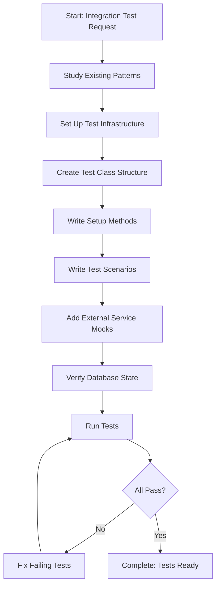

<!--
Step: Write Integration Tests
Purpose: Create comprehensive integration tests that verify complete flows of system components working together
-->

# Step: Write Integration Tests

## Description

Create comprehensive integration tests that verify the complete flow of system components working together. Tests can be triggered by API endpoints, message queue subscribers, or scheduled jobs.

## Purpose & Usage

Use this step when you need to:
- Create integration tests for API endpoints (HTTP-triggered flows)
- Create integration tests for message queue subscribers (Kafka-triggered)
- Test complex workflows involving multiple services
- Verify database transactions and data persistence
- Test integration with external services (via mocks)

**Output**: Comprehensive integration test files with full scenario coverage.

## Quick Reference

| Trigger Type | Use Case |
|--------------|----------|
| HTTP request | API endpoint tests |
| Kafka message | Subscriber tests |
| Timer | Background job tests |

---

## Agent Layer

### Required Components

- [mandatory-logging.md](../_components/mandatory-logging.md) - Logging guidelines
- Project-specific integration testing patterns documentation

### Step Metadata
- **Prerequisites**: Components implemented, integration test infrastructure available
- **Outputs**: End-to-end integration test files

### Context Parameters

- `componentType`: Type of component (API Controller, Subscriber, Background Job)
- `componentName`: Name of the component
- `componentNamespace`: Full namespace
- `triggerMechanism`: How flow is triggered (HTTP request, Kafka message, Timer)
- `scenariosToTest`: List of business scenarios
- `externalServices`: External services to mock
- `messageQueues`: Message queues involved

### Guidance

<!-- @include: _components/mandatory-logging.md -->

**Specific Actions:**

1. **Study Existing Test Patterns** - Review similar integration tests
2. **Set Up Test Infrastructure** - Configure test server, mocks, test database
3. **Create Test Class** - Set up test class with proper base class
4. **Write Test Scenarios** - Implement tests for each scenario
5. **Verify Coverage** - Ensure all scenarios are covered

### Flow

### Substeps

- [ ] **Substep 1: Study Existing Test Patterns**
  - Search for similar integration tests
  - Review test infrastructure setup
  - Note mocking patterns and test data builders

- [ ] **Substep 2: Set Up Test Infrastructure**
  - Configure test server or message consumer
  - Set up WireMock for external services
  - Configure test database

- [ ] **Substep 3: Create Test Class Structure**
  - Create test class with appropriate base class
  - Set up dependency injection for tests
  - Create setup and teardown methods

- [ ] **Substep 4: Write Test Scenarios**
  - Write happy path tests
  - Write validation failure tests
  - Write external service failure tests
  - Write edge case tests

- [ ] **Substep 5: Verify and Run Tests**
  - Run all tests
  - Verify database state assertions
  - Verify mock interactions

### Memory File Usage

**Write to**: Current step section in memory.md
- Information Produced: Test files created, scenarios covered
- Files Modified/Created: Integration test files
