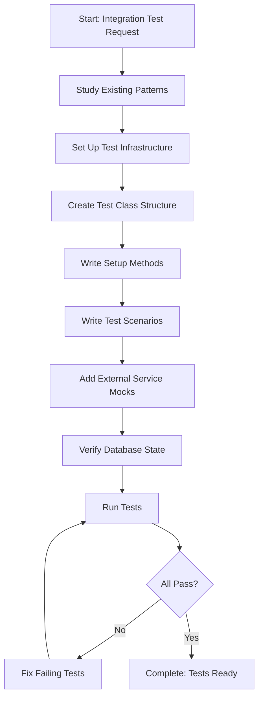

# Step: Write Integration Tests

## Description

Create comprehensive integration tests that verify the complete flow of system components working together. Tests can be triggered by API endpoints, message queue subscribers, or scheduled jobs.

## Purpose & Usage

Use this step when you need to:
- Create integration tests for API endpoints (HTTP-triggered flows)
- Create integration tests for message queue subscribers (Kafka-triggered)
- Test complex workflows involving multiple services
- Verify database transactions and data persistence
- Test integration with external services (via mocks)

**Output**: Comprehensive integration test files with full scenario coverage.

## Quick Reference

| Trigger Type | Use Case |
|--------------|----------|
| HTTP request | API endpoint tests |
| Kafka message | Subscriber tests |
| Timer | Background job tests |

## Flow

