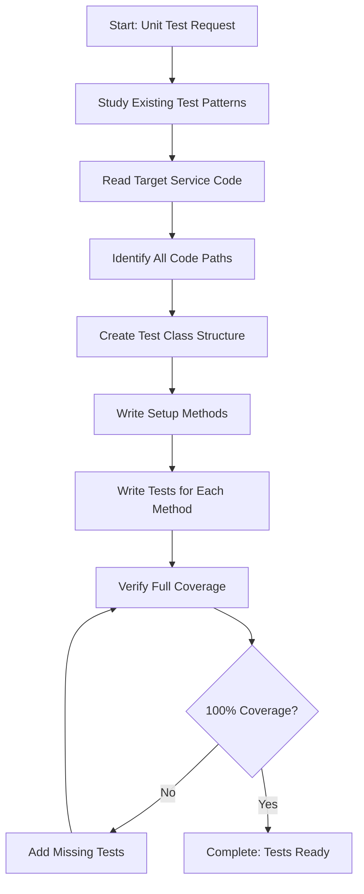

# Step: Write Unit Tests for Service Layer

## Description

Create comprehensive unit tests for the service layer with the goal of achieving full (100%) code coverage. Unit tests verify business logic in isolation by mocking dependencies.

## Purpose & Usage

Use this step when you need to:
- Create unit tests for newly implemented service layer components
- Add test coverage for new service methods
- Update existing tests after modifying service logic
- Improve test coverage for under-tested services

**Output**: Comprehensive unit test files in `Tests/UnitTests/` with full code coverage.

## Quick Reference

| Decision | Guideline |
|----------|-----------|
| Create test helper | If mocking same method 3+ times |
| Create helper class | If verifying same arguments 3+ times |
| Inline mocking | If method used < 3 times |

**Test Naming**: `MethodName_Scenario_ExpectedResult`

## Flow

