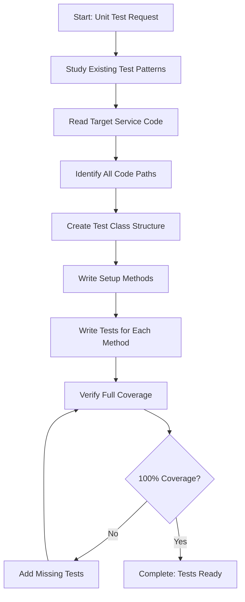

<!--
Step: Write Unit Tests for Service Layer
Purpose: Create comprehensive unit tests for service layer with full code coverage
-->

# Step: Write Unit Tests for Service Layer

## Description

Create comprehensive unit tests for the service layer with the goal of achieving full (100%) code coverage. Unit tests verify business logic in isolation by mocking dependencies.

## Purpose & Usage

Use this step when you need to:
- Create unit tests for newly implemented service layer components
- Add test coverage for new service methods
- Update existing tests after modifying service logic
- Improve test coverage for under-tested services

**Output**: Comprehensive unit test files in `Tests/UnitTests/` with full code coverage.

## Quick Reference

| Decision | Guideline |
|----------|-----------|
| Create test helper | If mocking same method 3+ times |
| Create helper class | If verifying same arguments 3+ times |
| Inline mocking | If method used < 3 times |

**Test Naming**: `MethodName_Scenario_ExpectedResult`

---

## Agent Layer

### Required Components

- [mandatory-logging.md](../_components/mandatory-logging.md) - Logging guidelines
- [pre-implementation-patterns.md](../_components/pre-implementation-patterns.md) - Pattern verification
- Project-specific unit testing best practices documentation

### Step Metadata
- **Prerequisites**: Service layer implementation completed, business logic finalized
- **Outputs**: Comprehensive unit test files with full code coverage

### Guidance

<!-- @include: _components/mandatory-logging.md -->

<!-- @include: _components/pre-implementation-patterns.md -->

**Test-Specific Pattern Checks:**
- [ ] Search for tests of similar service components in `Tests/UnitTests/`
- [ ] Review test class naming conventions (e.g., `ManagerTests`, `CalculatorTests`)
- [ ] Check test method naming patterns (e.g., `MethodName_Scenario_ExpectedResult`)
- [ ] Check `Tests/UnitTests/Helpers/Mocks/` for existing mock helper classes
- [ ] Review mocking library usage (FakeItEasy, Moq, etc.)
- [ ] Identify reusable mock extension methods
- [ ] Search `Tests/UnitTests/Helpers/` for reusable test utilities
- [ ] Check for test data builders or factories
- [ ] Identify testing framework in use (xUnit, NUnit, MSTest)
- [ ] Review how existing tests achieve 100% coverage
- [ ] Check patterns for testing exception scenarios

### Context Parameters

- `{{serviceName}}`: The name of the service to test
- `{{serviceNamespace}}`: Namespace of the service
- `{{methodsToTest}}`: List of service methods that need test coverage
- `{{dependencies}}`: List of dependencies to mock

### Flow

### Substeps

- [ ] **Substep 1: Study Existing Test Patterns**
  - Search for tests of similar service components
  - Review naming conventions, mocking patterns, helper classes
  - Document patterns to follow

- [ ] **Substep 2: Read Target Service Code**
  - Read the service implementation
  - Identify all public methods to test
  - Identify all dependencies that need mocking

- [ ] **Substep 3: Identify All Code Paths**
  - Map out success scenarios
  - Map out error/exception scenarios
  - Map out edge cases
  - Map out boundary conditions

- [ ] **Substep 4: Create Test Class Structure**
  - Create test file in appropriate location
  - Set up test class with proper attributes
  - Create constructor with dependency setup

- [ ] **Substep 5: Write Setup Methods**
  - Create mock objects for all dependencies
  - Set up common test data
  - Create any needed test helpers

- [ ] **Substep 6: Write Tests for Each Method**
  - Write tests for each public method
  - Cover success scenarios first
  - Add error/exception scenarios
  - Add edge cases
  - Follow AAA pattern (Arrange, Act, Assert)

- [ ] **Substep 7: Verify Full Coverage**
  - Run tests and check coverage
  - Identify any uncovered code paths
  - Add missing tests until 100% coverage achieved

### Memory File Usage

**When to Use Memory:**
- Use memory to track test coverage progress
- Document any test patterns discovered

**Memory Usage for This Step:**
- **Write to**: Current step section in memory.md
  - Information Produced:
    - Test files created
    - Coverage percentage achieved
    - Test count by category
  - Decisions Made:
    - Mock patterns used
    - Helper classes created
