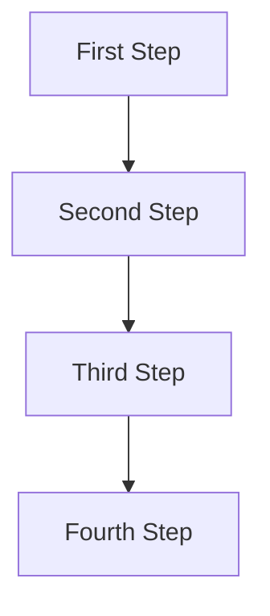
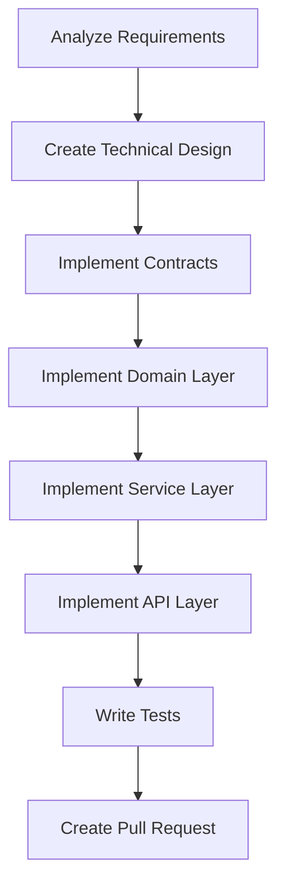
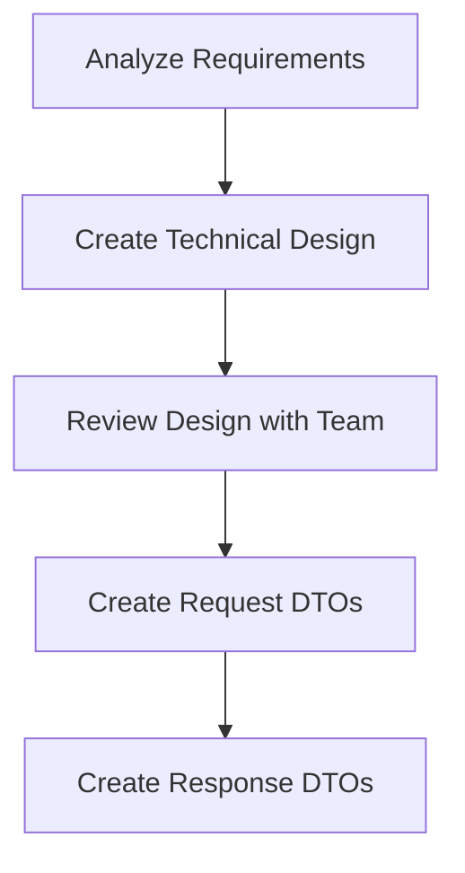

# Process Template Authoring Guide

This guide explains how to create new process templates for the Process Management System.

## Overview

Process templates are reusable markdown files that define common workflows. They provide a structured approach to recurring tasks and ensure consistency across the team.

## Template Structure

Every process template should follow this structure:

```markdown
<!--
Template: [Template Name]
Purpose: [What this template is for]
Required Parameters: [param1, param2, ...]
Optional Parameters: [param3, param4, ...]
When to use: [Description of when to use this template]
-->

# Process: {{processName}}

**Template**: [template-name]
**Status**: Not Started

## Current State
**Active Step**: Not started yet
**Current Action**: Waiting to begin
**Details**: Process will start when first step is initiated

## Description
{{description}}

## Parameters
- `param1`: {{param1}}
- `param2`: {{param2}}

## Context
- `repository`: paycloud-wc-lending-partnerships
- `branch`: {{targetBranch}}

## Process Flow



## Steps

- [ ] Step 1: [Step description]
  - **Description**: [Detailed description]
  - **Output**: [What this step produces]

- [ ] Step 2: [Step description]
  - **Description**: [Detailed description]
  - **Output**: [What this step produces]

### Final Phase: Learning & Improvement

- [ ] Step N: Continuous Improvement & Learning
  - **Step**: `@step:learning/continuous-improvement`
  - **Description**: Analyze process log and implement improvements for future iterations
  - **Context**:
    - `processLogPath`: .processes/active/{process-name}/log.md
    - `processName`: {{processName}}
    - `templateName`: [template-name]
  - **Output**: Analysis report, implemented improvements, updated templates/steps
  - **Iterative Workflow**: For each improvement: propose → investigate → implement → request approval → next
  - **Note**: User must approve each improvement before proceeding to the next one

## Errors & Notes
<!-- Add any notes, warnings, or observations here during execution -->

## Audit Log
<!-- Automatically maintained by Process Manager -->
```

## Required Sections

### 1. Header Comment Block

The header comment provides metadata about the template:

```markdown
<!--
Template: Feature Development
Purpose: Standard workflow for implementing new features
Required Parameters: featureName, targetBranch
Optional Parameters: issueId
When to use: When adding new functionality to the application
-->
```

**Guidelines:**
- Be clear and concise
- List all parameters the template needs
- Explain when this template should be used vs alternatives
- No need to estimate duration (removed from templates)
- No need for status or version fields (removed from templates)

### 2. Process Header

```markdown
# Process: {{processName}}

**Template**: template-name
**Status**: Not Started
```

**Guidelines:**
- Use `{{processName}}` or a descriptive title with placeholders
- Template name should match the filename (without .md)
- Status starts as "Not Started" and changes to "Running" when first step begins

### 3. Current State Section

```markdown
## Current State
**Active Step**: Not started yet
**Current Action**: Waiting to begin
**Details**: Process will start when first step is initiated
```

**Guidelines:**
- Always include this section for active processes
- Agent updates this section continuously during execution
- Be specific about what file or component is being worked on
- Details field is optional but helpful for additional context

### 4. Description Section

```markdown
## Description
{{description}}
```

**Guidelines:**
- Use a placeholder that will be filled when creating a process instance
- Keep it brief - this is expanded during process creation

### 5. Parameters Section

```markdown
## Parameters
- `featureName`: {{featureName}}
- `targetBranch`: {{targetBranch}}
- `issueId`: {{issueId}}
```

**Guidelines:**
- List all placeholders used in the template
- Use clear, descriptive parameter names
- Parameters should be in camelCase
- Include both required and optional parameters

### 5. Context Section

```markdown
## Context
- `repository`: paycloud-wc-lending-partnerships
- `branch`: {{targetBranch}}
- `issueId`: {{issueId}}
```

**Guidelines:**
- Provide key-value pairs of shared data
- Mix of static values (like repository) and parameters
- This data is available throughout the process

### 6. Process Flow Section (Visual Diagram)

Every template must include a mermaid diagram showing the sequential flow of steps:

```markdown
## Process Flow


```

**Diagram Guidelines:**
- Use `graph TD` (Top-Down) for sequential flow
- Each node should represent a major step
- Use `-->` arrows to show the sequential flow
- Keep node labels concise but descriptive
- The diagram should match the steps listed below

**Tips for Good Diagrams:**
- Include 15-30 nodes (matching your step count)
- Group related steps visually if possible
- Use clear, action-oriented labels
- The flow should be easy to follow top to bottom

### 7. Steps Section (Most Important)

Steps are listed sequentially without phases:

```markdown
## Steps

- [ ] Step 1: Analyze requirements for {{featureName}}
  - **Description**: Review requirements, user stories, and acceptance criteria
  - **Output**: Requirements document or notes

- [ ] Step 2: Create technical design
  - **Description**: Design solution including architecture and data models
  - **Output**: Design document

- [ ] Step 3: Implement contracts layer
  - **Description**: Create request/response DTOs in Contracts project
  - **Output**: DTO classes
```

**Step Guidelines:**
- Number steps sequentially (Step 1, Step 2, Step 3, etc.)
- Start each step with an unchecked checkbox `- [ ]`
- Include clear, actionable step descriptions
- Always specify the expected **Output**
- NO Dependencies field (steps are sequential by default)
- NO Estimated Duration field (removed from templates)
- Add **Note** for important considerations if needed
- Add **Target** for measurable goals if applicable (e.g., >80% test coverage)

### 8. Errors & Notes Section

```markdown
## Errors & Notes
<!-- Add any notes, warnings, or observations here during execution -->
```

**Guidelines:**
- Leave this empty in templates
- Include comment explaining its purpose
- This will be populated during process execution

### 9. Audit Log Section

```markdown
## Audit Log
<!-- Automatically maintained by Process Manager -->
```

**Guidelines:**
- Leave this empty in templates
- Include comment that Process Manager maintains this
- Will be automatically populated during execution

## Using Parameter Placeholders

Placeholders allow templates to be customized when creating process instances.

### Placeholder Syntax

Use double curly braces: `{{parameterName}}`

### Examples

```markdown
# Process: {{processName}}

## Description
{{description}}

## Steps
- [ ] Step 1: Implement {{featureName}} in the {{targetArea}}
- [ ] Step 2: Add tests for {{featureName}}
- [ ] Step 3: Deploy to {{targetEnvironment}}
```

### Placeholder Best Practices

1. **Use descriptive names**: `{{featureName}}` not `{{name}}`
2. **Be consistent**: Use the same placeholder name throughout
3. **Document all placeholders**: List them in the Parameters section
4. **Provide examples**: In the header comment, show example values
5. **Use in descriptions**: Include placeholders in step descriptions for context

## Sequential Step Organization

Steps flow sequentially from beginning to end:

### Good Step Organization Example

```markdown
## Steps

- [ ] Step 1: Analyze requirements
- [ ] Step 2: Create technical design
- [ ] Step 3: Review design with team
- [ ] Step 4: Create request DTOs
- [ ] Step 5: Create response DTOs
- [ ] Step 6: Create domain models
- [ ] Step 7: Implement repositories
- [ ] Step 8: Implement service layer
- [ ] Step 9: Implement API endpoints
- [ ] Step 10: Add authentication
- [ ] Step 11: Write unit tests
- [ ] Step 12: Write integration tests
- [ ] Step 13: Manual testing
- [ ] Step 14: Create documentation
- [ ] Step 15: Create pull request
- [ ] Step 16: Address review comments
- [ ] Step 17: Merge to target branch
```

**Organization Guidelines:**
- Steps flow from planning → implementation → testing → deployment
- Each step builds naturally on the previous ones
- Group related steps together (e.g., all DTO creation, all testing)
- No need for explicit phase divisions
- Aim for 15-30 steps for most templates

## Step Best Practices

### ✅ Good Step Example

```markdown
- [ ] Step 4: Create request DTO
  - **Description**: Add LoginRequest DTO in `Contracts/Requests/` with validation attributes
  - **Output**: LoginRequest.cs with [Required] and [EmailAddress] attributes
```

**Why it's good:**
- Clear, actionable description
- Specific location mentioned
- Concrete output defined
- No unnecessary duration estimate

### ❌ Poor Step Example

```markdown
- [ ] Step 4: Do the contracts
  - Create some DTOs
```

**Why it's poor:**
- Vague description
- No output specified
- No specific guidance
- Not structured properly

## Creating the Mermaid Diagram

The mermaid diagram is a visual representation of your steps:

### Steps to Create Diagram

1. **List all your steps** (Step 1, Step 2, etc.)
2. **Identify key steps** for the diagram nodes
3. **Create sequential flow** connecting each node
4. **Use concise labels** (shorter than step descriptions)

### Example Mapping

**Steps:**
```markdown
- [ ] Step 1: Analyze requirements
- [ ] Step 2: Create technical design
- [ ] Step 3: Review design with team
- [ ] Step 4: Create request DTOs
- [ ] Step 5: Create response DTOs
```

**Diagram:**


### Diagram Tips

- **Simplify labels**: "Create Technical Design" instead of "Create technical design for the feature"
- **Be consistent**: Match the order of steps exactly
- **One node per step**: Each step gets one diagram node
- **Use Title Case**: For visual consistency
- **Keep it linear**: Top-to-bottom sequential flow

## Creating Template Variations

You can create specialized templates for different scenarios:

### Example: Simple vs Comprehensive

**Simple Template:**
- 15-20 steps
- Combined related tasks
- For straightforward work

**Comprehensive Template:**
- 25-35 steps
- More granular breakdown
- For complex work or detailed tracking

### Example: Different Workflows

**Feature Development:**
- Full implementation cycle
- All layers included
- Complete testing

**Bug Fix:**
- Focus on analysis and fix
- Quick verification
- Targeted testing

## Testing Your Template

Before finalizing a template:

1. **Walk through mentally**: Can you follow the steps sequentially?
2. **Check placeholders**: Are all `{{parameters}}` defined?
3. **Validate diagram**: Does it match the steps?
4. **Check outputs**: Does each step produce something?
5. **Test with a real process**: Create an instance and use it
6. **Get feedback**: Have someone else review and use it

## Template Naming Conventions

**Filename Format:**
```
[category]-[specific-task].md
```

**Examples:**
- `feature-development.md`
- `bug-fix.md`
- `database-migration.md`
- `api-endpoint.md`
- `refactoring.md`
- `security-patch.md`
- `performance-optimization.md`

**Guidelines:**
- Use lowercase
- Use hyphens, not underscores or spaces
- Be descriptive but concise
- Match the template name in the frontmatter

## Example: Complete Template Header

```markdown
<!--
Template: API Endpoint Implementation
Purpose: Structured workflow for adding new API endpoints
Required Parameters: endpointName, httpMethod, routePath
Optional Parameters: apiVersion, visibility
When to use: When creating new API endpoints for the application
Example parameters:
  endpointName: GetUserProfile
  httpMethod: GET
  routePath: /api/v1/users/{id}/profile
  apiVersion: v1
  visibility: External
-->
```

## What Changed from Previous Format

The template format has been simplified:

### Removed Elements
- ❌ **Status** field (was always "Not Started" in templates)
- ❌ **Version** field (unnecessary complexity)
- ❌ **Phases** (steps are now sequential, no phase divisions)
- ❌ **Dependencies** field (sequential steps imply order)
- ❌ **Estimated Duration** field (removed from individual steps and overall)

### Added Elements
- ✅ **Mermaid diagram** (visual representation of the process flow)

### Simplified Structure
- Steps are numbered sequentially (Step 1, Step 2, Step 3...)
- No phase organization (steps flow naturally)
- Focus on Description and Output only
- Cleaner, easier to follow format

## Common Pitfalls to Avoid

1. **Too generic**: "Do the implementation" - be specific
2. **Missing outputs**: Always specify what each step produces
3. **Diagram mismatch**: Ensure diagram matches step sequence
4. **Too many steps**: 15-30 is ideal, break down if needed
5. **Forgetting placeholders**: Document all `{{parameters}}`
6. **Inconsistent numbering**: Use Step 1, Step 2, Step 3 format
7. **Vague descriptions**: Provide actionable guidance
8. **No diagram**: Every template must have a mermaid flow diagram
9. **Missing continuous improvement step**: Every template MUST include the final continuous improvement step

## Mandatory Final Step

**Every process template MUST include the Continuous Improvement & Learning step as the final step.**

This step is mandatory and should be added before the "Errors & Notes" section:

```markdown
### Final Phase: Learning & Improvement

- [ ] Step N: Continuous Improvement & Learning
  - **Step**: `@step:learning/continuous-improvement`
  - **Description**: Analyze process log and implement improvements for future iterations
  - **Context**:
    - `processLogPath`: .processes/active/{process-name}/log.md
    - `processName`: {{processName}}
    - `templateName`: [template-name]
  - **Output**: Analysis report, implemented improvements, updated templates/steps
  - **Iterative Workflow**: For each improvement: propose → investigate → implement → request approval → next
  - **Note**: User must approve each improvement before proceeding to the next one
```

**Why This Step is Mandatory:**
- Enables the process management system to learn and evolve
- Captures user corrections as improvement opportunities
- Automates repetitive manual interventions over time
- Continuously improves templates, steps, and documentation
- Creates a feedback loop for systematic enhancement

**What This Step Does:**
1. Reads the detailed process log file
2. Identifies patterns in user corrections
3. Proposes improvements one at a time
4. Implements approved improvements
5. Updates templates/steps/documentation
6. Makes future processes more efficient

See `@step:learning/continuous-improvement` for detailed guidance on this step.

## Getting Help

If you need help creating a template:
1. Review existing templates for patterns
2. Ask Process Manager (in Process Mode) for guidance
3. Start with a similar existing template and modify it
4. Test your template with a real process before finalizing

---

**Happy Template Creating! 📝**
