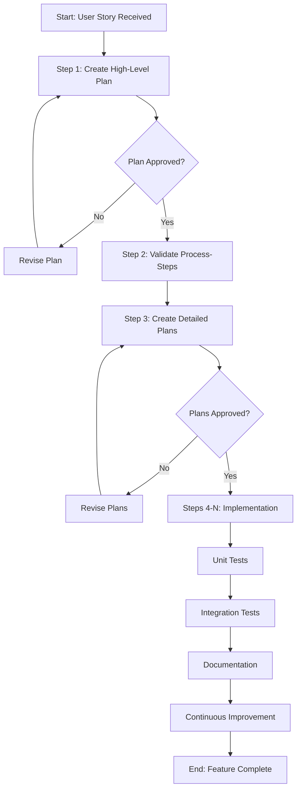

# Process: {{userStoryTitle}}

**Template**: develop-user-story  
**Status**: Not Started

## Description

Implement a complete user story from initial planning through testing and documentation. This template provides a systematic approach to feature development with Q&A checkpoints, iterative planning, and comprehensive testing.

## Purpose & Usage

Use this template when you need to:
- Implement a new feature based on user story requirements
- Follow a structured development workflow with planning, implementation, and testing phases
- Ensure comprehensive test coverage (unit and integration tests)
- Create documentation for new features

**Not suitable for**: Bug fixes, refactoring without new features, or documentation-only changes.

## Quick Reference

| Parameter | Required | Description |
|-----------|----------|-------------|
| `userStoryTitle` | Yes | Title of the user story |
| `userStoryDescription` | Yes | Detailed description of the feature |
| `acceptanceCriteria` | Yes | Criteria that must be met for completion |

## Process Flow

## Phases

| Phase | Steps | Description |
|-------|-------|-------------|
| Planning | 1-3 | Create and approve high-level and detailed plans |
| Implementation | 4-N | Execute approved plan tasks |
| Testing | N+1, N+2 | Unit tests and integration tests |
| Documentation | N+3 | Update relevant documentation |
| Learning | N+4 | Continuous improvement analysis |
