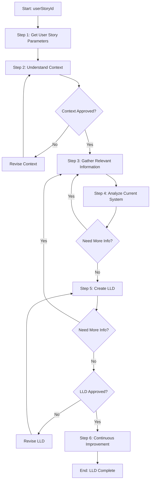

# Process: Create Low-Level Design for {{userStoryId}}

**Template**: low-level-design-user-story  
**Status**: Not Started

## Description

Create a standalone low-level design (LLD) document for a user story that serves as the foundational technical specification for subsequent SDLC phases including code development, test planning, and documentation.

## Purpose & Usage

Use this template when you need to:
- Create detailed technical design before implementation begins
- Provide design specifications for multiple teams (dev, QA, docs)
- Get design approval before coding starts
- Create a technical handoff artifact for the SDLC

**Not suitable for**: Simple bug fixes, implementation already in progress, high-level estimates only, proof-of-concept work.

## Quick Reference

| Parameter | Required | Description |
|-----------|----------|-------------|
| `userStoryId` | Yes | ID/reference of the user story (e.g., "US-1234", "PROJ-567") |

## Process Flow

## Steps Summary

| Step | Name | Guideline | Approval Required |
|------|------|-----------|-------------------|
| 1 | Get User Story Parameters | Yes | No |
| 2 | Understand User Story Context | No | Yes |
| 3 | Gather Relevant Information | Yes | No |
| 4 | Analyze Current System | No | No |
| 5 | Create Low-Level Design Document | Yes | Yes |
| 6 | Continuous Improvement | No | Yes |

