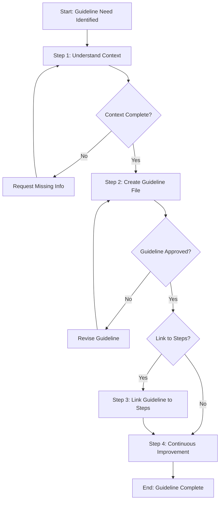

# Process: Create {{guidelineName}} Guideline

**Template**: create-guideline  
**Status**: Not Started

## Description

Create a new guideline document for the Agentic Process System. Guidelines answer "How to do X?" questions with practical, action-oriented content that process steps can reference.

## Purpose & Usage

Use this template when you need to:
- Create a missing guideline that a process step references
- Establish a new best practice or convention for the framework
- Document a practical "How to" workflow with examples

**Not suitable for**: Creating process templates (use `create-process-template`), creating process steps (use `create-process-step-template`), or complex technical documentation.

## Quick Reference

| Parameter | Required | Description |
|-----------|----------|-------------|
| `guidelineName` | Yes | Name of the action (kebab-case, without "how-to-" prefix) |
| `guidelineCategory` | Yes | Category folder (existing or new) |
| `guidelinePurpose` | Yes | The "How to" question this guideline answers |
| `relatedSteps` | No | Steps that will reference this guideline |
| `triggeringContext` | No | What triggered the need for this guideline |

## Process Flow

## Steps Summary

| Step | Name | Approval Required |
|------|------|-------------------|
| 1 | Understand context | No |
| 2 | Create guideline file | Yes |
| 3 | Link guideline to steps | No (optional) |
| 4 | Continuous Improvement | Yes (per improvement) |

## Steps

- [ ] **Step 1: Understand context**
  - **Step**: `@step:planning/understand-context`
  - **Description**: Gather parameters, identify sources, clarify requirements for the guideline
  - **Output**: Context documented in memory.json

- [ ] **Step 2: Create guideline file**
  - **Step**: `@step:guideline/create-guideline-file`
  - **Description**: Write the guideline markdown file with practical steps and examples
  - **Output**: Complete guideline file at `~/.claude/agentic-processes/guidelines/{{guidelineCategory}}/how-to-{{guidelineName}}.md`
  - **Approval Required**: Yes

- [ ] **Step 3: Link guideline to steps** *(optional)*
  - **Step**: `@step:guideline/link-guideline-to-steps`
  - **Description**: Update step JSON files to reference the new guideline in `userGuidelines`
  - **Output**: Updated step files

- [ ] **Step 4: Continuous Improvement**
  - **Step**: `@step:learning/continuous-improvement`
  - **Description**: Analyze process log and implement improvements for future iterations
  - **Output**: Improvements implemented

