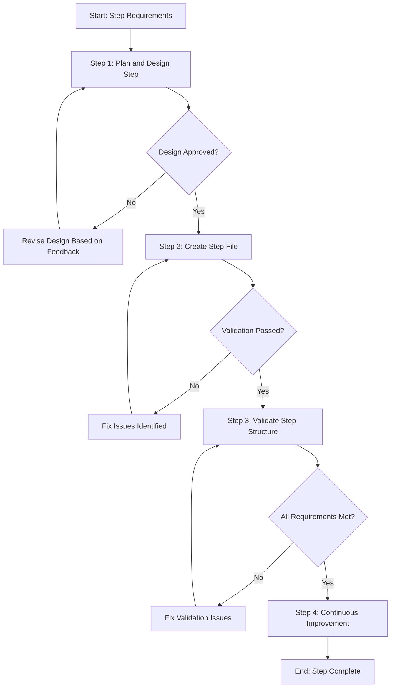

<!--
Template: Create Process Step Template
Purpose: End-to-end workflow for creating new process template steps from requirements through validation and documentation
Required Parameters: stepName, stepCategory, stepPurpose, useCases
Optional Parameters: exampleContext
When to use: When you need to create a new process step file for the Agentic Process System
-->

# Process: Create {{stepName}} Step

**Template**: create-process-step-template
**Status**: Not Started

## Current State
**Active Step**: Not started yet
**Current Action**: Waiting to begin
**Details**: Process will start when first step is initiated

## Description
Create a new process step file named {{stepName}} in the {{stepCategory}} category that {{stepPurpose}}. This step will be used when {{useCases}}.

## Parameters
- `stepName`: {{stepName}}
- `stepCategory`: {{stepCategory}}
- `stepPurpose`: {{stepPurpose}}
- `useCases`: {{useCases}}
- `exampleContext`: {{exampleContext}}

## Context
- `repository`: agentic-processes
- `stepsDirectory`: .processes/steps/
- `stepCategoryDirectory`: .processes/steps/{{stepCategory}}/
- `stepFile`: .processes/steps/{{stepCategory}}/{{stepName}}.md
- `stepTemplate`: .processes/steps/step-template.md
- `stepsReadme`: .processes/steps/README.md

## Process Flow

## Steps

- [ ] Step 1: Plan and design step
  - **Step**: `@framework-step:template/plan-and-design-step`
  - **Description**: Analyze requirements for the new step, define its purpose, identify use cases, determine the appropriate category, plan the step structure, identify required sections (description, output, guidance, flow diagram, substeps, examples, common pitfalls), and design the mermaid flow diagram. This step establishes the complete foundation and design for the step file.
  - **Output**: Requirements document, purpose statement, use cases documentation, category selection rationale, step structure plan, section breakdown plan, mermaid flow diagram code, substeps outline
  - **Iterative Review**: User can request changes to the design, flow, or structure; revise and re-present until satisfactory
  - **⚠️ APPROVAL CHECKPOINT - STOP AND WAIT**: User must explicitly approve the complete step design before proceeding to Step 2. Present deliverables, ask "Do you approve? (approve/modify/reject)", and WAIT for user response. Do NOT proceed automatically.
  - **Decision**:
    - **IF** user approves:
      - Proceed to Step 2 (Create Step File)
    - **ELSE** (user does not approve):
      - Revise design based on user feedback
      - Return to Step 1 (Plan and Design Step)
  - **Note**: This step is complete only when user approves the complete design

- [ ] Step 2: Create step file
  - **Step**: `@framework-step:template/create-step-file`
  - **Description**: Create the step file in `.processes/steps/{{stepCategory}}/` with the proper filename and write all sections including the header comment block, step title, description, output, guidance (with mandatory logging section), memory file usage, flow diagram with mermaid code, substeps breakdown, examples section, and common pitfalls section. The step must be self-contained and follow the step-template.md structure. Then comprehensively validate the step by verifying all required sections are present, checking the flow diagram matches the substeps, ensuring guidance is detailed and actionable, and reviewing compliance with best practices from steps/README.md.
  - **Output**: Complete step file with all sections, validation reports (structure, diagram alignment, guidance completeness, best practices compliance)
  - **Decision**:
    - **IF** validation passes (all checks pass):
      - Proceed to Step 3 (Validate Step Structure)
    - **ELSE** (validation fails - issues found):
      - Fix issues identified in validation reports
      - Re-run validation until all checks pass
  - **Note**: Only proceed to Step 3 when all validation checks pass

- [ ] Step 3: Validate step structure
  - **Step**: `@framework-step:template/validate-step-structure`
  - **Description**: Perform comprehensive validation of the created step file to ensure it meets all requirements. Verify the step is self-contained (no references to other steps), check that all required sections are present and properly formatted, validate the mermaid diagram syntax and that it matches the substeps, ensure guidance is detailed and actionable with specific file paths and code patterns, verify examples are included and relevant, check that common pitfalls are documented, and confirm compliance with naming conventions and best practices from steps/README.md.
  - **Output**: Comprehensive validation report with all checks (self-contained check, section completeness, diagram validation, guidance quality, examples quality, pitfalls documentation, naming compliance, best practices compliance)
  - **Decision**:
    - **IF** all validation checks pass:
      - Proceed to Step 4 (Continuous Improvement)
    - **ELSE** (validation fails - issues found):
      - Fix issues identified in validation report
      - Re-run validation until all checks pass
  - **Note**: Only proceed to Step 4 if all validation checks pass

### Final Phase: Learning & Improvement

- [ ] Step 4: Continuous Improvement & Learning
  - **Step**: `@framework-step:learning/continuous-improvement`
  - **Description**: Analyze process log and implement improvements for future iterations
  - **Context**:
    - `processLogPath`: .user-processes/active/{process-name}/log.md
    - `processName`: Create {{stepName}} Step
    - `templateName`: create-process-step-template
  - **Output**: Analysis report, implemented improvements, updated templates/steps
  - **Iterative Workflow**: For each improvement: propose → investigate → implement → request approval → next
  - **Note**: User must approve each improvement before proceeding to the next one

## Memory File

**Memory Location**: `./memory.md`

This process uses a unified memory file to track state and share information between steps. Key information stored includes:

- **Step 1**: Requirements, purpose, use cases, category selection, step structure plan, section breakdown plan, mermaid diagram code, substeps outline
- **Step 2**: Step file creation with all sections (header, description, output, guidance, memory usage, flow diagram, substeps, examples, pitfalls), validation reports
- **Step 3**: Step structure validation results (all checks: self-contained, sections, diagram, guidance, examples, pitfalls, naming, best practices)
- **Step 4**: Continuous improvement analysis and implemented improvements

## Errors & Notes
<!-- Add any notes, warnings, or observations here during execution -->

## Audit Log
<!-- Automatically maintained by Process Manager -->

