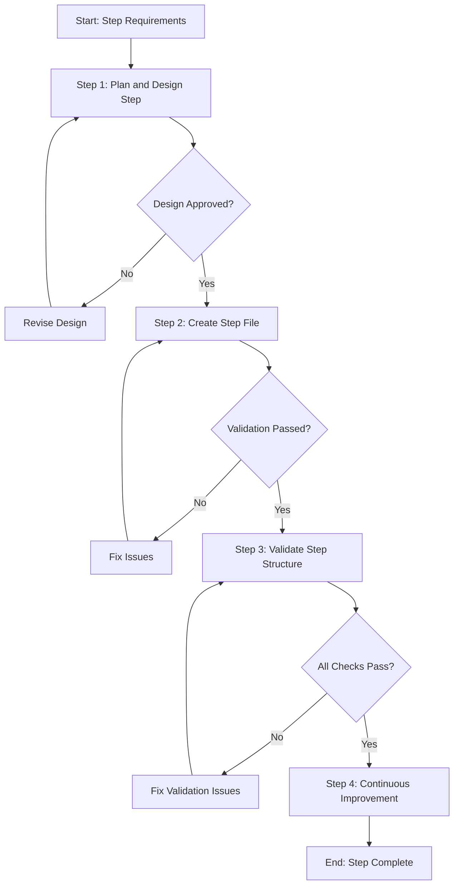

# Process: Create {{stepName}} Step

**Template**: create-process-step-template  
**Status**: Not Started

## Description

Create a new process step file for the Agentic Process System. This template guides you through designing, creating, and validating a new step that can be referenced by templates using the `@step:` syntax.

## Purpose & Usage

Use this template when you need to:
- Create a new reusable process step for the framework
- Define a self-contained unit of work that templates can reference
- Establish standardized guidance for a specific type of action

**Not suitable for**: Creating process templates (use `create-process-template`), modifying existing steps, or one-time actions.

## Quick Reference

| Parameter | Required | Description |
|-----------|----------|-------------|
| `stepName` | Yes | Name of the step (kebab-case) |
| `stepCategory` | Yes | Category folder (e.g., planning, testing) |
| `stepPurpose` | Yes | What the step accomplishes |
| `useCases` | Yes | When this step should be used |
| `exampleContext` | No | Example context for testing |

## Process Flow

## Steps Summary

| Step | Name | Approval Required |
|------|------|-------------------|
| 1 | Plan and design step | Yes |
| 2 | Create step file | No (validation required) |
| 3 | Validate step structure | No (validation required) |
| 4 | Continuous Improvement | Yes (per improvement) |
