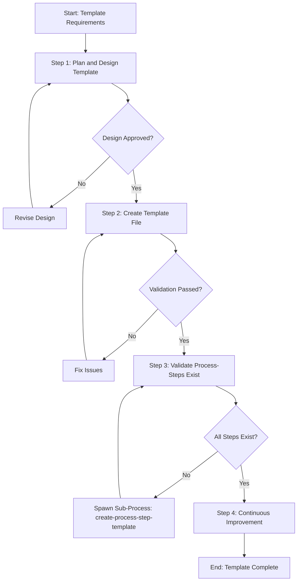

# Process: Create {{templateName}} Template

**Template**: create-process-template  
**Status**: Not Started

## Description

Create a new process template for the Agentic Process System. This template guides you through designing, creating, validating, and documenting a new template that can be used to instantiate processes.

## Purpose & Usage

Use this template when you need to:
- Create a new reusable process template for the framework
- Define a systematic workflow for a specific type of task
- Establish a standardized approach that others can follow

**Not suitable for**: Creating process steps (use `create-process-step-template`), modifying existing templates, or one-time processes.

## Quick Reference

| Parameter | Required | Description |
|-----------|----------|-------------|
| `templateName` | Yes | Name of the template to create |
| `templatePurpose` | Yes | What the template is designed to accomplish |
| `useCases` | Yes | Scenarios where this template should be used |
| `exampleParameters` | No | Example parameter values for testing |

## Process Flow

## Steps Summary

| Step | Name | Approval Required |
|------|------|-------------------|
| 1 | Plan and design template | Yes |
| 2 | Create template file | No (validation required) |
| 3 | Validate process-steps exist | No (may spawn sub-processes) |
| 4 | Continuous Improvement | Yes (per improvement) |
