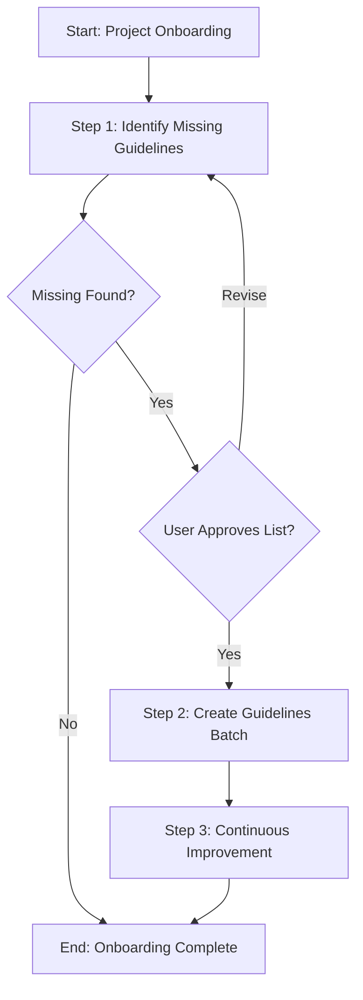

# Process: Onboard to Agentic Process Framework

**Template**: onboard  
**Status**: Not Started

## Description

Systematically onboard a project to the Agentic Process Framework by identifying and creating all missing guidelines referenced by process steps. This template auto-scans the framework to find gaps and guides you through populating them.

## Purpose & Usage

Use this template when you need to:
- First adopt the Agentic Process Framework in a project
- Populate empty or incomplete guideline folders
- Create guidelines referenced by process steps that don't exist yet
- Expand to new areas that require new guidelines

**Not suitable for**: Creating a single guideline (use `create-guideline`), general project setup, or non-guideline onboarding tasks.

## Quick Reference

| Attribute | Value |
|-----------|-------|
| **Parameters** | None (auto-scan mode) |
| **Steps** | 3 (100% reused from existing step library) |
| **Approval Points** | Step 1 output review |
| **Sub-Processes** | Spawns `create-guideline` per approved guideline |

## Process Flow

## Steps Summary

| Step | Name | Approval Required |
|------|------|-------------------|
| 1 | Identify missing guidelines | Yes (review findings) |
| 2 | Create guidelines (batch) | No* |
| 3 | Continuous Improvement | Yes (per improvement) |

*Step 2 spawns `create-guideline` sub-processes with immediate sync - each completes before the next starts.

## Steps

- [ ] **Step 1: Identify missing guidelines**
  - **Step**: `@framework-step:investigation/identify-files`
  - **Description**: Scan `.processes/steps/` for `userGuidelines` references and identify which referenced guidelines don't exist in `.user-processes/guidelines/`
  - **Output**: `identified-files.json` containing list of missing guidelines
  - **Approval Required**: Yes - review list before proceeding

- [ ] **Step 2: Create guidelines (batch)**
  - **Step**: Spawns `create-guideline` sub-processes
  - **Description**: For each approved missing guideline, spawn a `create-guideline` sub-process
  - **Output**: Created guideline files in `.user-processes/guidelines/{category}/`
  - **Sync**: Immediate (one guideline at a time)

- [ ] **Step 3: Continuous Improvement**
  - **Step**: `@framework-step:learning/continuous-improvement`
  - **Description**: Analyze process log and implement improvements for future iterations
  - **Output**: Improvements implemented

## How It Works

### Step 1: Scanning Logic

The `identify-files` step uses the following approach:
1. Grep for `userGuidelines` in all `.processes/steps/**/*.json` files
2. Extract the guideline paths from the references
3. Check if each referenced guideline exists in `.user-processes/guidelines/`
4. Output list of missing guidelines grouped by category

### Step 2: Batch Creation

For each approved guideline:
1. Spawn `create-guideline` sub-process with parameters:
   - `guidelineName`: extracted from the reference
   - `guidelineCategory`: extracted from the path
   - `guidelinePurpose`: derived from step context
2. Wait for completion (immediate sync)
3. Continue to next guideline

### Known Missing Guidelines

Based on framework analysis, these guidelines are commonly referenced but often missing:

| Category | Guidelines |
|----------|------------|
| api-design | implement-controllers, handle-authentication, version-apis |
| data-access | implement-repositories, use-mongodb |
| docs | document-flows |
| implementation | implement-services, use-dependency-injection, handle-errors |
| planning | write-low-level-design, gather-relevant-information, get-user-story-parameters |
| testing | write-integration-tests, generate-test-data, mock-dependencies, write-unit-tests |

