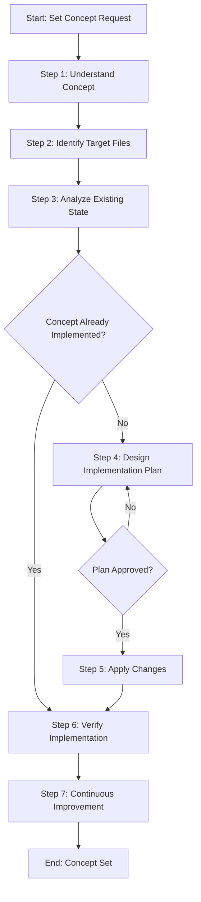

<!--
Template: Set Concept
Purpose: Systematic workflow for implementing or updating a concept (pattern, structure, standard, or approach) across non-code files
Required Parameters: conceptName, conceptDescription, targetFiles
Optional Parameters: existingState, requestedState, verificationCriteria, excludePatterns
When to use: When you need to implement or update a concept across non-code files (documentation, processes, AI agentic files, best practices, etc.)
-->

# Process: Set {{conceptName}} Concept

**Template**: set-concept
**Status**: Not Started

## Current State
**Active Step**: Not started yet
**Current Action**: Waiting to begin
**Details**: Process will start when first step is initiated

## Description
Implement or update the {{conceptName}} concept across target files. This process will guide you through understanding the concept, analyzing the current state, designing an implementation plan, applying changes (including creating new files when necessary), and verifying complete implementation.

## Parameters
- `conceptName`: {{conceptName}}
- `conceptDescription`: {{conceptDescription}}
- `targetFiles`: {{targetFiles}}
- `existingState`: {{existingState}}
- `requestedState`: {{requestedState}}
- `verificationCriteria`: {{verificationCriteria}}
- `excludePatterns`: {{excludePatterns}}

## Context
- `repository`: {{repository}}
- `conceptName`: {{conceptName}}
- `targetFiles`: {{targetFiles}}
- `excludePatterns`: {{excludePatterns}}

## Process Flow

## Steps

- [ ] Step 1: Understand concept
  - **Step**: `@framework-step:planning/understand-context`
  - **Description**: Fully understand the concept, its characteristics, requirements, and success criteria. Gather all necessary context about what the concept means and how it should be implemented.
  - **Output**: Context documentation with concept definition, characteristics, requirements, and success criteria
  - **Parameters Used**: `conceptName`, `conceptDescription`

- [ ] Step 2: Identify target files
  - **Step**: `@framework-step:investigation/identify-files`
  - **Description**: Identify which files need the concept implemented based on `targetFiles` parameter. This includes both existing files that need modification and new files that may need to be created to fully implement the concept.
  - **Output**: List of target files (existing and new files to create), saved to `identified-files.json`
  - **Parameters Used**: `targetFiles`, `excludePatterns`

- [ ] Step 3: Analyze existing state
  - **Step**: `@framework-step:investigation/review-verify-document`
  - **Description**: Review identified existing files to understand how the concept is currently represented (if at all). Analyze current implementation state and document findings. Identify which files exist and which need to be created.
  - **Output**: Findings report documenting current state, existing implementations (if any), gaps identified, and files that need to be created
  - **Parameters Used**: `conceptDescription`, `existingState` (if provided)
  - **Analysis Criteria**: Check if concept is already implemented in existing files

- [ ] Step 4: Design implementation plan
  - **Step**: `@framework-step:planning/design-implementation-plan`
  - **Description**: Understand the requested state (how files should look after implementation) and design a comprehensive plan for implementing the concept. The plan includes modifications to existing files and creation of new files as needed. Break down into actionable steps with change proposals.
  - **Output**: Implementation plan with requested state specification, step-by-step approach, and change proposals (for both file modifications and new file creation)
  - **Parameters Used**: `conceptDescription`, `requestedState` (if provided), `existingState` (from Step 3), `verificationCriteria`
  - **Decision Point**: User must approve plan before proceeding

- [ ] Step 5: Apply changes
  - **Step**: `@framework-step:common/apply-changes`
  - **Description**: Apply all approved changes to implement the concept. This includes modifying existing files and creating new files as specified in the implementation plan. Execute the implementation plan completely.
  - **Output**: Modified files, newly created files, change application report
  - **Parameters Used**: Implementation plan from Step 4

- [ ] Step 6: Verify implementation
  - **Step**: `@framework-step:investigation/review-verify-document`
  - **Description**: Verify that the concept is fully implemented across all target files (both modified and newly created). This step is part of the implementation process to ensure completeness after applying changes. Check against verification criteria to confirm the implementation was successful. Note: This is not a standalone verification process - use dedicated verification templates if you only need to check if a concept is already implemented.
  - **Output**: Verification report confirming concept is fully implemented, or list of gaps if not complete
  - **Parameters Used**: `verificationCriteria`, `requestedState`

### Final Phase: Learning & Improvement

- [ ] Step 7: Continuous Improvement & Learning
  - **Step**: `@framework-step:learning/continuous-improvement`
  - **Description**: Analyze process execution and implement improvements for future iterations
  - **Context**:
    - `processLogPath`: .user-processes/active/{process-name}/log.md
    - `processName`: Set {{conceptName}} Concept
    - `templateName`: set-concept
  - **Output**: Analysis report, implemented improvements, updated templates/steps
  - **Iterative Workflow**: For each improvement: propose → investigate → implement → request approval → next
  - **Note**: User must approve each improvement before proceeding to the next one

## Memory File

**Memory Location**: `./memory.md`

This process uses a unified memory file to track state and share information between steps. Key information stored includes:

- **Step 1**: Context documentation with concept definition, characteristics, requirements, and success criteria
- **Step 2**: List of target files (existing and new files to create)
- **Step 3**: Findings report documenting current state, existing implementations, gaps identified, and files that need to be created
- **Step 4**: Implementation plan with requested state specification, step-by-step approach, and change proposals
- **Step 5**: Modified files, newly created files, change application report
- **Step 6**: Verification report confirming concept is fully implemented, or list of gaps
- **Step 7**: Continuous improvement analysis and implemented improvements

## Errors & Notes
<!-- Add any notes, warnings, or observations here during execution -->

## Audit Log
<!-- Automatically maintained by Process Manager -->
