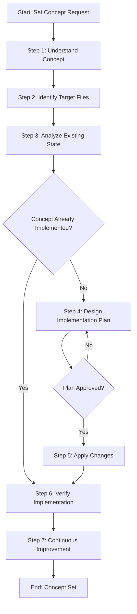

# Process: Set {{conceptName}} Concept

**Template**: set-concept  
**Status**: Not Started

## Description

Implement or update a concept systematically across multiple non-code files. This template guides you through understanding the concept, analyzing the current state, designing an implementation plan, applying changes, and verifying complete implementation.

## Purpose & Usage

Use this template when you need to:
- Implement a new pattern, structure, or standard across documentation files
- Update an existing concept across multiple files consistently
- Apply best practices or conventions to non-code files (markdown, processes, configurations)
- Ensure consistent implementation of architectural decisions or guidelines

**Not suitable for**: Code changes, single-file modifications, or verification-only tasks.

## Quick Reference

| Parameter | Required | Description |
|-----------|----------|-------------|
| `conceptName` | Yes | Name of the concept to implement |
| `conceptDescription` | Yes | Detailed description of what the concept entails |
| `targetFiles` | Yes | Files/patterns to apply the concept to |
| `existingState` | No | Description of current state |
| `requestedState` | No | Description of desired end state |
| `verificationCriteria` | No | Criteria to verify successful implementation |
| `excludePatterns` | No | File patterns to exclude |

## Process Flow

## Steps Summary

| Step | Name | Approval Required |
|------|------|-------------------|
| 1 | Understand concept | No |
| 2 | Identify target files | No |
| 3 | Analyze existing state | No |
| 4 | Design implementation plan | Yes |
| 5 | Apply changes | No |
| 6 | Verify implementation | No |
| 7 | Continuous Improvement | Yes (per improvement) |
