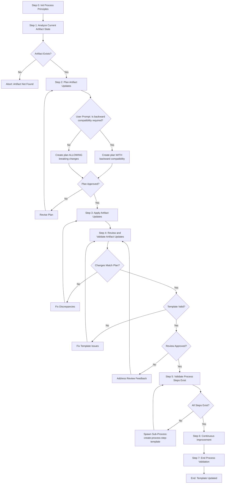

# Process: Update {{templateName}} Template

**Template**: update-process-template  
**Status**: Not Started

## Description

Update an existing process template in the Agentic Process System. This template uses generalized artifact update steps (analyze, plan, apply, review) configured for template artifacts, guiding you through analyzing the current state, planning changes, applying updates, and validating the result.

## Purpose & Usage

Use this template when you need to:
- Update existing templates when requirements change
- Add new steps to templates
- Modify template parameters
- Improve template structure
- Fix issues in templates
- Update step references

**Not suitable for**: Creating new templates (use `create-process-template`), one-time changes that don't need validation.

## Quick Reference

| Parameter | Required | Description |
|-----------|----------|-------------|
| `templateName` | Yes | Name of the template to update |
| `updateDescription` | Yes | Description of what changes are needed |
| `changeScope` | No | Scope: "minor" or "major" |
| `preserveActiveProcesses` | No | Warn if active processes use this template |

### Backward Compatibility

**Important**: Backward compatibility is NOT a parameter. The process **prompts you** during Step 2:

> "Is backward compatibility required for this update?"

- If **yes**: The update plan maintains backward compatibility
- If **no**: The update plan allows breaking changes

## Process Flow

## Steps Summary

| Step | Name | Approval Required |
|------|------|-------------------|
| 0 | Init Process Principles | No |
| 1 | Analyze Current Artifact State | No |
| 2 | Plan Artifact Updates | **Yes** (outputs: update-plan.md) |
| 3 | Apply Artifact Updates | No |
| 4 | Review and Validate Artifact Updates | **Yes** (outputs: review-report.md) |
| 5 | Validate Process Steps Exist | No (may spawn sub-processes) |
| 6 | Continuous Improvement | No |
| 7 | End Process Validation | No |

## Step Details

### Step 0: Init Process Principles
Load and confirm understanding of the 7 operating principles.

### Step 1: Analyze Current Artifact State
- Validate parameters (`artifactType`, `artifactPath`, optional `focusArea`)
- Locate and load artifact files based on type (JSON and MD)
- Parse structure using type-specific logic (templates: steps, params, metadata; steps: substeps, guidance; processes: state, subprocess)
- Record baseline analysis to memory (read-only step)

### Step 2: Plan Artifact Updates (Approval Required)
- Review update description and load baseline analysis from memory
- **Prompt**: "Is backward compatibility required?"
- Check for active consumers of the artifact (type-specific search)
- Design changes as before/after pairs with impact analysis
- Create `update-plan.md` for approval

### Step 3: Apply Artifact Updates
- Load approved plan from `update-plan.md`
- Resolve artifact file paths by type
- Apply changes sequentially: JSON first, then MD, then diagram if flow changed
- Verify every change by re-reading files (retry on failure)

### Step 4: Review and Validate Artifact Updates (Approval Required)
- Compare applied changes against approved `update-plan.md`
- Assess implementation quality (clarity, consistency, simplicity, completeness)
- Run type-specific structural validation checks
- Create `review-report.md` for approval

### Step 5: Validate Process Steps Exist
- Verify all referenced steps exist
- Spawn sub-processes for missing steps if needed

### Step 6: Continuous Improvement
- Review process for potential improvements
- Document learnings

### Step 7: End Process Validation
- Final validation and compliance check
