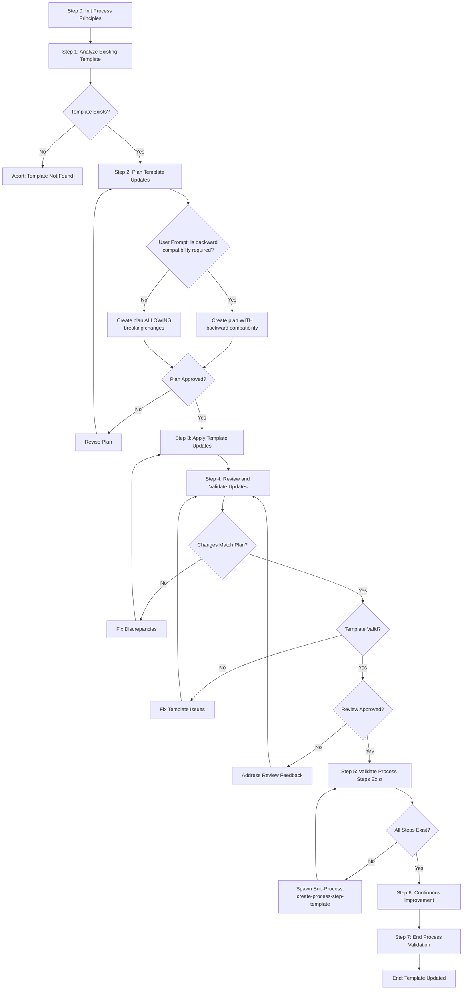

# Process: Update {{templateName}} Template

**Template**: update-process-template  
**Status**: Not Started

## Description

Update an existing process template in the Agentic Process System. This template guides you through analyzing the current template, planning changes, applying updates, and validating the result.

## Purpose & Usage

Use this template when you need to:
- Update existing templates when requirements change
- Add new steps to templates
- Modify template parameters
- Improve template structure
- Fix issues in templates
- Update step references

**Not suitable for**: Creating new templates (use `create-process-template`), one-time changes that don't need validation.

## Quick Reference

| Parameter | Required | Description |
|-----------|----------|-------------|
| `templateName` | Yes | Name of the template to update |
| `updateDescription` | Yes | Description of what changes are needed |
| `changeScope` | No | Scope: "minor" or "major" |
| `preserveActiveProcesses` | No | Warn if active processes use this template |

### Backward Compatibility

**Important**: Backward compatibility is NOT a parameter. The process **prompts you** during Step 2:

> "Is backward compatibility required for this update?"

- If **yes**: The update plan maintains backward compatibility
- If **no**: The update plan allows breaking changes

## Process Flow

## Steps Summary

| Step | Name | Approval Required |
|------|------|-------------------|
| 0 | Init Process Principles | No |
| 1 | Analyze Existing Template | No |
| 2 | Plan Template Updates | **Yes** (outputs: update-plan.md) |
| 3 | Apply Template Updates | No |
| 4 | Review and Validate Updates | **Yes** (outputs: review-report.md) |
| 5 | Validate Process Steps Exist | No (may spawn sub-processes) |
| 6 | Continuous Improvement | No |
| 7 | End Process Validation | No |

## Step Details

### Step 0: Init Process Principles
Load and confirm understanding of the 7 operating principles.

### Step 1: Analyze Existing Template
- Load template JSON and MD files
- Parse current structure (steps, parameters, metadata)
- Identify all step references
- Document current state in memory

### Step 2: Plan Template Updates (Approval Required)
- Review the update description
- **Prompt**: "Is backward compatibility required?"
- Design changes based on compatibility decision
- Check for active processes using this template
- Create `update-plan.md` for approval

### Step 3: Apply Template Updates
- Read approved plan from `update-plan.md`
- Apply changes to template JSON
- Apply changes to template MD
- Update mermaid diagram if needed

### Step 4: Review and Validate Updates (Approval Required)
- Compare changes against `update-plan.md`
- Validate template structure and schema
- Verify JSON/MD sync
- Create `review-report.md` for approval

### Step 5: Validate Process Steps Exist
- Verify all referenced steps exist
- Spawn sub-processes for missing steps if needed

### Step 6: Continuous Improvement
- Review process for potential improvements
- Document learnings

### Step 7: End Process Validation
- Final validation and compliance check
