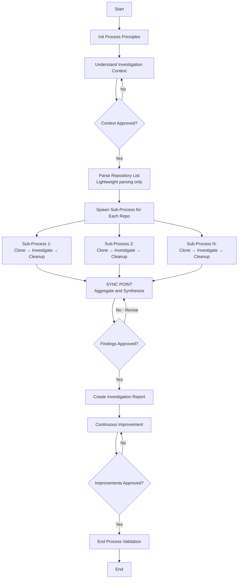

# Process: {{researchQuestion}}

**Template**: multi-repo-codebase-investigation
**Status**: Not Started

## Description

Systematic investigation of multiple repositories to answer a specific research question. This template orchestrates per-repository investigation subprocesses, aggregates findings across repositories, and produces a comprehensive comparative report. Supports both remote repositories (with on-demand cloning and automatic cleanup) and local paths.

## Purpose & Usage

Use this template when you need to:
- Investigate how a feature or pattern is implemented across multiple microservices or codebases
- Compare implementations and practices across different repositories
- Gather metrics or data from multiple projects simultaneously
- Understand architectural decisions made independently across teams
- Analyze security, testing, or configuration practices across repositories

**Not suitable for**: Single-repository investigations, general code search without a focused research question, or tasks that do not require cross-repository comparison.

## Quick Reference

| Parameter | Required | Default | Description |
|-----------|----------|---------|-------------|
| `researchQuestion` | Yes | - | The specific question or investigation goal to answer across repositories |
| `repositories` | Yes | - | List of repository URLs or local paths to investigate (comma-separated) |
| `investigationScope` | No | - | Specific areas or patterns to focus on |
| `filePatterns` | No | - | File patterns to search within each repository |
| `excludePatterns` | No | - | Patterns to exclude from investigation |
| `outputFormat` | No | "markdown" | Desired output format for findings |

## Process Flow

## Steps

- [ ] Step 0: Init Process Principles (@framework-step:common/init-process-principles)
  - Output: Operating principles loaded and confirmed

- [ ] Step 1: Understand Investigation Context (@framework-step:planning/understand-context)
  - Output: Context documentation with research question, repositories, and scope
  - Approval: Required before proceeding

- [ ] Step 2: Parse Repository List (@framework-step:multi-repo/parse-repository-list)
  - Output: `repositories-list.json` with each repo's name, source, type (remote/local), and tracking fields

- [ ] Step 3: Investigate Repositories - Subprocess Loop (@framework-step:common/spawn-sub-process)
  - Sub-Process Template: `investigate-single-repo`
  - Output: Completed sub-processes for each repository; `repositories-list.json` updated with subprocess IDs and statuses
  - Note: Each subprocess handles clone (if remote), investigation, and cleanup autonomously

- [ ] Step 4: Aggregate and Synthesize Findings - SYNC POINT (@framework-step:multi-repo/aggregate-and-synthesize-findings)
  - Output: `comparative-analysis.md` with cross-repository patterns, differences, and recommendations
  - Approval: Required before proceeding to report creation

- [ ] Step 5: Create Investigation Report (@framework-step:investigation/create-research-report)
  - Output: `investigation-report.{md|json}` with executive summary, per-repository findings, comparative analysis, and recommendations

- [ ] Step 6: Continuous Improvement (@framework-step:learning/continuous-improvement)
  - Output: Improvements implemented to the template and process
  - Approval: Required

- [ ] Step 7: End Process Validation (@framework-step:common/end-process-validation)
  - Output: Compliance report confirming all steps completed and artifacts present
