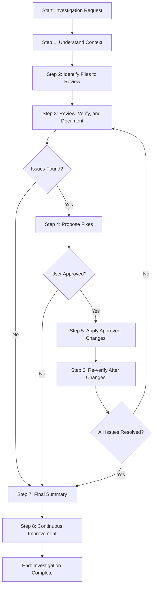

<!--
Template: Review and Verify
Purpose: Generic investigation and verification workflow for reviewing code, files, references, or any aspect of a codebase with iterative review-fix-verify cycles
Required Parameters: investigationScope, verificationCriteria
Optional Parameters: targetFiles, excludePatterns
When to use: When you need to systematically investigate, review, and verify aspects of a codebase (file references, project-specific content, code quality, etc.) with iterative fixes
-->

# Process: Review and Verify {{investigationScope}}

**Template**: review-and-verify
**Status**: Not Started

## Current State
**Active Step**: Not started yet
**Current Action**: Waiting to begin
**Details**: Process will start when first step is initiated

## Description
Systematically investigate and verify {{investigationScope}} against {{verificationCriteria}}. This process will review relevant files, verify against criteria, document findings, propose fixes if issues are found, apply approved fixes, and iterate until all issues are resolved.

## Parameters
- `investigationScope`: {{investigationScope}}
- `verificationCriteria`: {{verificationCriteria}}
- `targetFiles`: {{targetFiles}}
- `excludePatterns`: {{excludePatterns}}

## Context
- `repository`: (current repository)
- `investigationScope`: {{investigationScope}}
- `verificationCriteria`: {{verificationCriteria}}
- `targetFiles`: {{targetFiles}}
- `excludePatterns`: {{excludePatterns}}

## Process Flow

## Steps

- [ ] Step 1: Understand context
  - **Step**: `@framework-step:planning/understand-context`
  - **Description**: Fully understand the context, sources, and requirements for this task or process. This step establishes a clear foundation by gathering all necessary context information before proceeding with work. It clarifies what needs to be accomplished, identifies relevant information sources, understands success criteria (verification criteria in this case), and documents any specific requirements or constraints. Gather all necessary context to proceed with the investigation.
  - **Output**: Context documentation organized by categories (process parameters, information sources, requirements, success criteria, constraints), Q&A section if context is incomplete, complete context understanding verified and documented
  - **Context**:
    - `investigationScope`: {{investigationScope}}
    - `verificationCriteria`: {{verificationCriteria}}

- [ ] Step 2: Identify files to review
  - **Step**: `@framework-step:investigation/identify-files`
  - **Description**: Identify which files and directories need to be processed based on flexible criteria (patterns, scope descriptions, or both). The step supports two search modes: Simple search (fast, default) using available tools, and Deep search (exhaustive, directory/file listing with tracking). If targetFiles parameter is provided, use those as patterns; otherwise, identify relevant files based on investigation scope. Apply excludePatterns if provided. The step applies exclusion filtering and produces a comprehensive list of files ready for processing, saved to a separate JSON file with a reference stored in memory.
  - **Output**: Comprehensive list of identified files (saved to `identified-files.json`), file identification report (summary of search approach, criteria applied, exclusions applied, file counts), memory reference (file count, path to JSON file, brief summary)
  - **Context**:
    - `targetFiles`: {{targetFiles}} (used as filePatterns)
    - `excludePatterns`: {{excludePatterns}}
    - `investigationScope`: {{investigationScope}} (used as scope)

- [ ] Step 3: Review, verify, and document findings
  - **Step**: `@framework-step:investigation/review-verify-document`
  - **Description**: Systematically review each identified file for content relevant to the investigation scope. Read files, analyze content, extract relevant information, and verify against criteria. For each item found, verify whether it meets the criteria. Identify any violations, issues, or items that do not meet the criteria. Categorize issues by type and severity. Create a comprehensive summary of findings - if no issues were found, document that all items passed verification; if issues were found, document each issue with details including location, description, and how it violates the criteria. Prepare findings for presentation to the user. This step produces a findings report and structured issues list (JSON) if issues are found.
  - **Output**: Findings report (`findings-report.md` with executive summary, review findings, verification results, issues found), issues list (`issues-list.json` with structured data if issues found), memory update with file paths, counts, status, and references to report files
  - **Context**:
    - `investigationScope`: {{investigationScope}}
    - `verificationCriteria`: {{verificationCriteria}}
  - **Decision**:
    - **IF** no issues found:
      - Proceed to Step 7 (Final Summary)
    - **ELSE** (issues found):
      - Proceed to Step 4 (Propose Fixes)

- [ ] Step 4: Propose fixes
  - **Step**: `@framework-step:investigation/propose-fixes`
  - **Description**: Propose specific fixes for issues identified during review and verification. For each issue, analyze the problem, determine the best fix approach, and provide detailed proposals including what needs to change, how to change it, and why this fix addresses the issue. Present all fix proposals to the user in a clear, actionable format and wait for approval. The user can approve specific fixes by issue ID (or all by approving all IDs), and any fixes not explicitly approved remain unapproved. The user can also request modifications to proposals, which will trigger a revision cycle.
  - **Output**: Fix proposals document (`fix-proposals.md` with header, summary, detailed proposals for each issue, approval section), approval status (list of approved issue IDs stored in memory), memory update with proposals document path, total proposals created, approval status, and list of approved issue IDs
  - **Decision**:
    - **IF** user approves fixes:
      - Proceed to Step 5 (Apply Approved Changes)
    - **ELSE** (user rejects or no approval):
      - Proceed to Step 7 (Final Summary)
  - **Note**: This step only runs if issues were found in Step 3

- [ ] Step 5: Apply approved changes
  - **Step**: `@framework-step:common/apply-changes`
  - **Description**: Apply all user-approved changes to relevant files based on approved change proposals. Read approved change proposals from memory, apply each approved change to the target files using the detailed change instructions provided, verify that each change was applied correctly, and document all changes made in a change application report. The step is designed to be simple and focused - it executes approved proposals and does not make decisions about what changes to make.
  - **Output**: Modified files (all files that had approved changes applied), change application report (`changes-applied.md` documenting all changes made with summary, change details, and list of modified files), memory update with report path, files modified, and results
  - **Note**: This step only runs if user approved changes in Step 4

- [ ] Step 6: Re-verify after changes
  - **Step**: `@framework-step:investigation/review-verify-document`
  - **Description**: After changes are applied, re-run the review, verification, and documentation process to check that the changes resolved the issues and that no new issues were introduced. Use the same process as Step 3: systematically review modified files for content relevant to the investigation scope, read files, analyze content, extract relevant information, and verify against criteria. For each item found, verify whether it meets the criteria. Identify any remaining violations, issues, or items that do not meet the criteria. Categorize any remaining issues by type and severity. Create a comprehensive summary of findings. This step produces a findings report and structured issues list (JSON) if issues remain.
  - **Output**: Findings report (`findings-report.md` with executive summary, review findings, verification results, remaining issues if any), issues list (`issues-list.json` with structured data if issues remain), memory update with file paths, counts, status, and references to report files
  - **Decision**:
    - **IF** all issues resolved:
      - Proceed to Step 7 (Final Summary)
    - **ELSE** (issues remain):
      - Return to Step 3 (Review, Verify, and Document Findings) to iterate

- [ ] Step 7: Final summary
  - **Step**: `@framework-step:investigation/final-summary`
  - **Description**: Provide a final comprehensive summary of the investigation that consolidates information from all previous steps. Read investigation data from memory (scope, files reviewed, findings, issues, fixes, verification status), compile all information into organized sections, create a comprehensive final summary document, and present a clear conclusion to the user. The summary handles all scenarios: investigations where no issues were found, investigations where issues were found but not fixed, and investigations where issues were found and fixed.
  - **Output**: Final summary document (`final-summary.md` containing executive summary, investigation scope, files reviewed, findings summary, issues found if any, fixes applied if any, final verification status, remaining issues if any, recommendations if any, clear conclusion), memory update with final summary document path, overall conclusion, final verification status, and recommendations

### Final Phase: Learning & Improvement

- [ ] Step 8: Continuous Improvement & Learning
  - **Step**: `@framework-step:learning/continuous-improvement`
  - **Description**: Analyze process log and implement improvements for future iterations
  - **Context**:
    - `processLogPath`: .user-processes/active/{process-name}/log.md
    - `processName`: Review and Verify {{investigationScope}}
    - `templateName`: review-and-verify
  - **Output**: Analysis report, implemented improvements, updated templates/steps
  - **Iterative Workflow**: For each improvement: propose → investigate → implement → request approval → next
  - **Note**: User must approve each improvement before proceeding to the next one

## Memory File

**Memory Location**: `./memory.md`

This process uses a unified memory file to track state and share information between steps. Key information stored includes:

- **Step 1**: Context documentation, requirements, sources identified, verification criteria
- **Step 2**: List of files to review, file identification results
- **Step 3**: Review findings, verification results, issues found, categorization, findings summary, issue details
- **Step 4**: Fix proposals, fix instructions, user approval status
- **Step 5**: Applied changes, modified files
- **Step 6**: Re-verification results (using Step 3 process), remaining issues
- **Step 7**: Final summary, conclusions
- **Step 8**: Continuous improvement analysis and implemented improvements

## Errors & Notes
<!-- Add any notes, warnings, or observations here during execution -->

## Audit Log
<!-- Automatically maintained by Process Manager -->

