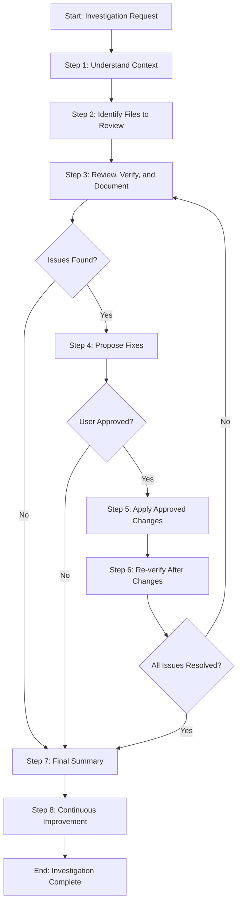

# Process: Review and Verify {{investigationScope}}

**Template**: review-and-verify  
**Status**: Not Started

## Description

Systematically investigate and verify aspects of a codebase against specific criteria. This template provides an iterative review-fix-verify cycle to ensure thorough investigation and complete resolution of any issues found.

## Purpose & Usage

Use this template when you need to:
- Investigate and verify code quality, file references, or project-specific content
- Review multiple files against defined criteria
- Iteratively fix issues until verification passes
- Document findings and applied fixes comprehensively

**Not suitable for**: Implementing new features (use `develop-user-story`), one-time file changes, or concept implementation (use `set-concept`).

## Quick Reference

| Parameter | Required | Description |
|-----------|----------|-------------|
| `investigationScope` | Yes | What aspect to investigate (e.g., "dead code", "file references") |
| `verificationCriteria` | Yes | Criteria to verify against |
| `targetFiles` | No | Specific files/patterns to review |
| `excludePatterns` | No | Patterns to exclude from review |

## Process Flow

## Steps Summary

| Step | Name | Conditional |
|------|------|-------------|
| 1 | Understand context | No |
| 2 | Identify files to review | No |
| 3 | Review, verify, and document | No |
| 4 | Propose fixes | Only if issues found |
| 5 | Apply approved changes | Only if fixes approved |
| 6 | Re-verify after changes | Only after applying changes |
| 7 | Final summary | No |
| 8 | Continuous Improvement | No |
