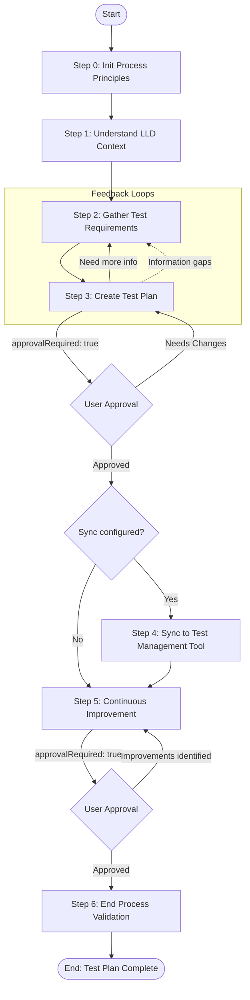

# Process: Create Test Plan from LLD - {{userStoryId}}

**Template**: create-test-plan-from-lld  
**Status**: Not Started

## Description

Create comprehensive test plans from user story Low-Level Design (LLD) documents by analyzing requirements, designing test cases, and optionally syncing with external test management tools.

## Purpose & Usage

Use this template when you need to:
- Create a comprehensive test plan from an approved LLD document
- Update existing test cases based on new features or LLD changes

**Not suitable for**: Exploratory testing without formal LLD, unit tests (those belong with code), or performance/load testing (use dedicated performance template).

## Quick Reference

| Parameter | Required | Description |
|-----------|----------|-------------|
| `userStoryId` | Yes | ID/reference of the user story (e.g., "US-1234", ADO work item ID) |
| `lldPath` | Yes | Path to the LLD document (relative to project root) |
| `testPlanId` | No | Existing test plan ID to update (for incremental updates) |

## Guideline-Based Configuration

The following are configured via team guidelines (`.guidelines/` folder) rather than runtime parameters:

| Guideline | Purpose |
|-----------|---------|
| `how-to-write-test-plan.md` | Test types, formats, naming conventions, documentation standards |
| `how-to-check-existing-test-cases.md` | How to find and compare existing test cases |
| `how-to-sync-test-management.md` | How to sync with external test management tools |

## Process Flow

## Steps

### Step 0: Init Process Principles
**Step Reference**: `@framework-step:common/init-process-principles`  
**Approval Required**: No

Load and confirm the 8 operating principles for this process execution.

**Output**: Principles loaded and confirmed

---

### Step 1: Understand LLD Context
**Step Reference**: `@framework-step:planning/understand-context`  
**Approval Required**: No

Parse and understand the LLD document to identify the scope for test planning:
- Feature overview and business context
- Technical implementation details
- Component interactions and data flows
- API contracts and integration points

**Output**: Context summary in memory

---

### Step 2: Gather Test Requirements
**Step Reference**: `@framework-step:testing/gather-test-requirements`  
**Approval Required**: No

Extract and organize test-specific requirements from the LLD:
- Acceptance criteria (explicit from LLD)
- Edge cases and boundary conditions
- Integration points requiring testing
- Test data requirements
- Error handling scenarios

**Output**: Test requirements in memory

---

### Step 3: Create Test Plan
**Step Reference**: `@framework-step:testing/create-test-plan`  
**Approval Required**: Yes

Analyze test scope and create the complete test plan document:

1. **Analyze test scope** - Determine test categories, coverage matrix, boundaries
2. **Determine required test cases** - Identify all test cases needed based on requirements
3. **Check for existing test cases** - Compare required vs existing (using guideline):
   - Which test cases need **updating**
   - Which test cases are **new**
   - Which existing test cases are **obsolete**
4. **Create/update test cases** - Generate new cases, update existing ones
5. **Compile test plan document** - Create `plans/{user-story-name}/test-plan.md`

**Guidelines Used**:
- `how-to-write-test-plan.md` - Test types, formats, structure
- `how-to-check-existing-test-cases.md` - Methods for finding/matching existing cases

**Output**: Test plan document at `plans/{user-story-name}/test-plan.md`

---

### Step 4: Sync to Test Management Tool
**Step Reference**: `@framework-step:testing/sync-test-management`  
**Approval Required**: Conditional (based on guideline configuration)

Push test cases to external test management tool (Azure DevOps, Zephyr, TestRail, etc.).

**Conditional**: Only executes if sync is configured in `how-to-sync-test-management.md` guideline.

**Output**: Sync report with test case IDs and status

---

### Step 5: Continuous Improvement
**Step Reference**: `@framework-step:learning/continuous-improvement`  
**Approval Required**: Yes

Review the process execution and capture learnings:
- What worked well
- What could be improved
- Suggested enhancements to guidelines or process

**Output**: Improvements documented

---

### Step 6: End Process Validation
**Step Reference**: `@framework-step:common/end-process-validation`  
**Approval Required**: No

Final compliance check to ensure all process requirements were met.

**Output**: Compliance report

---

## Steps Summary

| Step | Name | Approval Required |
|------|------|-------------------|
| 0 | Init Process Principles | No |
| 1 | Understand LLD Context | No |
| 2 | Gather Test Requirements | No |
| 3 | Create Test Plan | **Yes** |
| 4 | Sync to Test Management Tool | Conditional |
| 5 | Continuous Improvement | **Yes** |
| 6 | End Process Validation | No |

## Key Output

**File**: `plans/{user-story-name}/test-plan.md`

**Structure**: Defined by `how-to-write-test-plan.md` guideline
