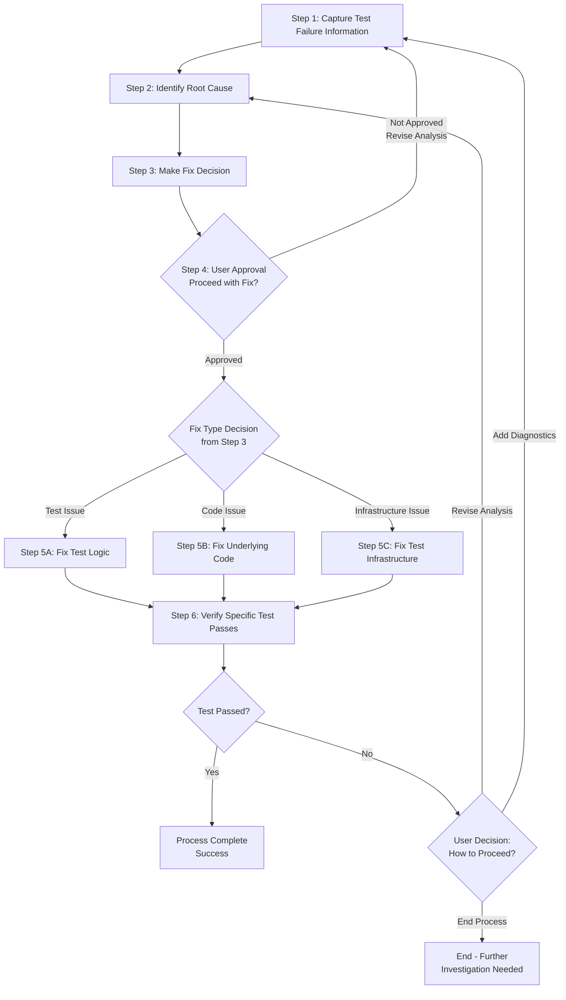

<!--
Template: Integration Test Fix
Purpose: Systematic approach to diagnosing and fixing integration test failures
Required Parameters: testName, testClass
Optional Parameters: testProject, failureDescription
When to use: When an integration test is failing and needs systematic diagnosis and repair
-->

# Process: Fix Integration Test - {{testName}}

**Template**: integration-test-fix
**Status**: Not Started

## Description

Systematic diagnosis and fix for failing integration tests. This template guides through capturing failure information, identifying root cause, determining fix type (test, code, or infrastructure), implementing the fix, and verifying the test passes.

## Purpose & Usage

Use this template when you need to:
- Diagnose why an integration test is failing
- Determine if the issue is in the test, the code, or the infrastructure
- Implement a targeted fix based on root cause analysis
- Verify the fix resolves the failure

**Not suitable for**: Writing new integration tests (use `develop-user-story`), refactoring tests without failures, or unit test fixes.

## Quick Reference

| Parameter | Required | Description |
|-----------|----------|-------------|
| `testName` | Yes | Name of the failing test method |
| `testClass` | Yes | Class containing the test |
| `testProject` | No | Test project name |
| `failureDescription` | No | Description of the failure |

**Process Flow (Simplified)**:
1. Capture failure → 2. Identify root cause → 3. Make fix decision → 4. User approval → 5. Implement fix → 6. Verify passes → 7. Learn

---

## Agent Layer

### Current State
**Active Step**: Not started yet
**Current Action**: Waiting to begin
**Details**: Process will start when first step is initiated

### Parameters (Full)
- `testName`: {{testName}}
- `testClass`: {{testClass}}
- `testProject`: {{testProject}}
- `failureDescription`: {{failureDescription}}

### Context
- `repository`: paycloud-wc-lending-partnerships
- `testProject`: {{testProject}}
- `testClass`: {{testClass}}
- `testName`: {{testName}}

### Process Flow (Detailed)

### Steps

- [ ] Step 1: Capture Test Failure Information for {{testName}}
  - **Step**: `@framework-step:testing/capture-test-failure`
  - **Context**:
    - `testName`: {{testName}}
    - `testClass`: {{testClass}}
    - `testProject`: {{testProject}}
  - **Action**:
    - Run the failing test and capture full output
    - Identify exact failure point and error message
    - Check test execution logs and stack traces
    - Review test initialization and setup code
    - **IF** information is insufficient for diagnosis:
      - Add diagnostic logs to relevant code (test setup, business logic, or infrastructure)
      - Run the test again to capture enhanced output
      - Repeat until sufficient diagnostic information is gathered
    - Store failure details in current step section of memory.md

- [ ] Step 2: Identify Root Cause for {{testName}} failure
  - **Step**: `@framework-step:testing/diagnose-integration-test-failure`
  - **Context**:
    - `testName`: {{testName}}
    - `testClass`: {{testClass}}
  - **Action**:
    - Determine if test logic is correct
    - Check if expected behavior matches business requirements
    - Validate test data setup
    - Review recent code changes that might affect test
    - Store root cause analysis in current step section of memory.md

- [ ] Step 3: Make Fix Decision based on root cause analysis
  - **Action**:
    - Review findings from Step 2 in memory.md
    - Decision tree:
      - **IF** test logic is incorrect or assertions are wrong:
        - Decision: Test Issue - fix the test
      - **ELSE IF** underlying code has a bug:
        - Decision: Code Issue - fix the underlying code
      - **ELSE IF** test infrastructure, setup, or environment issue:
        - Decision: Infrastructure Issue - fix test infrastructure
    - Document decision rationale
    - Store decision and reasoning in current step section of memory.md

- [ ] Step 4: User Approval - Present analysis and proposed fix approach
  - **Action**:
    - Present root cause analysis from Step 2 in memory.md
    - Present proposed fix approach from Step 3 in memory.md
    - Wait for user confirmation to proceed
  - **Decision**:
    - **IF** user approves:
      - Proceed to Step 5 (Implement Fix)
    - **ELSE** (user does not approve):
      - Revise analysis (may include adding logs/debugging)
      - Return to Step 1 (Capture Test Failure Information)

- [ ] Step 5: Implement Fix for {{testName}} based on decision
  - **Step**: `@framework-step:testing/implement-integration-test-fix`
  - **Context**:
    - `testName`: {{testName}}
    - `testClass`: {{testClass}}
    - `testProject`: {{testProject}}
  - **Action**:
    - **Branch A - Test Fix** (IF fix decision = Test Issue):
      - Update test logic, assertions, or test data
      - Fix test setup or initialization
      - Update test expectations to match correct business behavior
    - **Branch B - Code Fix** (IF fix decision = Code Issue):
      - Fix underlying business logic or service code
      - Update domain models if needed
      - Fix data access layer issues
    - **Branch C - Infrastructure Fix** (IF fix decision = Infrastructure Issue):
      - Update test setup, Docker config, or mocks
      - Fix test database initialization
      - Update test environment configuration
      - Fix test helper utilities
    - Store implementation details in current step section of memory.md
    - Track all modified files in "Files Modified/Created" subsection

- [ ] Step 6: Verify {{testName}} passes
  - **Step**: `@framework-step:testing/verify-test-passes`
  - **Context**:
    - `testName`: {{testName}}
    - `testClass`: {{testClass}}
    - `testProject`: {{testProject}}
  - **Action**:
    - Run the originally failing test: {{testName}}
    - Capture test execution results
    - Store results in current step section of memory.md
  - **Decision**:
    - **IF** test passes:
      - Process complete - test fix successful ✅
      - Document success in current step section of memory.md
    - **ELSE** (test still fails):
      - Present failure results to user
      - Ask user how to proceed:
        - **Option A**: Revise analysis and try different approach (return to Step 2)
        - **Option B**: Add more diagnostic information (return to Step 1)
        - **Option C**: End process (may need different approach or further investigation)

#### Final Phase: Learning & Improvement

- [ ] Step 7: Continuous Improvement & Learning
  - **Step**: `@framework-step:learning/continuous-improvement`
  - **Description**: Analyze process log and implement improvements for future iterations
  - **Context**:
    - `processLogPath`: .user-processes/active/{process-name}/log.md
    - `processName`: Fix Integration Test - {{testName}}
    - `templateName`: integration-test-fix
  - **Output**: Analysis report, implemented improvements, updated templates/steps
  - **Iterative Workflow**: For each improvement: propose → investigate → implement → request approval → next
  - **Note**: User must approve each improvement before proceeding to the next one

### Memory File

**Memory Location**: `./memory.md`

This process uses a unified memory file to maintain continuity across steps. Information stored by step:

- **Step 1**: Test failure analysis (output, error messages, stack traces)
- **Step 2**: Root cause analysis (diagnostic findings and determination)
- **Step 3**: Fix decision (rationale for test fix vs. code fix vs. infrastructure fix)
- **Step 5**: Implementation notes (implementation details and code changes made)
- **Step 6**: Validation results (test execution results)

Files modified during the process are tracked in each step's "Files Modified/Created" section.

### Errors & Notes
<!-- Add any notes, warnings, or observations here during execution -->

### Audit Log
<!-- Automatically maintained by Process Manager -->
