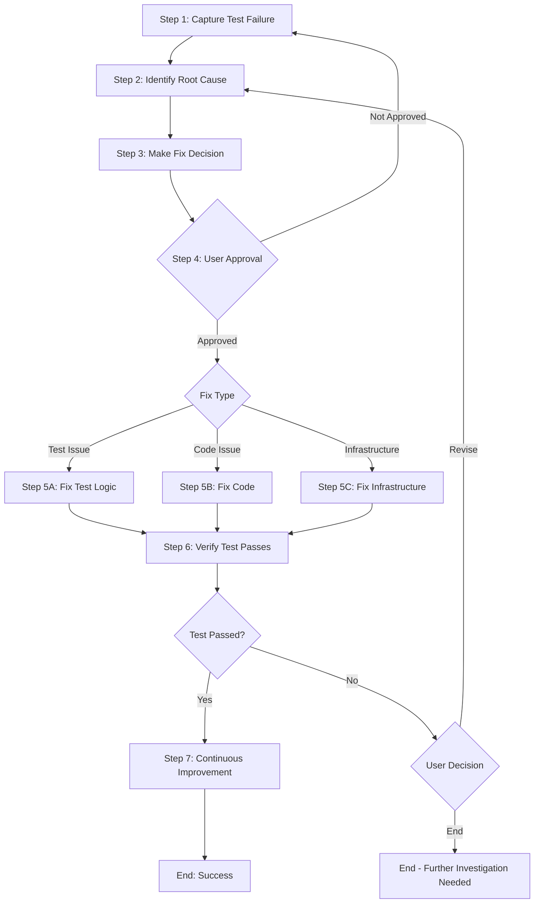

# Process: Fix Integration Test - {{testName}}

**Template**: integration-test-fix  
**Status**: Not Started

## Description

Systematic diagnosis and fix for failing integration tests. This template guides through capturing failure information, identifying root cause, determining fix type (test, code, or infrastructure), implementing the fix, and verifying the test passes.

## Purpose & Usage

Use this template when you need to:
- Diagnose why an integration test is failing
- Determine if the issue is in the test, the code, or the infrastructure
- Implement a targeted fix based on root cause analysis
- Verify the fix resolves the failure

**Not suitable for**: Writing new integration tests (use `develop-user-story`), refactoring tests without failures, or unit test fixes.

## Quick Reference

| Parameter | Required | Description |
|-----------|----------|-------------|
| `testName` | Yes | Name of the failing test method |
| `testClass` | Yes | Class containing the test |
| `testProject` | No | Test project name |
| `failureDescription` | No | Description of the failure |

## Fix Types

| Type | Description | Fix Target |
|------|-------------|------------|
| Test Issue | Test logic, assertions, or test data incorrect | Test code |
| Code Issue | Underlying business logic has a bug | Application code |
| Infrastructure Issue | Test setup, environment, or configuration problem | Infrastructure |

## Process Flow

## Steps Summary

| Step | Name | Approval Required |
|------|------|-------------------|
| 1 | Capture test failure information | No |
| 2 | Identify root cause | No |
| 3 | Make fix decision | No |
| 4 | User approval | Yes |
| 5 | Implement fix | No |
| 6 | Verify test passes | No |
| 7 | Continuous Improvement | Yes (per improvement) |
