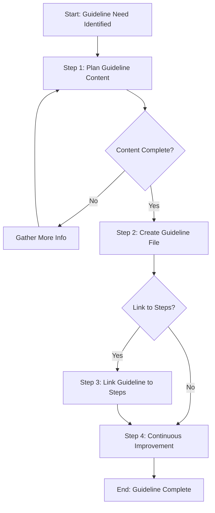

# Template Design Summary: create-guideline

## 1. Requirements Review

### What is being created
A template for creating **guideline documents** that answer "How to do X?" questions for the Agentic Process Framework.

### Why is it needed
- Process steps reference guidelines via `userGuidelines` in JSON files
- Guidelines directories exist but are mostly empty
- Need a standardized way to create missing guidelines
- When a step references a guideline that doesn't exist, this template should be used

### Expected outcomes
- Consistent guideline format across the framework
- Practical, action-oriented documentation
- Guidelines properly linked to process steps

---

## 2. Existing Resources Check

### Existing templates reviewed
| Template | Similarity | Conclusion |
|----------|------------|------------|
| `create-process-template` | Medium - creates framework artifacts | Different target (templates vs guidelines) |
| `create-process-step-template` | Medium - creates framework artifacts | Guidelines are simpler, no validation needed |

**Conclusion**: No existing template fits. Guidelines are simpler documents that don't require the complex validation of templates/steps.

### Guideline structure (from `.user-processes/guidelines/README.md`)
```
guidelines/
├── api-design/           # API layer guidelines
├── data-access/          # Data layer guidelines
├── docs/                 # Documentation guidelines
├── implementation/       # Service layer guidelines
├── planning/             # Planning guidelines
└── testing/              # Testing guidelines
```

### Guideline format
- **Filename**: `how-to-{action}.md`
- **Content**: Simple practical steps and examples
- **Location**: `.user-processes/guidelines/{category}/`

---

## 3. Purpose Statement

**Create reusable guideline documents that provide practical "How to" guidance for process framework steps, enabling consistent patterns and best practices across the system.**

---

## 4. Use Cases

| When to use | Example |
|-------------|---------|
| Step references a missing guideline | Step JSON has `userGuidelines` entry pointing to non-existent file |
| Establishing new best practice | Team wants to document a common pattern |
| Improving step execution | Adding practical guidance to help agents/users complete steps |

**Not suitable for:**
- Creating process templates (use `create-process-template`)
- Creating process steps (use `create-process-step-template`)
- Complex technical documentation (use dedicated docs process)

---

## 5. Existing Reusable Steps Check

| Category | Steps Reviewed | Can Reuse |
|----------|----------------|-----------|
| `planning/` | gather-relevant-information, understand-context | Yes - for planning phase |
| `learning/` | continuous-improvement | Yes - mandatory final step |
| `template/` | plan-and-design-template | Partially - too complex for guidelines |

**Decision**: Guidelines are simple enough that custom lightweight steps may be better than reusing complex template steps. However, continuous-improvement is mandatory.

---

## 6. Step Breakdown

| Step | Name | Description | Output | Reuses |
|------|------|-------------|--------|--------|
| 1 | Plan guideline content | Identify what the guideline should cover | Content outline, examples to include | New (lightweight) |
| 2 | Create guideline file | Write the guideline markdown file | Complete guideline file | New |
| 3 | Link guideline to steps (optional) | Update step JSON files to reference the guideline | Updated step files | New |
| 4 | Continuous Improvement | Review process and identify improvements | Improvements implemented | `@framework-step:learning/continuous-improvement` |

---

## 7. Parameters

### Required Parameters

| Parameter | Type | Description | Example |
|-----------|------|-------------|---------|
| `guidelineName` | string | Name of the action (without "how-to-" prefix) | `implement-controllers` |
| `guidelineCategory` | enum | Category folder for the guideline | `api-design` |
| `guidelinePurpose` | string | The "How to" question this guideline answers | `How to implement API controllers following project conventions` |

### Optional Parameters

| Parameter | Type | Description | Example |
|-----------|------|-------------|---------|
| `relatedSteps` | array | Steps that will reference this guideline | `["api/implement-controller-layer"]` |
| `triggeringContext` | string | What triggered the need for this guideline | `Step X referenced missing guideline` |

### Parameter Validation

- `guidelineCategory` must be one of: `api-design`, `data-access`, `docs`, `implementation`, `planning`, `testing`
- `guidelineName` should be kebab-case without "how-to-" prefix

---

## 8. Process Flow Design

### Flow Characteristics
- **Linear flow**: Simple sequence with one optional step
- **No sub-processes**: Guidelines don't spawn other processes
- **Feedback loop**: Can return to planning if content gaps discovered

### Decision Points
- After Step 2: Does the guideline need to be linked to steps?
- After Step 3: Are there more guidelines needed?

---

## 9. Mermaid Diagram



---

## 10. Summary

| Aspect | Value |
|--------|-------|
| **Template Name** | `create-guideline` |
| **Category** | `infrastructure` |
| **Total Steps** | 4 (1 optional) |
| **Approval Points** | Step 1 (design approval) |
| **Sub-Processes** | None |
| **Complexity** | Low |

### Key Design Decisions

1. **Lightweight approach**: Guidelines are simpler than templates/steps, so this process is deliberately minimal
2. **Optional linking step**: Not all guidelines need immediate linking to steps
3. **Flexible categories**: Uses existing guideline category structure
4. **Feedback loop**: Allows returning to gather more info during planning

---

## Approval Request

**Please review this design and approve to proceed to Step 2 (Create template file).**

Questions for review:
1. Are the parameters appropriate?
2. Is the step breakdown sufficient?
3. Should step linking be mandatory or optional?

