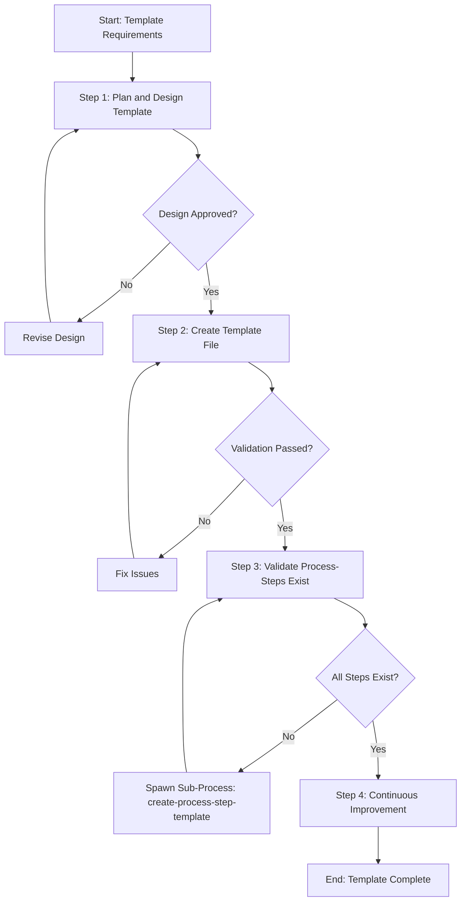

# Process: Create low-level-design-user-story Template

**Template**: create-process-template  
**Status**: ✅ Completed

## Description

Create a new process template for the Agentic Process System. This template guides you through designing, creating, validating, and documenting a new template that can be used to instantiate processes.

## Purpose & Usage

Use this template when you need to:
- Create a new reusable process template for the framework
- Define a systematic workflow for a specific type of task
- Establish a standardized approach that others can follow

**Not suitable for**: Creating process steps (use `create-process-step-template`), modifying existing templates, or one-time processes.

## Parameters

| Parameter | Value |
|-----------|-------|
| `templateName` | low-level-design-user-story |
| `templatePurpose` | Create low-level design documentation for user stories that serves as the foundational technical specification for subsequent SDLC phases |
| `useCases` | Beginning of SDLC when breaking down user stories into technical design that guides implementation, code development, and test plan creation |

## Process Flow

## Steps

- [x] **Step 1: Plan and design template** ✅ COMPLETED
  - **Step**: `@framework-step:template/plan-and-design-template`
  - **Description**: Define requirements, design the template structure, create process flow diagram
  - **Output**: Requirements document, design artifacts, mermaid diagram
  - **Approval Required**: Yes ✅ Approved

- [x] **Step 2: Create template file** ✅ COMPLETED
  - **Step**: `@framework-step:template/create-template-file`
  - **Description**: Create the actual template files (.md and .json) with all sections
  - **Output**: `.processes/templates/development/low-level-design-user-story.md` and `.json`

- [x] **Step 3: Validate process-steps exist** ✅ COMPLETED
  - **Step**: `@framework-step:template/validate-process-steps-exist`
  - **Description**: Check that all referenced process steps exist, spawn sub-processes if needed
  - **Output**: Validation report - All 6 steps validated ✅
  - **Sub-Process Trigger**: 4 sub-processes spawned and completed

- [x] **Step 4: Continuous Improvement** ✅ COMPLETED
  - **Step**: `@framework-step:learning/continuous-improvement`
  - **Description**: Review process execution and identify improvements
  - **Output**: 3 improvements implemented to plan-and-design-template.json
  - **Approval Required**: Yes (per improvement) - All approved
