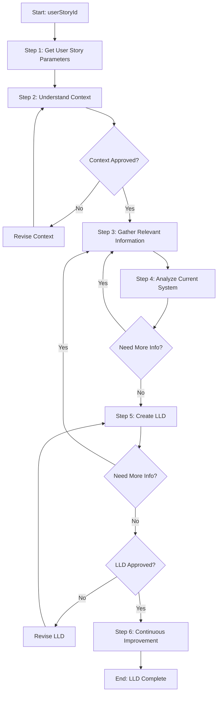

# Template Design Summary: low-level-design-user-story

## Overview

| Attribute | Value |
|-----------|-------|
| **Template Name** | `low-level-design-user-story` |
| **Category** | `development/` |
| **Location** | `.processes/templates/development/low-level-design-user-story.md` |
| **Purpose** | Create standalone LLD document for user stories as foundational spec for SDLC phases |

---

## Parameter

| Parameter | Required | Type | Description | Example |
|-----------|----------|------|-------------|---------|
| `userStoryId` | ✅ Yes | string | ID/reference of the user story | "US-1234", "PROJ-567", "GH-89" |

> **Note**: This is the only parameter. All other details (title, description, acceptance criteria) are collected in Step 1 using a guideline-based approach.

---

## Steps Overview

```
┌─────────────────────────────────────────────────────────────────────┐
│  Step 1: Get User Story Parameters          [Guideline] [No Approval] │
│  └─ Collect title, description, acceptance criteria from userStoryId │
├─────────────────────────────────────────────────────────────────────┤
│  Step 2: Understand User Story Context      [Approval Required]      │
│  └─ Gather requirements, scope, success criteria                     │
├─────────────────────────────────────────────────────────────────────┤
│  Step 3: Gather Relevant Information        [Guideline] [No Approval] │
│  └─ Collect docs, specs, code patterns, SME input                    │
│  ↑                                                                   │
│  │ ┌─────────────────────────────────────────────────────────────┐  │
│  └─┤ FEEDBACK LOOP: Steps 4 & 5 return here if more info needed │  │
│    └─────────────────────────────────────────────────────────────┘  │
├─────────────────────────────────────────────────────────────────────┤
│  Step 4: Analyze Current System             [No Approval]            │
│  └─ Identify affected components, dependencies, patterns             │
│  └─ → Returns to Step 3 if more information needed                   │
├─────────────────────────────────────────────────────────────────────┤
│  Step 5: Create Low-Level Design Document   [Guideline] [Approval]   │
│  └─ Create LLD with diagrams and specifications                      │
│  └─ → Returns to Step 3 if more information needed                   │
├─────────────────────────────────────────────────────────────────────┤
│  Step 6: Continuous Improvement             [Approval Required]      │
│  └─ Review process and implement improvements                        │
└─────────────────────────────────────────────────────────────────────┘
```

---

## Detailed Steps

### Step 1: Get User Story Parameters
| Attribute | Value |
|-----------|-------|
| **Step Reference** | `@framework-step:planning/get-user-story-parameters` |
| **Guideline-Based** | ✅ Yes |
| **Approval Required** | ❌ No |
| **Status** | 🔴 Step needs to be created |

**Purpose**: Collect user story details from `userStoryId` using team's preferred method.

**Guideline Options**:
- Pull from Jira, Azure DevOps, Linear, GitHub Issues
- Extract from requirements documents (PRD, BRD)
- Manual entry from stakeholder input
- Reference from team's story templates

**Output**: `userStoryTitle`, `userStoryDescription`, `acceptanceCriteria`

---

### Step 2: Understand User Story Context
| Attribute | Value |
|-----------|-------|
| **Step Reference** | `@framework-step:planning/understand-context` |
| **Guideline-Based** | ❌ No |
| **Approval Required** | ✅ Yes |
| **Status** | ✅ Step exists |

**Purpose**: Fully understand the context, requirements, and success criteria.

**Output**: Context documentation with requirements, scope, constraints, success criteria

---

### Step 3: Gather Relevant Information
| Attribute | Value |
|-----------|-------|
| **Step Reference** | `@framework-step:planning/gather-relevant-information` |
| **Guideline-Based** | ✅ Yes |
| **Approval Required** | ❌ No |
| **Status** | 🔴 Step needs to be created |

**Purpose**: Collect all relevant data from various sources before system analysis.

**Guideline Options**:
| Source Type | Examples |
|-------------|----------|
| Documentation | Architecture docs, API specs, system design docs |
| Existing Code | Related modules, patterns in use, existing implementations |
| Knowledge Base | Wiki pages, Confluence, internal docs |
| Stakeholder Input | SME interviews, product owner notes |
| External Resources | Third-party API docs, library documentation |

**Output**: Collected information stored in memory

---

### Step 4: Analyze Current System
| Attribute | Value |
|-----------|-------|
| **Step Reference** | `@framework-step:planning/analyze-affected-system` |
| **Guideline-Based** | ❌ No |
| **Approval Required** | ❌ No |
| **Status** | 🔴 Step needs to be created |

**Purpose**: Analyze codebase to identify affected components and dependencies.

**Output**: 
- System analysis report
- Affected components map
- Dependencies list
- Existing patterns identified

---

### Step 5: Create Low-Level Design Document
| Attribute | Value |
|-----------|-------|
| **Step Reference** | `@framework-step:planning/create-low-level-design` |
| **Guideline-Based** | ✅ Yes |
| **Approval Required** | ✅ Yes |
| **Status** | 🔴 Step needs to be created |

**Purpose**: Create comprehensive LLD document using team's preferred format.

**Guideline Options**:
- Different diagram types (class, sequence, component, data flow)
- Different section structures
- Different tools (Mermaid, PlantUML, draw.io)
- Different levels of detail

**Output**: Complete LLD document at `plans/{user-story-name}/lld.md`

**LLD Document Contents**:
1. Overview and scope
2. Current system analysis
3. Proposed design
   - Architecture diagram
   - Data flow diagram
   - Class diagrams
   - Sequence diagrams
4. Technical specifications
   - API contracts
   - Database changes
   - Configuration changes
5. Dependencies and risks
6. Test considerations

---

### Step 6: Continuous Improvement
| Attribute | Value |
|-----------|-------|
| **Step Reference** | `@framework-step:learning/continuous-improvement` |
| **Guideline-Based** | ❌ No |
| **Approval Required** | ✅ Yes |
| **Status** | ✅ Step exists |

**Purpose**: Review process execution and implement improvements.

**Output**: Process improvements implemented

---

## Process Flow Diagram



### Feedback Loops

| From Step | Condition | Returns To |
|-----------|-----------|------------|
| Step 4: Analyze Current System | Need more information | Step 3: Gather Relevant Information |
| Step 5: Create LLD | Need more information | Step 3: Gather Relevant Information |

---

## Q&A Pattern

**Each step handles its own Q&A as needed** - there is no standalone Q&A step.

When questions arise during any step:
1. Identify open questions
2. Present to user
3. Wait for answers
4. Continue with step

---

## Key Design Decisions

| Decision | Rationale |
|----------|-----------|
| Single `userStoryId` parameter | Simplifies template invocation; details collected in Step 1 |
| 3 guideline-based steps (1, 3, 5) | Teams have different tools and processes |
| 3 approval checkpoints (2, 5, 6) | Key decision points need user verification |
| Q&A as substep pattern | Questions naturally arise during steps, not in isolation |
| Standalone LLD template | Design artifact feeds multiple SDLC phases |
| Feedback loops to Step 3 | Steps 4 & 5 can return to gather more info if gaps discovered |

---

## Step Creation Status

| Step | Status | Sub-Process |
|------|--------|-------------|
| `get-user-story-parameters` | 🔴 Pending | `process-step-get-user-story-parameters-20260122` (deleted) |
| `understand-context` | ✅ Exists | - |
| `gather-relevant-information` | 🔴 Pending | `process-step-gather-relevant-information-20260122` (deleted) |
| `analyze-affected-system` | 🟡 In Progress | `process-step-analyze-affected-system-20260122` |
| `create-low-level-design` | 🔴 Pending | `process-step-create-low-level-design-20260122` |
| `continuous-improvement` | ✅ Exists | - |

---

## Template Files

| File | Location |
|------|----------|
| Template MD | `.processes/templates/development/low-level-design-user-story.md` |
| Template JSON | `.processes/templates/development/low-level-design-user-story.json` |

---

## Usage Example

```bash
/process-new low-level-design-user-story userStoryId=US-1234
```

This creates a new process instance that will:
1. Collect user story details for US-1234
2. Understand the context and get approval
3. Gather relevant information from team's sources
4. Analyze the current system
5. Create and get approval for the LLD document
6. Run continuous improvement

