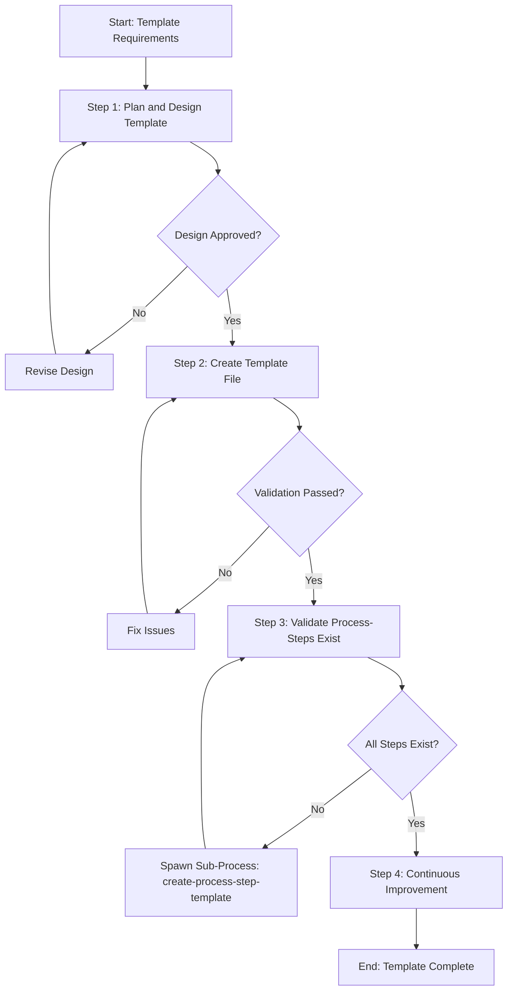

# Process: Create onboard Template

**Template**: create-process-template  
**Status**: Running

## Description

Create a new process template for the Agentic Process System. This template guides you through designing, creating, validating, and documenting a new template that can be used to instantiate processes.

## Purpose & Usage

Use this template when you need to:
- Create a new reusable process template for the framework
- Define a systematic workflow for a specific type of task
- Establish a standardized approach that others can follow

**Not suitable for**: Creating process steps (use `create-process-step-template`), modifying existing templates, or one-time processes.

## Parameters

| Parameter | Value |
|-----------|-------|
| `templateName` | onboard |
| `templatePurpose` | Onboarding when starting to work with the framework, specifically for identifying and creating missing guidelines that are referenced by process steps |
| `useCases` | When a user project starts using the framework and needs to populate missing guidelines, or when expanding to new areas that require new guidelines to be created |

## Process Flow

## Steps

- [ ] **Step 1: Plan and design template** ⏳ AWAITING APPROVAL
  - **Step**: `@framework-step:template/plan-and-design-template`
  - **Description**: Gather requirements, design template structure, create flow diagram
  - **Output**: [`template-design-summary.md`](./template-design-summary.md) ✅
  - **Approval Required**: Yes - **PENDING**

- [ ] **Step 2: Create template file**
  - **Step**: `@framework-step:template/create-template-file`
  - **Description**: Create the actual template files (.md and .json)
  - **Output**: Complete template file with validation reports

- [ ] **Step 3: Validate process-steps exist**
  - **Step**: `@framework-step:template/validate-process-steps-exist`
  - **Description**: Verify all referenced steps exist, spawn sub-processes for missing ones
  - **Output**: Validation report

- [ ] **Step 4: Continuous Improvement**
  - **Step**: `@framework-step:learning/continuous-improvement`
  - **Description**: Review process, identify improvements, update templates
  - **Output**: Improvements implemented

