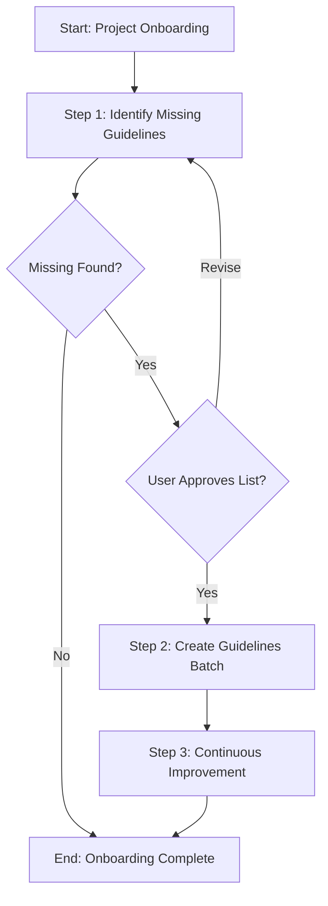

# Template Design Summary: onboard

## Overview

| Field | Value |
|-------|-------|
| **Template Name** | onboard |
| **Category** | infrastructure |
| **Purpose** | Systematic onboarding for projects starting with the Agentic Process Framework, specifically identifying and creating missing guidelines referenced by process steps |

## Use Cases

Use this template when:
1. A project first adopts the Agentic Process Framework
2. The framework's guideline folders are empty or incomplete
3. Process steps reference guidelines that don't exist yet
4. Expanding to new areas that require new guidelines

**Not suitable for**: Creating a single guideline (use `create-guideline`), general project setup, or non-guideline onboarding tasks.

## Parameters

This template has **no parameters**. It automatically scans the framework to identify all missing guidelines.

## Analysis: Missing Guidelines Found

Based on scanning `.processes/steps/` for `userGuidelines` references, the following guidelines are referenced but don't exist:

### api-design (3 missing)
- `how-to-implement-controllers.md`
- `how-to-handle-authentication.md`  
- `how-to-version-apis.md`

### data-access (2 missing)
- `how-to-implement-repositories.md`
- `how-to-use-mongodb.md`

### docs (1 missing)
- `how-to-document-flows.md`

### implementation (3 missing)
- `how-to-implement-services.md`
- `how-to-use-dependency-injection.md`
- `how-to-handle-errors.md`

### planning (3 missing)
- `how-to-write-low-level-design.md`
- `how-to-gather-relevant-information.md`
- `how-to-get-user-story-parameters.md`

### testing (4 missing)
- `how-to-write-integration-tests.md`
- `how-to-generate-test-data.md`
- `how-to-mock-dependencies.md`
- `how-to-write-unit-tests.md`

**Total**: 16 missing guidelines across 6 categories

## Step Breakdown (100% Step Reuse)

| # | Step Name | Step Reference | Approval | Output |
|---|-----------|----------------|----------|--------|
| 1 | Identify missing guidelines | `@framework-step:investigation/identify-files` | **Yes** (review findings) | List of missing guidelines |
| 2 | Create guidelines (batch) | Spawns `create-guideline` sub-processes | No* | Created guidelines |
| 3 | Continuous Improvement | `@framework-step:learning/continuous-improvement` | Per item | Improvements |

*Note: Step 2 spawns `create-guideline` sub-processes with `immediate` sync - each sub-process completes before the next starts.

### Step Details

#### Step 1: Identify Missing Guidelines
- **Uses**: `@framework-step:investigation/identify-files`
- **Scope**: "Find all guideline files referenced in .processes/steps that don't exist in .guidelines/"
- **How**: 
  1. Grep for `userGuidelines` patterns in step JSON files
  2. Extract referenced guideline paths
  3. Check which files exist vs don't exist
  4. Output list of missing guidelines to `identified-files.json`
- **Approval**: User reviews the list before proceeding

#### Step 2: Create Guidelines (Batch)
- **Uses**: Spawns `create-guideline` template per approved guideline
- **Sync**: Immediate (one at a time)
- **Input**: Approved list from Step 1

#### Step 3: Continuous Improvement
- **Uses**: `@framework-step:learning/continuous-improvement`
- **Standard**: Final review and process improvements

## Process Flow Diagram

## Design Decisions

1. **100% step reuse** - No new steps needed; use existing `identify-files` for scanning
2. **No parameters** - Template auto-scans framework for missing guidelines
3. **User approval at Step 1 output** - User reviews list before creating guidelines
4. **Immediate sync for sub-processes** - Each guideline sub-process completes before the next starts
5. **Reuse `create-guideline` template** - Leverage existing template for guideline creation

## Notes

- The `identify-files` step can handle the scan using grep for `userGuidelines` patterns
- Guidelines are project-specific - the onboard process helps bootstrap them but teams should customize content
- Future enhancement: add "quick mode" that creates placeholder guidelines vs full content
