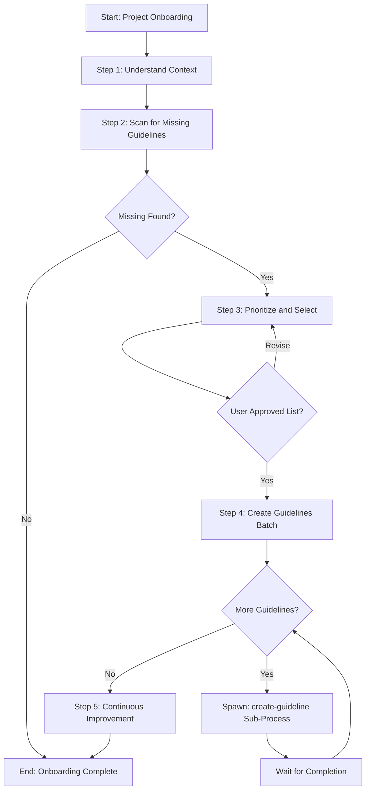

# Template Design Summary: onboard

## Overview

| Field | Value |
|-------|-------|
| **Template Name** | onboard |
| **Category** | infrastructure |
| **Purpose** | Systematic onboarding for projects starting with the Agentic Process Framework, specifically identifying and creating missing guidelines referenced by process steps |

## Use Cases

Use this template when:
1. A project first adopts the Agentic Process Framework
2. The framework's guideline folders are empty or incomplete
3. Process steps reference guidelines that don't exist yet
4. Expanding to new areas that require new guidelines

**Not suitable for**: Creating a single guideline (use `create-guideline`), general project setup, or non-guideline onboarding tasks.

## Parameters

| Parameter | Required | Type | Description | Example |
|-----------|----------|------|-------------|---------|
| `projectName` | Yes | string | Name of the project being onboarded | "backend-api" |
| `scope` | No | string | Limit scan to specific guideline categories | "api-design,testing" |
| `priorityCategories` | No | string | Categories to prioritize creating first | "testing,implementation" |

## Analysis: Missing Guidelines Found

Based on scanning `.processes/steps/` for `userGuidelines` references, the following guidelines are referenced but don't exist:

### api-design (3 missing)
- `how-to-implement-controllers.md`
- `how-to-handle-authentication.md`  
- `how-to-version-apis.md`

### data-access (2 missing)
- `how-to-implement-repositories.md`
- `how-to-use-mongodb.md`

### docs (1 missing)
- `how-to-document-flows.md`

### implementation (3 missing)
- `how-to-implement-services.md`
- `how-to-use-dependency-injection.md`
- `how-to-handle-errors.md`

### planning (3 missing)
- `how-to-write-low-level-design.md`
- `how-to-gather-relevant-information.md`
- `how-to-get-user-story-parameters.md`

### testing (4 missing)
- `how-to-write-integration-tests.md`
- `how-to-generate-test-data.md`
- `how-to-mock-dependencies.md`
- `how-to-write-unit-tests.md`

**Total**: 16 missing guidelines across 6 categories

## Reusable Steps Analysis

### From `.processes/steps/planning/`
- ✅ `understand-context` - Can reuse for initial context gathering

### From `.processes/steps/common/`
- ✅ `spawn-sub-process` - Can use pattern for spawning `create-guideline` sub-processes

### From `.processes/steps/learning/`
- ✅ `continuous-improvement` - Standard final step

### New Steps Needed
| Step | Category | Description |
|------|----------|-------------|
| `scan-missing-guidelines` | onboard | Scans framework steps to identify all referenced guidelines that don't exist |
| `prioritize-guidelines` | onboard | Presents findings and allows user to select which guidelines to create |
| `create-guidelines-batch` | onboard | Iteratively spawns `create-guideline` sub-processes for each selected guideline |

## Step Breakdown

| # | Step Name | Step Reference | Approval | Output |
|---|-----------|----------------|----------|--------|
| 1 | Understand context | `@framework-step:planning/understand-context` | No | Context documented |
| 2 | Scan for missing guidelines | `@framework-step:onboard/scan-missing-guidelines` | No | List of missing guidelines |
| 3 | Prioritize and select guidelines | `@framework-step:onboard/prioritize-guidelines` | **Yes** | Approved list to create |
| 4 | Create guidelines (batch) | `@framework-step:onboard/create-guidelines-batch` | No* | Created guidelines |
| 5 | Continuous Improvement | `@framework-step:learning/continuous-improvement` | Per item | Improvements |

*Note: Step 4 spawns `create-guideline` sub-processes with `immediate` sync - each sub-process completes before the next starts.

## Process Flow Diagram

## Design Decisions

1. **Batch creation over single process** - The template handles multiple guidelines efficiently by iterating through selected guidelines
2. **User approval checkpoint at prioritization** - Allows user to choose which guidelines matter most for their project
3. **Immediate sync for sub-processes** - Each guideline sub-process completes before the next starts to avoid parallel complexity
4. **Scope parameter for flexibility** - Users can focus on specific categories (e.g., only "testing") rather than all guidelines
5. **Reuse `create-guideline` template** - Leverage existing template rather than duplicating guideline creation logic

## Notes

- The scanning step should be smart about detecting both framework steps (`.processes/steps/`) and any user steps (`.user-processes/steps/`)
- Guidelines are project-specific - the onboard process helps bootstrap them but teams should customize content
- Consider adding a "quick mode" in future that creates placeholder guidelines vs full content

