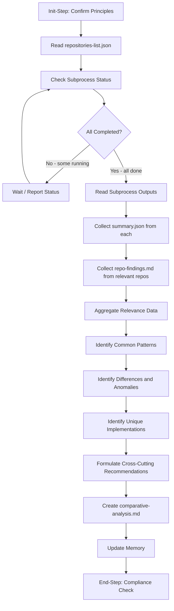

# Step Design: aggregate-and-synthesize-findings

## Overview

This document describes the design for the `aggregate-and-synthesize-findings` step, which will be placed in the `multi-repo` category at `.processes/steps/multi-repo/aggregate-and-synthesize-findings/`.

This step is Step 4 in the `multi-repo-codebase-investigation` template. It serves as the sync point where the parent process waits for all per-repository investigation subprocesses to complete, then reads their outputs and produces a cross-repository comparative analysis.

## Purpose

Aggregate findings from completed per-repository investigation subprocesses, perform cross-repository comparison, and synthesize patterns into a comparative analysis document for user approval.

## Category

**multi-repo** -- New category for steps that orchestrate or aggregate across multiple repositories. This step reads from multiple subprocess directories, which is inherently a multi-repo concern. The parent template design already established this category.

## Use Cases

1. **Primary**: After all per-repository `investigate-single-repo` subprocesses complete in the multi-repo-codebase-investigation template (Step 4).
2. **General**: Any multi-repo workflow that spawns per-repo subprocesses and needs to aggregate their outputs into a single comparative document.
3. **Reusable pattern**: Could be used in future multi-repo templates (e.g., multi-repo audit, multi-repo migration assessment) that follow the same subprocess-per-repo pattern.

## Prerequisites

- All subprocesses from the previous step must have completed (or failed)
- `repositories-list.json` must exist in the process directory with subprocess tracking data
- Each completed subprocess directory must contain `summary.json` (and optionally `repo-findings.md`)

## Output

### Artifacts
- `comparative-analysis.md` -- Cross-repository comparative analysis document

### Memory Updates
- `repositorySummaries` -- Aggregated summary data from all subprocesses
- `relevanceCounts` -- Count of relevant vs not-relevant vs failed repositories
- `commonPatterns` -- Patterns found across multiple repositories
- `keyDifferences` -- Notable differences between repositories
- `comparativeAnalysisPath` -- Path to the output document

## Flow Diagram



## Substeps

### Substep 0: Init-Step: Confirm Principles
- Read `.processes/steps/_components/operating-principles.md` and recall all principles
- Output: "Confirmed: Principles confirmed for this step"

### Substep 1: Read Repository Tracking Data
- Read `repositories-list.json` from the process directory
- Parse the list to identify all repositories and their subprocess paths
- Log the total count of repositories

### Substep 2: Verify Subprocess Completion
- Check the `status` field of each entry in `repositories-list.json`
- All entries must be `completed` or `failed` (none `pending` or `running`)
- If any are still running/pending, report which ones and wait
- Log: "All {count} subprocesses have reached terminal state ({completed} completed, {failed} failed)"

### Substep 3: Read Subprocess Outputs
- For each repository entry with status `completed`:
  - Read `summary.json` from the subprocess directory
  - If `summary.json` indicates the repo is relevant, also read `repo-findings.md`
- For each entry with status `failed`:
  - Note the failure (include in analysis as "investigation failed")
- Collect all data into a structured in-memory collection

### Substep 4: Aggregate and Classify
- Tally relevance: count of relevant, not-relevant, and failed repositories
- Group findings by topic/theme based on the research question
- Organize findings for comparison

### Substep 5: Cross-Repository Comparison
- **Common Patterns**: Identify patterns, implementations, or practices found in 2+ repositories
- **Key Differences**: Highlight where repositories diverge in approach
- **Unique Implementations**: Note approaches found in only one repository
- **Anomalies**: Flag unexpected findings or inconsistencies
- **Cross-Cutting Recommendations**: Formulate actionable recommendations based on the comparison

### Substep 6: Create comparative-analysis.md
- Write the document with these sections:
  - **Research Question** -- The question being investigated
  - **Repositories Investigated** -- Table with name, relevance, status
  - **Relevance Summary** -- Counts and brief reasoning
  - **Common Patterns** -- Patterns found across repos
  - **Key Differences** -- Where repos diverge
  - **Unique Implementations** -- Approaches in single repos
  - **Anomalies** -- Unexpected findings
  - **Cross-Cutting Recommendations** -- Actionable insights
  - **Per-Repository Summaries** -- Brief summary per repo (from summary.json)
- Save to process directory as `comparative-analysis.md`

### Substep 7: Update Memory
- Write to memory.json current step section:
  - `repositorySummaries`: summary data per repo
  - `relevanceCounts`: { relevant, notRelevant, failed }
  - `commonPatterns`: list of identified patterns
  - `keyDifferences`: list of differences
  - `comparativeAnalysisPath`: path to output file
- Update `decisionsMade` and `filesModifiedCreated`

### Substep 8: End-Step: Compliance Check
- Verify log.json was updated
- Verify mandatory actions confirmed with output
- Verify process files conform to type definitions
- Verify crossReferences updated in memory.json
- Output: "Confirmed: Step completed in compliance with operating principles"

## Structure Plan

### JSON File Structure (aggregate-and-synthesize-findings.json)

```
type: "step"
name: "aggregate-and-synthesize-findings"
category: "multi-repo"
metadata:
  title: "Aggregate and Synthesize Findings"
  purposeAndUsage: "Aggregate findings from completed per-repository investigation 
    subprocesses, perform cross-repository comparison, and produce a comparative 
    analysis document. Use as a sync point after spawning per-repo subprocesses."
  lastUpdated: "2026-04-01"

output:
  description: "Comparative analysis document synthesizing cross-repository findings"
  artifacts: ["comparative-analysis.md"]
  memoryUpdates: ["repositorySummaries", "relevanceCounts", "commonPatterns", 
                   "keyDifferences", "comparativeAnalysisPath"]

guidance:
  prerequisites:
    - "repositories-list.json exists with subprocess tracking data"
    - "All subprocesses have reached terminal state (completed or failed)"
  mandatoryComponents: ["mandatory-logging.md"]
  specificActions:
    - "Read repositories-list.json to locate subprocess directories"
    - "Verify all subprocesses completed before proceeding"
    - "Read summary.json from each completed subprocess"
    - "Read repo-findings.md from relevant repos"
    - "Perform cross-repository comparison"
    - "Create comparative-analysis.md"
  files:
    read: ["repositories-list.json", "{subProcessPath}/summary.json", 
           "{subProcessPath}/repo-findings.md"]
    create: ["comparative-analysis.md"]
    update: ["memory.json", "log.json"]
  tools:
    - "read_file - Read repositories-list.json and subprocess outputs"
    - "write - Create comparative-analysis.md"
    - "search_replace - Update memory.json"
  bestPractices:
    - "Handle failed subprocesses gracefully -- include them as failed in the analysis"
    - "Group findings by theme, not just by repository"
    - "Prioritize actionable insights over exhaustive listing"
    - "Use tables for easy comparison across repos"
    - "Keep the document scannable with clear section headers"

substeps: [0..8 as defined above]

flow:
  description: "Read tracking data -> Verify completion -> Read outputs -> 
    Aggregate -> Compare -> Create document -> Update memory"

memoryFileUsage:
  readFrom: "repositories-list.json (subprocess paths and status)"
  writeTo: "Current step section in memory.json"
  fields:
    - "Information Produced: repositorySummaries, relevanceCounts, 
       commonPatterns, keyDifferences, comparativeAnalysisPath"
    - "Decisions Made: How findings were grouped, which patterns qualified 
       as common"

dependencies:
  requiredComponents: ["mandatory-logging.md"]
  requiredFiles: ["repositories-list.json", "summary.json (per subprocess)"]
  requiredTools: ["read_file", "write", "search_replace"]

references:
  relatedSteps: ["spawn-sub-process", "parse-repository-list", "final-summary"]
  usedInTemplates: ["multi-repo-codebase-investigation"]
```

### MD File Structure (aggregate-and-synthesize-findings.md)

Sections:
1. Required Components (mandatory-logging.md)
2. Description
3. Output
4. Guidance (specific actions, files, tools, best practices)
5. Memory File Usage
6. Flow (mermaid diagram)
7. Substeps

## Decisions Made

| Decision | Rationale |
|----------|-----------|
| Category: `multi-repo` | Step is specific to multi-repo orchestration -- reads from multiple subprocess directories |
| No generalization needed | No existing step performs subprocess output aggregation; this is genuinely new functionality |
| 9 substeps (0-8) | Init + 7 functional substeps + End-Step compliance check |
| Subprocess completion check as explicit substep | Must verify all subprocesses finished before reading outputs |
| Handle failures gracefully | Failed subprocesses should be noted in the analysis, not block the step |
| Document structure mirrors comparison concerns | Sections organized by analysis type (patterns, differences, anomalies) rather than by repository |
| Read from subprocess directories, not parent memory | Per the template design, subprocess tracking is in repositories-list.json for better data locality |
| approvalRequired not set in step JSON | Approval is configured at the template level (Step 4 has approvalRequired: true), not in the step definition itself |
