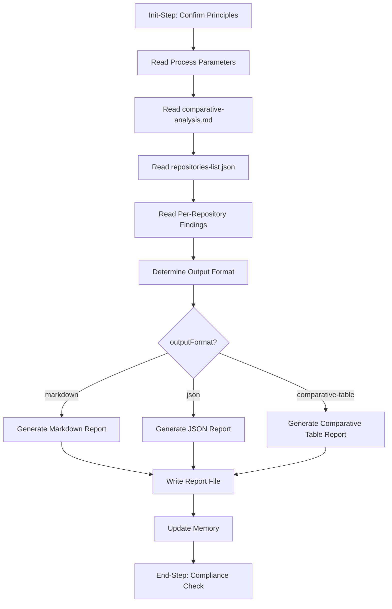

# Step Design: create-research-report

## Overview

This document describes the design for the `create-research-report` step, which will be placed in the `investigation` category at `.processes/steps/investigation/create-research-report/`.

This step is Step 5 in the `multi-repo-codebase-investigation` template. It takes the `comparative-analysis.md` produced by the aggregate step (Step 4) along with per-repository findings, and structures them into a formal investigation report. The report format is configurable via the `outputFormat` parameter.

## Purpose

Generate a structured investigation report from aggregated research findings, supporting multiple output formats (markdown, JSON, comparative-table), that synthesizes per-repository and cross-repository analysis into a comprehensive deliverable.

## Category

**investigation** -- This step produces an investigation report, which is core investigation functionality. The template already references it as `@framework-step:investigation/create-research-report`. While it consumes multi-repo aggregated data, the step itself is about report generation -- an investigation concern. It could also serve single-repo investigations if findings are structured similarly.

## Use Cases

1. **Primary**: Final step in multi-repo investigation workflows (Step 5 of `multi-repo-codebase-investigation`) after findings have been aggregated and synthesized.
2. **General**: Any investigation workflow that needs a formally structured research report from pre-aggregated findings.
3. **Format flexibility**: When investigation results need to be delivered in different formats (markdown for human consumption, JSON for programmatic processing, comparative-table for side-by-side analysis).

## Prerequisites

- `comparative-analysis.md` must exist in the process directory (produced by the previous aggregate step)
- `repositories-list.json` must exist with subprocess paths and status data
- Per-repository subprocess directories must contain `summary.json` and optionally `repo-findings.md`
- Process parameters available: `researchQuestion`, `outputFormat`, `investigationScope`

## Output

### Artifacts
- `investigation-report.md` -- Full investigation report (when outputFormat is "markdown" or "comparative-table")
- `investigation-report.json` -- Structured investigation report (when outputFormat is "json")

### Memory Updates
- `reportPath` -- Path to the generated report file
- `reportFormat` -- The output format used
- `reportSections` -- List of sections included
- `repositoryCounts` -- Total, relevant, not-relevant, failed counts
- `executiveSummary` -- Brief summary for quick reference

## Overlap Analysis

### Comparison with `final-summary` step

| Aspect | final-summary | create-research-report |
|--------|--------------|----------------------|
| Workflow | Single-repo (identify -> review -> fix -> summarize) | Multi-repo (aggregate -> report) |
| Inputs | memory.json previous steps, findings-report.md, issues-list.json | comparative-analysis.md, repositories-list.json, per-repo summary.json/repo-findings.md |
| Output | final-summary.md (single format) | investigation-report.{md\|json} (3 formats) |
| Sections | Executive Summary, Investigation Scope, Files Reviewed, Findings Summary, Issues Found, Fixes Applied, Verification Status, Remaining Issues, Recommendations, Conclusion | Executive Summary, Research Question, Repositories Investigated, Per-Repository Findings, Comparative Analysis, Common Patterns, Unique Approaches, Recommendations, Conclusion |
| Focus | Issues found/fixed, verification status | Cross-repo patterns, comparative analysis |

**Conclusion**: These are distinct steps serving different workflows. No generalization opportunity -- the inputs, structure, and purpose are fundamentally different.

## Flow Diagram



## Substeps

### Substep 0: Init-Step: Confirm Principles
- Read `.processes/steps/_components/operating-principles.md` and recall all principles
- Output: "Confirmed: Principles confirmed for this step"

### Substep 1: Read Process Context and Parameters
- Read from memory.json: previous step data (comparativeAnalysisPath, relevanceCounts)
- Read process parameters: `researchQuestion`, `outputFormat` (default: "markdown"), `investigationScope`
- Log: "Read process context: outputFormat={format}, researchQuestion={question}"

### Substep 2: Read Source Data
- Read `comparative-analysis.md` from the process directory
- Read `repositories-list.json` to get the list of repositories and subprocess paths
- For each relevant repository: read `summary.json` from the subprocess directory
- For each relevant repository: read `repo-findings.md` if it exists
- Collect all source data into structured form
- Log: "Read source data from {count} repositories"

### Substep 3: Structure Report Content
- Compose the Executive Summary (high-level answer to the research question)
- Organize per-repository findings (name, relevance, key findings)
- Extract comparative analysis sections from comparative-analysis.md:
  - Common Patterns
  - Key Differences / Unique Approaches
  - Anomalies (if any)
- Formulate Recommendations based on the analysis
- Write Conclusion that directly answers the research question

### Substep 4: Generate Report in Target Format
- Based on `outputFormat` parameter:
  - **markdown** (default): Generate `investigation-report.md` with full narrative sections
  - **json**: Generate `investigation-report.json` with structured data matching the same sections
  - **comparative-table**: Generate `investigation-report.md` with table-heavy format emphasizing side-by-side comparison
- Write the report file to the process directory
- Log: "Created investigation report in {format} format"

### Substep 5: Update Memory
- Write to memory.json current step section:
  - `reportPath`: path to generated report
  - `reportFormat`: output format used
  - `reportSections`: list of sections included
  - `repositoryCounts`: { total, relevant, notRelevant, failed }
  - `executiveSummary`: brief summary text
- Update `decisionsMade` and `filesModifiedCreated`

### Substep 6: End-Step: Compliance Check
- Verify log.json was updated
- Verify mandatory actions confirmed with output
- Verify process files conform to type definitions
- Verify crossReferences updated in memory.json
- Output: "Confirmed: Step completed in compliance with operating principles"

## Structure Plan

### JSON File Structure (create-research-report.json)

```
type: "step"
name: "create-research-report"
category: "investigation"
metadata:
  title: "Create Research Report"
  purposeAndUsage: "Generate a structured investigation report from aggregated 
    research findings, supporting multiple output formats. Use as the final 
    reporting step after findings have been aggregated and synthesized."
  lastUpdated: "2026-04-01"

output:
  description: "Investigation report in the specified output format"
  artifacts: ["investigation-report.md or investigation-report.json"]
  memoryUpdates: ["reportPath", "reportFormat", "reportSections", 
                   "repositoryCounts", "executiveSummary"]

guidance:
  prerequisites:
    - "comparative-analysis.md exists in process directory"
    - "repositories-list.json exists with subprocess tracking data"
    - "Per-repository subprocess directories contain summary.json"
  mandatoryComponents: ["mandatory-logging.md"]
  specificActions:
    - "Read comparative-analysis.md and per-repo findings"
    - "Read repositories-list.json for repo list and subprocess paths"
    - "Determine output format from process parameters (default: markdown)"
    - "Structure content into report sections"
    - "Generate report file in target format"
  files:
    read: ["comparative-analysis.md", "repositories-list.json",
           "{subProcessPath}/summary.json", 
           "{subProcessPath}/repo-findings.md"]
    create: ["investigation-report.md or investigation-report.json"]
    update: ["memory.json", "log.json"]
  tools:
    - "read_file - Read source documents and subprocess outputs"
    - "write - Create investigation report file"
    - "search_replace - Update memory.json"
  bestPractices:
    - "Lead with the answer: Executive Summary should directly address the research question"
    - "Keep per-repository sections concise -- reference repo-findings.md for details"
    - "Use consistent structure across output formats"
    - "Tables for comparative data, narrative for analysis"
    - "Include counts (total/relevant/not-relevant/failed) for quick context"
    - "Recommendations should be actionable and grounded in evidence"

substeps: [0..6 as defined above]

flow:
  description: "Read context -> Read source data -> Structure content -> 
    Generate report -> Update memory"

memoryFileUsage:
  readFrom: "Previous step section (comparativeAnalysisPath, relevanceCounts), 
    repositories-list.json, process parameters"
  writeTo: "Current step section in memory.json"
  fields:
    - "Information Produced: reportPath, reportFormat, reportSections, 
       repositoryCounts, executiveSummary"
    - "Decisions Made: Output format selection, section organization"

dependencies:
  requiredComponents: ["mandatory-logging.md"]
  requiredFiles: ["comparative-analysis.md", "repositories-list.json", 
                   "summary.json (per subprocess)"]
  requiredTools: ["read_file", "write", "search_replace"]

references:
  relatedSteps: ["aggregate-and-synthesize-findings", "final-summary"]
  usedInTemplates: ["multi-repo-codebase-investigation"]
```

### MD File Structure (create-research-report.md)

Sections:
1. Required Components (mandatory-logging.md)
2. Description
3. Output
4. Guidance (specific actions, files, tools, best practices)
5. Memory File Usage
6. Flow (mermaid diagram)
7. Substeps

### Report Section Definitions

#### Markdown Format Sections
1. **Executive Summary** -- 2-3 paragraph answer to the research question
2. **Research Question** -- The original question being investigated
3. **Investigation Scope** -- What was investigated and any constraints
4. **Repositories Investigated** -- Table: name, type, relevance, status
5. **Per-Repository Findings** -- Subsection per relevant repo with key findings
6. **Comparative Analysis** -- Cross-repo patterns and analysis (from comparative-analysis.md)
7. **Common Patterns** -- Patterns found across multiple repositories
8. **Unique Approaches** -- Notable approaches found in only one repository
9. **Recommendations** -- Actionable recommendations grounded in findings
10. **Conclusion** -- Final answer and next steps

#### JSON Format Structure
```json
{
  "reportMetadata": {
    "researchQuestion": "...",
    "investigationScope": "...",
    "generatedAt": "ISO timestamp",
    "repositoryCount": { "total": N, "relevant": N, "notRelevant": N, "failed": N }
  },
  "executiveSummary": "...",
  "repositories": [
    { "name": "...", "type": "remote|local", "relevance": "relevant|not-relevant|failed", "findings": "..." }
  ],
  "comparativeAnalysis": {
    "commonPatterns": [...],
    "uniqueApproaches": [...],
    "keyDifferences": [...]
  },
  "recommendations": [...],
  "conclusion": "..."
}
```

#### Comparative-Table Format
Same as markdown but with emphasis on side-by-side comparison tables:
- Per-aspect comparison table (rows = aspects, columns = repositories)
- Pattern prevalence matrix
- Recommendations mapped to repositories

## Decisions Made

| Decision | Rationale |
|----------|-----------|
| Category: `investigation` | Report generation is core investigation functionality; template already references `@framework-step:investigation/create-research-report` |
| No generalization with `final-summary` | Different workflows, inputs, outputs, and section structures -- merging would create unnecessary complexity |
| 7 substeps (0-6) | Init + 5 functional substeps + End-Step; kept lean since this step is primarily content structuring |
| Single format-branching substep | All formats share the same data collection and structuring; only the final rendering differs |
| Read from files, not memory | Per-repo findings are in subprocess directories; comparative analysis is a file; reading from files is more reliable than memory for large data |
| Default to markdown | Consistent with template parameter default; most human-readable option |
| Include failed repos in report | Users need to know which repos could not be investigated and why |
| approvalRequired not set in step JSON | Approval is configured at the template level, not in the step definition itself |
